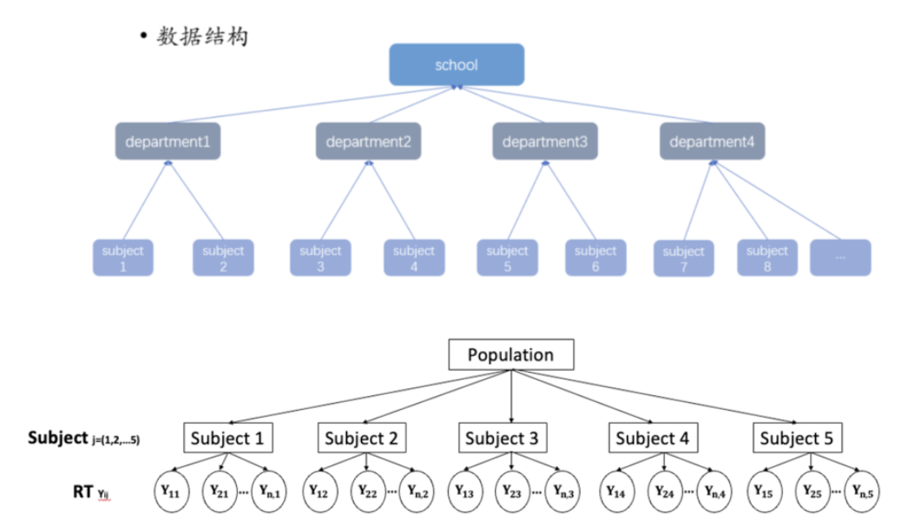
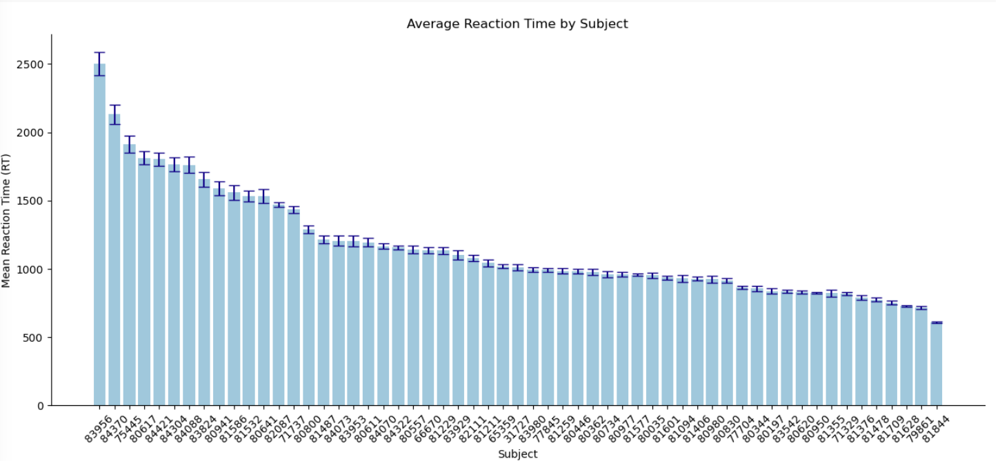
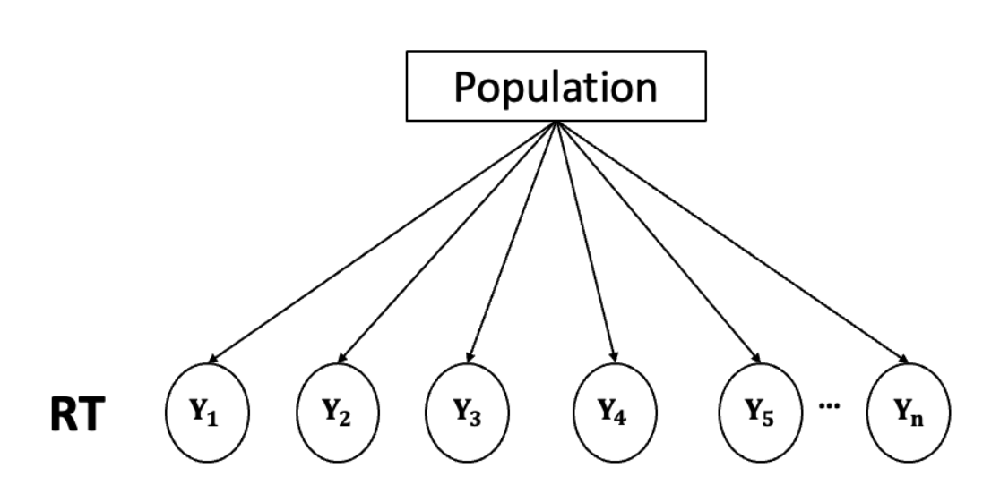
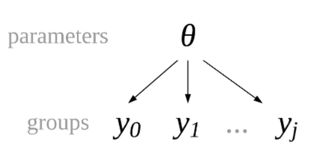
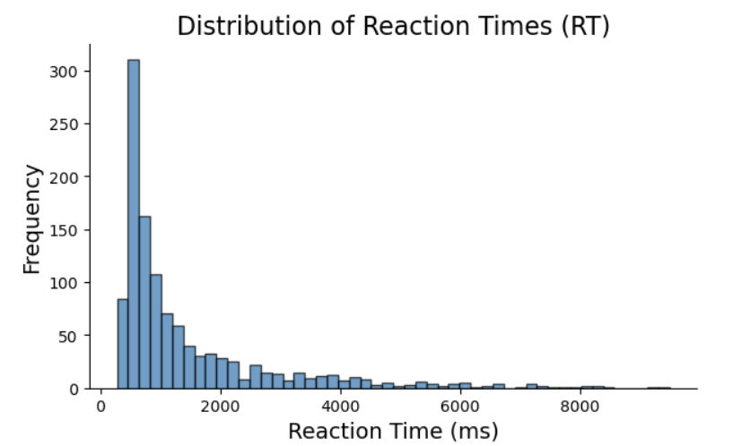
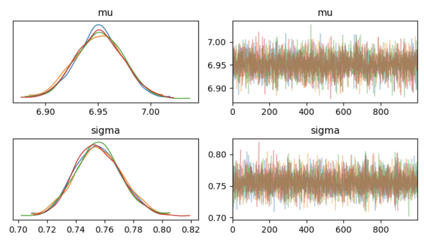
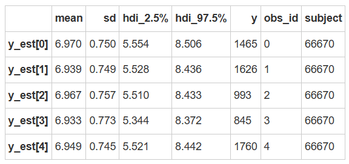
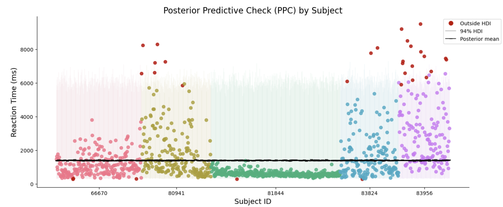

# Hierarchical Models

在先前的学习中，我们可以逐渐意识到——真正的数据分析是一个迭代的过程。

- 如果我们有多个模型，则涉及到**模型比较**的问题，最后根据最优模型进行统计推断。

- 还要一个很重要但是容易被忽视的部分：**结果报告**。结果报告很重要的一点则是根据报告对象的不同而调整不同的报告方式。在做完一系列统计分析后，需要将最后的结果进行报告，那么此时面对的对象不同，报告的方式也应该有所不同，这一部分的能力需要在今后的实践中逐渐磨练与提升。

**回顾：以随机点运动任务为例**

本节课我们依旧以随机点运动任务（Random Motion Dot Task）为例，之前的课中，我们仅选取一个被试的例子。

- 然而，在真实的心理学研究中，我们不仅仅针对一个被试进行研究，大多情况需要针对多个被试的反应时间数据进行分析，那么我们此时要如何建立模型呢？

***传统的做法***

一般来说，传统的做法是计算出每个被试的正确试次的平均反应时，或者计算出平均正确率，然后基于多个被试的平均反应时/正确率进行方差分析。

***🤔思考：我们是否可以将每个试次的数据都纳入数据分析的过程中呢？***

- 这个时候我们可以发现，数据是存在层级结构的：

- 我们先看单个被试的数据，每个被试都进行了一系列的反应试次，因此**每个试次都是一个数据点嵌套在被试里**。接下来，我们再看多个被试，可以发现这些被试是从群体中抽取出来的，因此**每个被试作为一个数据点嵌套在群体里**。

- 另外还有一种层级结构，例如我们在以个体作为研究对象时，尤其是以学生作为被试时，可以发现：不同的大学生嵌套在不同的院系，不同院系嵌套在同一个学校，不同的学校又进一步嵌套在不同的城市等等。这种层级结构非常常见，即某一个数据点嵌套在一个更高维数据点内的情况。

***当面临反应时数据时，可能存在的问题与挑战：***

1、反应时具有较大的个体差异，不同被试的反应时可能存在较大差异。

2、大多情况下不符合正态分布，更多时候是偏态分布。

3、数据偏倚：反应时间可能受到各种因素的影响（如疲劳、动机等），而这些因素在被试间是不一致的。

- 与传统的频率学派方法不同，贝叶斯方法能够将先验信息（例如，关于群体或个体的预期分布）与数据结合，通过推断逐步修正不确定性，从而得出更精确的估计。

- 对于多个被试的反应时间数据，贝叶斯层级模型通过引入“群体层”和“个体层”，在建模过程中既考虑到个体差异，也能够捕捉到群体总体趋势，从而更全面地理解反应时间数据背后的复杂结构。

## 层级数据结构

在心理学实验中，**层级数据或分组数据**(hierarchical or grouped data)十分常见，例如：

- 设计不同的实验条件，在同一实验条件下收集多个数据(实验条件为组)

- 划分不同的人群，在同类人群中收集多个数据(人群为组)

- 在一种实验条件内，被试需要重复对同种刺激做出反应(被试为组)

同时，根据下图可以看出，尽管数据内容有所不同，但其层级结构具有高度相似性，均呈现出分层式的组织方式。

无论是学校-系-被试的层次，还是群体-被试-反应时间的结构，数据的组织逻辑都体现为从整体到局部的逐级细分。



在之前使用的数据中，层级数据表现为来自多个被试的反应时间数据。

- 我们先通过可视化来观察被试的反应时数据之间的个体差异：

```python
# 导入 pymc 模型包，和 arviz 等分析工具 
import pymc as pm
import arviz as az
import seaborn as sns
import scipy.stats as st
import numpy as np
import matplotlib.pyplot as plt
import xarray as xr
import pandas as pd
import ipywidgets
import bambi as bmb

# 忽略不必要的警告
import warnings
warnings.filterwarnings("ignore")
```

```python
# 使用 pandas 导入示例数据
try:
  df_raw  = pd.read_csv("/home/mw/input/bayes3797/evans2020JExpPsycholLearn_exp1_full_data.csv") 
except:
  df_raw  = pd.read_csv('data/evans2020JExpPsycholLearn_exp1_full_data.csv')

df_raw[["subject","RT"]]
```

对所有被试的反应时间的平均值进行可视化，可以发现:

- 不同被试的平均反应时间差异较大

```python
# 计算每个被试的平均反应时间和标准误差
subject_stats = df_raw.groupby("subject")["RT"].agg(['mean', 'std', 'count']).reset_index()
subject_stats['sem'] = subject_stats['std'] / np.sqrt(subject_stats['count'])

# 按照平均反应时间从高到低排序
subject_stats.sort_values(by="mean", ascending=False, inplace=True, ignore_index=True)
subject_stats.subject = subject_stats.subject.astype(str)

# 绘制平均反应时间的可视化
plt.figure(figsize=(13, 6))
sns.barplot(x="subject", y="mean", data=subject_stats, color = "skyblue")

# 添加误差线
for i, row in subject_stats.iterrows():
    plt.errorbar(x=i, y=row['mean'], yerr=row['sem'], linestyle='', capsize=5, color = "darkblue")

plt.title("Average Reaction Time by Subject")
plt.xlabel("Subject")
plt.ylabel("Mean Reaction Time (RT)")
plt.xticks(rotation=45)
plt.tight_layout()
sns.despine()
plt.show()
```



由于被试数量较多，为了使得之后的代码简单和结果清晰，仅使用其中5个被试的数据作为演示。

此外，为了保证数据更加“干净”，仅选择单一的percentCoherence 水平（即 5%）时的RT数据进行分析，避免多种条件混合带来的潜在偏差。

```python
# 筛选出特定被试并创建索引
df_first5 = df_raw[df_raw['subject'].isin([81844, 83956, 83824, 66670, 80941]) & (df_raw['percentCoherence'] == 5)]

# 为每个被试建立索引 'subj_id' 和 'obs_id'
df_first5['subj_id'] = df_first5['subject']
df_first5['obs_id'] = df_first5.groupby('subject').cumcount() + 1

df_first5["log_RTs"] = np.log(df_first5["RT"])

df_first5.head()
```

绘制每个被试在percentCoherence为5%时的反应时间直方图，以查看数据分布。

- 可以发现，不同被试的反应时间分布存在差异，这可能是由于被试之间的个体差异造成的。

- 更重要的是，反应时的分布并不是正态分布，而是偏斜的。

为了正确对反应时分布进行建模，我们需要使用非正态分布的分布，或者将反应时求对数后再通过正态分布进行建模。

- 可以发现，在经过对数转换后，反应时的分布更加接近正态分布。

通过对比这两种反应时间分布，我们可以更好地理解数据的特性。

```python
# 创建一个包含两个子图的 2 行 5 列布局
fig, axes = plt.subplots(2, 5, figsize=(20, 6))  

# 绘制第一个子图：原始的RT
df_first5.hist(column="RT", by="subject", ax=axes[0], figsize=(13, 3), layout=(1, 5))
for ax in axes[0]: 
    ax.tick_params(axis='x', rotation=0)

# 绘制第二个子图：logRT
df_first5.assign(logRT = np.log(df_first5['RT'])).hist(column="logRT", by="subject", ax=axes[1], figsize=(13, 3), layout=(1, 5))
for ax in axes[1]:  
    ax.tick_params(axis='x', rotation=0)

# 调整布局
plt.tight_layout()
sns.despine()
plt.show()
```


我们可以使用上节课学习的链接函数（link function）来将反应时数据转换为正态分布:

公式为：

$$
\eta = log(RT)\\
\eta \sim \mathcal{N} (\mu,\sigma)
$$

其中，$\eta$是反应时的对数，$\mu和\sigma$是正态分布的均值和标准差。

注意，由于RT 经过对数变化后其范围缩小，因此我们对先验进行设置时需要对$\mu和\sigma$进行缩放，以保持与反应时数据范围相匹配。

$$
\mu \sim \mathcal{N}(7.5,5)\\
\sigma \sim Exp(1)
$$

```python
with pm.Model() as log_RT_model:    

    #定义beta_0    
    mu = pm.Normal("mu", mu=7.5, sigma=5)    
    #定义sigma                    
    sigma = pm.Exponential("sigma", 1)    

    logRT = pm.math.log(df.RT)    

    likelihood = pm.Normal("y_est", mu=mu, sigma=sigma, observed=logRT)    

    log_RT_model_trace = pm.sample(random_seed=84735)
```

**数据的层级结构**


我们通过观察图中的数据结构，可以清晰看出：

- 假设我们用j来表示不同的被试，那么这里总共5个被试，因此j的取值是1至5。

- i来表示被试内部的每一个数据点，i的取值是1至n。

- 每一个被试的数据则可以被表示为$Y_{ij}$，例如$Y_{11}$表示第1个被试的第1个数据点，$Y_{21}$表示第1个被试的第2个数据点，$Y_{12}$表示第2个被试的第1个数据点。

现在，我们有几种做法可以考察：

- 第一种：完全忽略被试这一层，即忽略被试间的个体差异，认为所有被试的水平都是一样的，直接将被试级别的数据拼到一起，然后根据这个数据集去估计群体层面的反应时特点。

- 第二种：只对被试数据感兴趣，放弃对群体数据的估计。

显然，这两种做法都不是最优的。第一种方法忽略了被试这一层的变异性，第二种直接放弃了我们的最终目标。

🤔那么，有没有第三种做法进行折中，既能考虑被试的个体差异，又能估计总体参数呢？

- 第三种：综合考虑数据的层级结构，即群体-被试-试次。

这三种方法分别对应三种不同的建模思路（“池化”是一种形象的说法，类似于将所有数据放在一个池子里）：

- 完全池化(complete pooling)

- 非池化(no pooling)

- 部分池化(patial pooling)

## 完全池化(Complete pooling)模型

在完全池化模型中，我们忽略个体的分组信息(Site)，认为这些个体直接来自一个更大的总体。也就是说，将被试这层的数据直接拿掉了，认为是总体到每个数据点。



为了简化建模的难度，我们只对一个特定条件下的均值进行估计，没有加入自变量。

我们可以使用正态模型（假设所有数据点来自于一个正态分布）来建立完全池化模型：

$$
Y_{ij}|\mu,\sigma \sim N(\mu,\sigma^2)\\
\mu \sim N(7.5,5^2)\\
\sigma \sim Exp(1)
$$

**global parameters $\theta$:**

换一种形式，直接用$\theta$，与$y_0,y_1,y_2...,y_j$连接。



- $\mu$为反应时在总体中的均值(global mean)

- $\sigma$为反应时均值在总体中的标准差(global standard deviation)

下图给出了数据中所有被试（n = 57）反应时间的分布情况，大部分反应时间集中在 1000-3000 毫秒 之间:

```python
# 绘制所有被试的反应时间 (RT) 的分布图
plt.figure(figsize=(7, 4))
plt.hist(df_first5['RT'], bins=50, edgecolor='black', alpha=0.7)
plt.title('Distribution of Reaction Times (RT)', fontsize=16)
plt.xlabel('Reaction Time (ms)', fontsize=14)
plt.ylabel('Frequency', fontsize=14)
sns.despine()
plt.show()
```



**模型定义及MCMC采样**

$$
Y_{ij}|\mu,\sigma \sim N(\mu,\sigma^2)\\
\mu \sim N(7.5,5^2)\\
\sigma \sim Exp(1)
$$

根据公式使用 pymc 定义模型：

```python
with pm.Model() as complete_pooled_model:

    # 对 RT 进行 log 变换
    log_RTs = pm.MutableData("log_RTs", np.log(df_first5['RT']))

    #定义 mu, 注意已经考虑到 RT 已经进行 log 转换
    mu = pm.Normal("mu", mu=7.5, sigma=5)  
    #定义sigma                  
    sigma = pm.Exponential("sigma", 1) 

    #定义似然：预测值y符合N(mu, sigma)分布；传入实际数据y 反应时间 log_RTs
    likelihood = pm.Normal("y_est", mu=mu, sigma=sigma, observed=log_RTs)  

    complete_trace = pm.sample(random_seed=84735)
```

```python
pm.model_to_graphviz(complete_pooled_model)
```

**查看后验参数估计**

```python
axes = az.plot_trace(complete_trace,
              compact=False,
              figsize=(7,4))
plt.tight_layout()
plt.show()
```



```python
az.summary(complete_trace)
```


由于RT 已经进行了 log 变换，所以后验均值 mu 的真实值应为 1388。

使用以下公式可以将 mu 转换为 RT 的真实值：

$$
RT_{mean}=e^{\mu_{mean}+\sigma^2_{mean}/2}
$$

```python
def inv_log(mu, sigma):
    return np.exp(mu + (sigma ** 2) / 2)

pred_rt = inv_log(6.950,0.756)
print("The estimated mean of RT is: ", pred_rt.round(3))
```
The estimated mean of RT is:  1388.207

```python
print("The posterior mean of mu is: ", az.summary(complete_trace)["mean"][0].round(3))
print("The truth log RT mean is:", np.log(df_first5['RT']).mean().round(3))
```
The posterior mean of mu is:  6.951
The truth log RT mean is: 6.951

**后验预测分布**

- 画出所有预测值的95%后验预测可信区间

- 同时可以观察真实值落在可信区间的情况

(在之前的课件中已介绍过可信区间的绘制，主要借助az.summary生成后验预测总结的表格，并判断真实值是否落在可信区间内)

```python
# 进行后验预测
complete_ppc = pm.sample_posterior_predictive(complete_trace,
                                              model=complete_pooled_model)
```

```python
# 定义函数，计算 95%hdi
def ppc_sum(ppc, data, y = "RT"):
    
    hdi_sum = az.summary(ppc, hdi_prob=0.95, kind="stats")
    hdi_sum["y"] = data[y].values
    hdi_sum["obs_id"] = data.reset_index(drop=True).index.values
    hdi_sum["subject"] = data["subject"].values

    return hdi_sum
```

```python
# 计算后验预测的 95%hdi
complete_hdi_sum = ppc_sum(ppc = complete_ppc, data=df_first5)
complete_hdi_sum.head()
```



由于mean和hdi也是受到对数化影响的，因此需要对数据进行逆对数转换：

```python
def inv_log(mu, sigma):
    return np.exp(mu + (sigma ** 2) / 2)

def inv_log_hdi_sum(hdi_sum):
    
    df = hdi_sum.copy()
    
    df["mean"] = inv_log(df["mean"], df["sd"])
    df.iloc[:, 2] = inv_log(df.iloc[:, 2], df["sd"])
    df.iloc[:, 3] = inv_log(df.iloc[:, 3], df["sd"])
    
    return df

complete_hdi_sum = inv_log_hdi_sum(complete_hdi_sum)
```

由于我们省略了分组信息，假测所有的观测值都来自同一正态分布，因此所有观测值的后验预测均值都是相似的

- 纵坐标为反应时的范围

- 横坐标代表每个观测值根据不同被试的排序

- 黑色横线部分表示每个观测值的后验预测均值

```python
import matplotlib.pyplot as plt
import numpy as np
import seaborn as sns
from matplotlib.lines import Line2D  # 确保导入 Line2D

def ppc_plot(hdi_sum, ax=None, show_plot=True):

    df = hdi_sum.copy()
    
    df["obs_id"] = df.reset_index(drop=True).index

    # 选择一个Seaborn调色板
    palette = sns.color_palette("husl", len(df['subject'].unique()))

    # 创建一个颜色映射字典，深色和浅色
    color_map = {subject: (palette[i], sns.light_palette(palette[i], reverse=True)[3])
                for i, subject in enumerate(df['subject'].unique())}

    # 映射颜色到新列
    df['color_dark'] = df['subject'].map(lambda x: color_map[x][0])
    df['color_light'] = df['subject'].map(lambda x: color_map[x][1])

    # 根据是否落在可信区间内分配颜色
    df["color_dark"] = np.where(
        (df["y"] >= df["hdi_2.5%"]) & (df["y"] <= df["hdi_97.5%"]), 
        df["color_dark"], '#C00000'
    )

    # 设置画布
    if ax is None:
        fig, ax = plt.subplots(figsize=(15, 6))

    # 绘制 94% 的可信区间
    ax.vlines(df["obs_id"], 
                df["hdi_2.5%"], 
                df["hdi_97.5%"], 
                color=df["color_light"], 
                alpha=0.1, 
                label="94% HDI")

    # 各被试散点图数据
    ax.scatter(df["obs_id"], df["y"], 
                color=df["color_dark"],
                alpha=0.8, 
                zorder=2)

    # 绘制后验预测均值
    ax.scatter(df["obs_id"], df["mean"], 
                marker="_", 
                c='black', 
                alpha=0.7, 
                zorder=2, 
                label="Posterior mean")

    # 设置图例
    handles = [
        Line2D([0], [0], marker='o', color='w', markerfacecolor='#C00000', markersize=10, label='Outside HDI'),
        Line2D([0], [0], color='gray', alpha=0.5, label='94% HDI'),
        Line2D([0], [0], marker='_', color='black', alpha=0.7, label='Posterior mean'),
    ]
    ax.legend(handles=handles, loc='upper right', bbox_to_anchor=(1.08, 1))

    # 设置 x 轴刻度
    count_per_subject = df.groupby("subject").size().values
    cumulative_count = count_per_subject.cumsum()
    xtick = cumulative_count - count_per_subject / 2
    ax.set_xticks(xtick, df["subject"].unique())

    # 设置图形标题和标签
    ax.set_title("Posterior Predictive Check (PPC) by Subject", fontsize=16)
    ax.set_xlabel("Subject ID", fontsize=14)
    ax.set_ylabel("Reaction Time (ms)", fontsize=14)

    if show_plot:
        sns.despine()
        plt.show()
    else:
        return ax
```

```python
ppc_plot(hdi_sum=complete_hdi_sum)
```



***完全池化模型的缺点***

可以看出，94%hdi实际上能够预测绝大部分真实的反应时数据。但是存在另一个问题，就是每一个真值都没有那么接近后验预测均值，尤其是第3个被试，他的数据集基本上在预测均值的下方区域。

- 因此，在我们做预测时，完全池化模型不考虑个体差异，这对于某些被试的预测效果会大打折扣。
