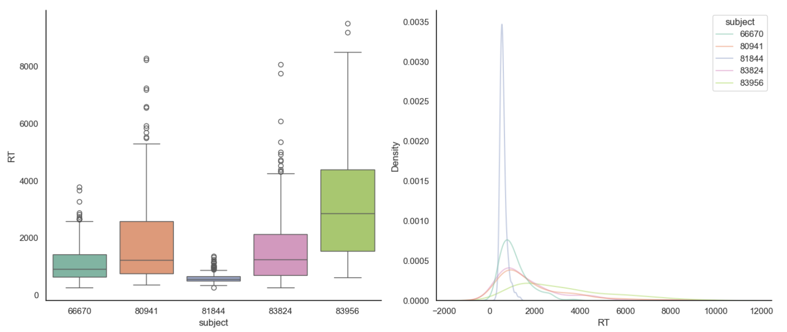
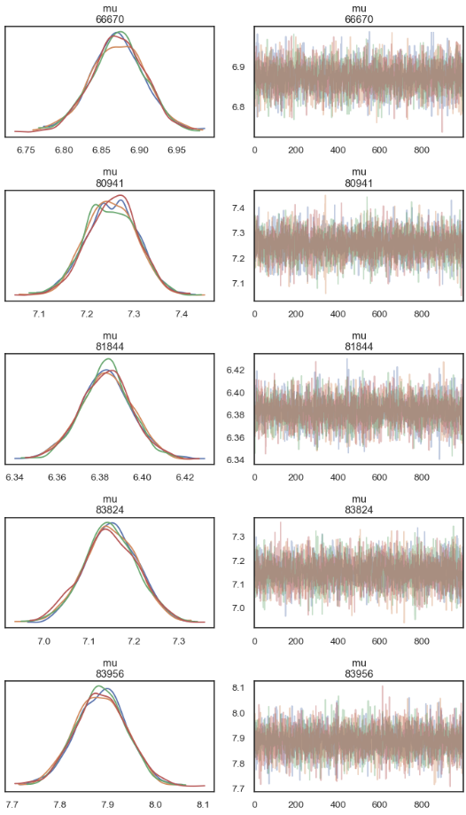
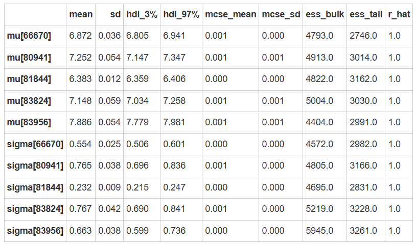
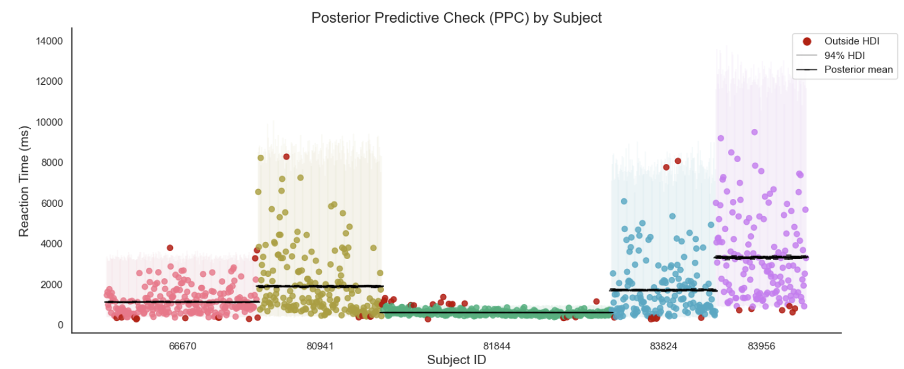

# 非池化模型(No pooling)

在complete pooled模型中，我们忽略了数据来自不同的被试这一事实

现在我们考虑另外一种情况，我们假设**五个被试分别来自不同的分布，对五个被试进行不同的分析**(每个被试的$\mu_j$都不一样，每个被试内的试次都服从均值为$\mu_j$的正态分布)

- 注意：我们假定，每个被试的数据之间完全没有关联，不同被试之间彼此独立。

- 从统计上讲，假定各被试之间的参数(例如均值μ)没有关系，或者说是完全异质。

```python
# 设置绘图风格
sns.set(style="white")

# 创建子图
fig, axes = plt.subplots(1, 2, figsize=(14, 6))

# 左侧箱线图：显示每个被试的反应时间分布
sns.boxplot(
    data=df_first5,
    x="subject",
    y="RT",
    palette="Set2",
    ax=axes[0]
)

# 右侧核密度估计图：显示每个被试的反应时间密度分布
sns.kdeplot(
    data=df_first5,
    x="RT",
    hue="subject",
    palette="Set2",
    common_norm=False,
    alpha=0.5,
    ax=axes[1]
)

# 显示图形
plt.tight_layout()
sns.despine()
plt.show()
```



**Group-specific parameters**

- 在完全池化模型中，我们使用了正态分布的参数来自总体层面

- 而在非池化模型中，我们认为正态分布的参数在**组与组之间是不同的**(group-specific) ---- **可以认为每个被试的数据对应一个独立的正态分布模型**


1.使用$\mu_j$来表示每个被试的反应时均值

- 不同被试的$\mu_j$不同

- 同一被试内的试次服从以$\mu_j$为均值的正态分布

2.同样，使用$\sigma_j$来表示每个被试内部每个试次的反应时变异性

- 和$\mu_j$类似，不同被试的$\sigma_j$不同

- 同一个被试服从以$\sigma_j$为标准差的正态分布

则对于被试 j 内的每个试次来说，反应时间满足：

$$
Y_{ij} | \mu_j, \sigma \sim N(\mu_j, \sigma_j^2) \\
\mu_j \sim N(7.5, 5^2) \\
\sigma_j \sim \text{Exp}(1)
$$

## 模型定义及MCMC采样

- 考虑到数据有5个被试，即j=1,2,3,4,5。因此，$\mu_j和\sigma_j$也有5个值。

- 在pymc中，我们可以通过定义坐标 coords 来实现 `pm.Normal(..., dims="subject")`

- 此外，每个trial的数据来自于某位被试，因此可以通过 `pm.MutableData("subject_id", mapped_subject_id, dims="obs_id")`来定义每个trial数据 obs_id 和被试 subject 之间的映射。

```python
# 建立被试 ID 映射表
subject_mapping = {subj_id: idx for idx, subj_id in enumerate(df_first5["subj_id"].unique())}

# 将被试 ID 转换为索引
mapped_subject_id = df_first5["subj_id"].map(subject_mapping).values

# 定义 pymc 模型坐标
coords = {
    "subject": df_first5["subj_id"].unique(),
    "obs_id": df_first5.index.values
}

with pm.Model(coords=coords) as no_pooled_model:
    
    # 对 RT 进行 log 变换
    log_RTs = pm.MutableData("log_RTs", np.log(df_first5['RT']))

    # 定义被试特定的均值和标准差
    mu = pm.Normal("mu",  mu=7.5, sigma=5, dims="subject")      
    sigma = pm.Exponential("sigma", 1, dims="subject")       

    # 定义观测数据的映射 (obs_id -> subject)
    subject_id = pm.MutableData("subject_id", mapped_subject_id, dims="obs_id")

    # 定义观测值 (obs_id 映射到对应 subject 的 mu 和 sigma)
    y = pm.Normal("y_est", mu=mu[subject_id], sigma=sigma[subject_id],
                  observed=log_RTs, dims="obs_id")

    # MCMC 采样
    no_pooled_trace = pm.sample(1000, return_inferencedata=True)
```

```python
pm.model_to_graphviz(no_pooled_model)
```

## 查看后验参数估计

- 可以发现，对于每个被试，均有不同的参数值(包括$\mu和\sigma$)

```python
ax = az.plot_trace(
    no_pooled_trace,
    var_names=["mu"],
    filter_vars="like",
    compact=False,
    figsize=(7,12))
plt.tight_layout()
```



```python
az.summary(no_pooled_trace)
```



## 后验预测分布

```python
no_ppc = pm.sample_posterior_predictive(no_pooled_trace,
                                        model=no_pooled_model)
```

```python
no_hdi_sum = ppc_sum(ppc = no_ppc,
                data=df_first5)
```

进行对数转换：

```python
no_hdi_sum = inv_log_hdi_sum(no_hdi_sum)
```

```python
ppc_plot(hdi_sum=no_hdi_sum)
```



## 非池化模型的缺点

可以看出，每个组的均值和方差都是不同的，它针对每一个被试都建立了一个独特的模型，能够很好地捕捉个体差异。

但是，这样做存在一些缺陷：

- 在小样本数据上，非池化模型存在过拟合的风险。它不仅拟合了数据特点，还拟合了每个被试独特个性的特点。

- 非池化模型假设每个组都属于不同的分布，因此其得出的结果难以用来预测新组别的情况。例如，新加入一个被试，我们很难选择某个模型对其进行预测。
