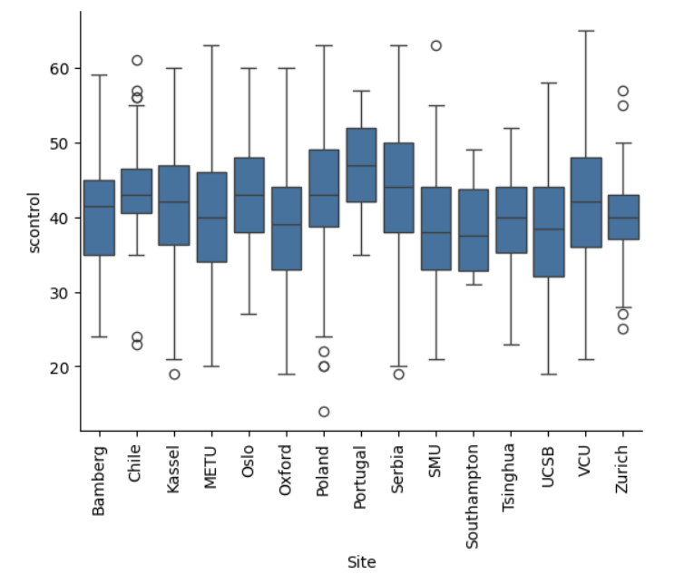
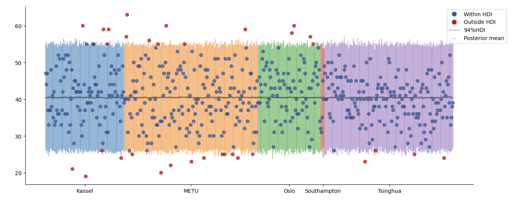
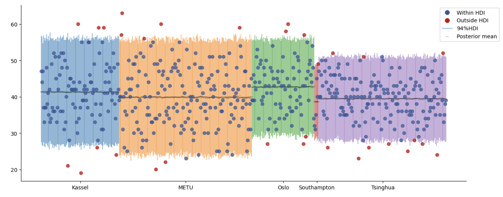
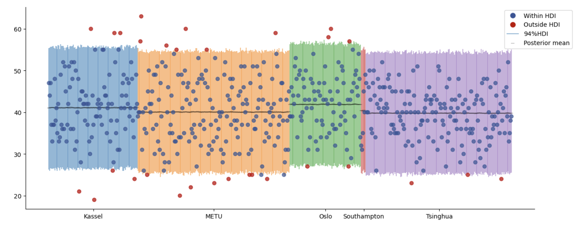

# 开放式练习

在本次的练习中，层级数据表现为来自多个被试的自我控制分数，你可以选择完善完全池化、非池化、部分池化模型的练习代码，也可以选择使用之前介绍过的bambi模型构建分层模型，并思考分层模型带来的收缩效应 (shrinkake)。

🔔 针对Bambi构建分层模型的提示：

1. 使用部分池化中的第一种公式构建分层模型时，提示：可使用`scontrol ~ 0 + (1|Site)`构建模型。

2. 使用`az.plot_forest`绘制被试参数森林图。

> 数据来源: Hu, C.-P. et al. (2018). Raw data from the Human Penguin Project. Open Science Framework. https://doi.org/10.17605/OSF.IO/H52D3
> 自我控制量表来源：Tangney, J. P., Baumeister, R. F. & Boone, A. L. High self-control predicts good adjustment, less pathology, better grades, and interpersonal success. J. Pers. 72, 271–324 (2004).

```python
# 导入 pymc 模型包，和 arviz 等分析工具 
import pymc as pm
import arviz as az
import seaborn as sns
import scipy.stats as st
import numpy as np
import matplotlib.pyplot as plt
import xarray as xr
import pandas as pd
import ipywidgets
import bambi as bmb

# 忽略不必要的警告
import warnings
warnings.filterwarnings("ignore")
```

```python
# 通过 pd.read_csv 加载数据 Data_Sum_HPP_Multi_Site_Share.csv
try:
  df_raw = pd.read_csv('/home/mw/input/bayes3797/Data_Sum_HPP_Multi_Site_Share.csv')
except:
  df_raw = pd.read_csv('data/Data_Sum_HPP_Multi_Site_Share.csv')

df_raw[["Site","scontrol"]]
```

**数据可视化**

将所有被试的自我控制分数进行可视化，可以发现：

- 有的组存在较多极端值

- 组与组之间的均值不同

```python
sns.boxplot(data=df_raw,
            x="Site",
            y="scontrol")

plt.xticks(rotation=90) 
sns.despine()
plt.show()
```



```python
# 选取5个被试
first5_site = ['Southampton','METU','Kassel','Tsinghua','Oslo']
df_first5 = df_raw.query("Site in @first5_site")

#为被试生成索引，为被试生成索引
df_first5["site_idx"] = pd.factorize(df_first5.Site)[0]
df_first5["obs_id"] = range(len(df_first5))

#设置索引，方便之后调用数据
df_first5.set_index(['Site','obs_id'],inplace=True,drop=False)
df_first5.head(10)
```

**模型定义及MCMC采样**

$$
Y_{ij}|\mu,\sigma \sim N(\mu,\sigma^2)\\
\mu \sim N(0,50^2)\\
\sigma \sim Exp(1)
$$

根据公式使用 pymc 定义模型：

```python
##--------------------------------------------------
#      提示：对...中的内容进行修改
#---------------------------------------------------

with pm.Model() as complete_pooled_model:

    #定义beta_0
    mu = pm.Normal("mu", mu=..., sigma=...)  
    #定义sigma                  
    sigma = pm.Exponential(...)       

    #定义似然：预测值y符合N(mu, sigma)分布；传入实际数据y 自我控制水平 df_first5.scontrol

    likelihood = pm.Normal(...)   

    # 进行采样，默认为 chains=4, samples=1000,burn=1000
    complete_trace = pm.sample(random_seed=84735)
```

```python
az.plot_trace(complete_trace,
              compact=False,
              figsize=(15,6))
az.summary(complete_trace)
```

```python
##--------------------------------------------------
#      提示：对...中的内容进行修改
#---------------------------------------------------

# 进行后验预测
complete_ppc = pm.sample_posterior_predictive(...)
```

```python
# 定义函数，计算 95%hdi
def ppc_sum(ppc, data):
    
    hdi_sum = az.summary(ppc, hdi_prob=0.95)
    hdi_sum["obs_id"] = data["obs_id"].values
    hdi_sum["y"] = data["scontrol"].values
    hdi_sum["site"] = data["Site"].values

    return hdi_sum

# 计算后验预测的 95%hdi
complete_hdi_sum = ppc_sum(ppc = complete_ppc, data=df_first5)
complete_hdi_sum
```

**定义绘图函数**

```python
# 定义函数绘制超出 95%hdi 的点
from matplotlib.lines import Line2D

def ppc_plot(hdi_sum):
    fig, ax =  plt.subplots(figsize=(15,6))

    #生成颜色条件，根据被试生成不同的颜色（可信区间）
    unique_sites = hdi_sum["site"].unique()
    conditions=[]
    colors=[]
    for i, site in enumerate(unique_sites):
        condition = hdi_sum["site"] == site
        conditions.append(condition)
        color = f"C{i}"
        colors.append(color)
        
    hdi_colors = np.select(conditions,colors)
    #绘制94%的可信区间
    HDI = ax.vlines(hdi_sum["obs_id"], 
            hdi_sum["hdi_2.5%"], hdi_sum["hdi_97.5%"], 
            color=hdi_colors, 
            alpha=0.5,
            label="94% HDI")
    #绘制后验预测均值
    pos_mean = ax.scatter(hdi_sum["obs_id"], hdi_sum["mean"],
            marker="_",
            c = 'black',
            alpha=0.2,
            zorder = 2,
            label="Posterior mean")
    #根据是否落在可信区间内选择不同的颜色
    colors = np.where((hdi_sum["y"] >= hdi_sum["hdi_2.5%"]) & (hdi_sum["y"] <= hdi_sum["hdi_97.5%"]), 
                    '#2F5597', '#C00000')
    #绘制真实值
    ax.scatter(hdi_sum["obs_id"], hdi_sum["y"],
            c = colors,
            alpha=0.7,
            zorder = 2)
    # 设置图例的颜色、形状、名称
    legend_color = ['#2F5597', '#C00000']
    handles = [plt.Line2D([0], [0], 
                        marker='o', 
                        color='w', 
                        markerfacecolor=color, markersize=10) for color in legend_color]
    handles += [HDI]
    handles += [pos_mean]
    labels = ['Within HDI', 'Outside HDI','94%HDI','Posterior mean']

    plt.legend(handles=handles, 
               labels=labels,
               loc='upper right',
               bbox_to_anchor=(1.08, 1))
    # 设置x轴的刻度，根据每个类别的数量确定刻度位置
    count_per_site = hdi_sum.groupby("site").size().values
    cumulative_count = count_per_site.cumsum()
    xtick = cumulative_count - count_per_site / 2
    plt.xticks(xtick, hdi_sum["site"].unique())

    sns.despine()
```

```python
# 定义函数，计算 95%hdi
def ppc_sum(ppc, data):
    
    hdi_sum = az.summary(ppc, hdi_prob=0.95)
    hdi_sum["obs_id"] = data["obs_id"].values
    hdi_sum["y"] = data["scontrol"].values
    hdi_sum["site"] = data["Site"].values

    return hdi_sum
```

```python
##--------------------------------------------------
#      提示：对...中的内容进行修改
#---------------------------------------------------

# 计算后验预测的 95%hdi
complete_hdi_sum = ppc_sum(...)
complete_hdi_sum
```

由于我们省略了分组信息，假测所有的观测值都来自同一正态分布，因此所有观测值的后验预测均值都是相似的

- 纵坐标为自我控制分数的范围

- 横坐标代表每个观测值的排序

- 横线部分表示每个观测值的后验预测均值

```python
##--------------------------------------------------
#      提示：对...中的内容进行修改
#---------------------------------------------------

ppc_plot(...)
```

🔔答案：

```python
with pm.Model() as complete_pooled_model:

    #定义beta_0
    mu = pm.Normal("mu", mu=0, sigma=50)  
    #定义sigma                  
    sigma = pm.Exponential("sigma", 1)           
    #定义似然：预测值y符合N(mu, sigma)分布；传入实际数据y 自我控制水平 df_first5.scontrol
    likelihood = pm.Normal("y_est", mu=mu, sigma=sigma, observed=df_first5.scontrol)   
    # 进行采样，默认为 chains=4, samples=1000,burn=1000
    complete_trace = pm.sample(random_seed=84735)
```

```python
az.plot_trace(complete_trace,
              compact=False,
              figsize=(15,6))
```

```python
complete_ppc = pm.sample_posterior_predictive(complete_trace,
                                              model=complete_pooled_model)
```

```python
complete_hdi_sum = ppc_sum(ppc = complete_ppc, data=df_first5)
complete_hdi_sum
```

```python
ppc_plot(hdi_sum=complete_hdi_sum)
```




## No pooling 非池化模型

在complete pooled模型中，我们忽略了数据来自不同的被试这一事实

现在我们考虑另外一种情况，我们**假设五个被试分别来自不同的分布，对五个被试进行不同的分析**

- 注意：我们假定，各被试数据之间完全没有关联，不同被试之间彼此独立。

- 从统计上讲，假定各被试之间的参数(例如均值$\mu$)没有关系，或者说是完全异质。

**Group-specific parameters**

- 在完全池化模型中，我们使用了正态分布的参数来自总体层面；

- 在非池化模型中，我们认为正态分布的参数在组与组之间是不同的(group-specific) ---- 可以认为么个被试的数据对应一个独立的正态分布模型


1.使用$\mu_j$来表示每个被试的自我控制分数均值

- 不同被试的$\mu_j$不同

- 同一被试内的个体服从以$\mu_j$为均值的正态分布模型

2.同样，使用$\sigma_j$来表示每个被试内部自我控制分数的变异性

- 和$\mu_j$类似，不同被试的$\sigma_j$不同

- 同一被试内的个体服从以$\sigma_j$为标准差的正态分布模型

则对于被试j内的个体来说，自我控制分数满足：

$$
Y_{ij} | \mu_j, \sigma \sim N(\mu_j, \sigma_j^2) \\
\mu_j \sim N(0, 50^2) \\
\sigma_j \sim \text{Exp}(1)
$$

**模型定义及MCMC采样**

根据公式定义模型：

$$
Y_{ij} | \mu_j, \sigma \sim N(\mu_j, \sigma_j^2) \\
\mu_j \sim N(0, 50^2) \\
\sigma_j \sim \text{Exp}(1)
$$

- 考虑到数据有5个被试，即 j = 1,2,3,4,5。因此，$\mu_j$和$\sigma_j$也有5个值。

- 在pymc中，我们可以通过定义坐标`coords` 来实现 `pm.Normal(..., dims="site")`

- 此外，每个个体的数据来自于某个被试，因此可以通过`pm.MutableData("site", df_first5.site_idx, dims="obs_id")`来定义个体数据 obs_id 和被试 site 之间的映射。

```python
##--------------------------------------------------
#      提示：对...中的内容进行修改
#---------------------------------------------------

coords = {"site": df_first5["Site"].unique(),
          "obs_id": df_first5.obs_id}

with pm.Model(coords=coords) as no_pooled_model:

    #定义mu，指定dims="site"，生成不同的mu 
    mu = pm.Normal(...)                  
    #定义sigma，指定dims="site"，生成不同的sigma
    sigma = pm.Exponential(...)            
    #获得观测值对应的被试映射
    site = pm.MutableData(...) 
    # 定义 likelihood
    likelihood = pm.Normal(...)

    no_pooled_trace = pm.sample(random_seed=84735)
```

**查看后验参数估计**

可以发现，对于每个被试，均有不同的参数值 (包括$\mu和\sigma$)

```python
##--------------------------------------------------
#      提示：对...中的内容进行修改
#---------------------------------------------------

ax = az.plot_trace(
    no_pooled_trace,
    compact=False,
    figsize=(20,50))

az.summary(...)
```

**后验预测分布**

```python
##--------------------------------------------------
#      提示：对...中的内容进行修改
#---------------------------------------------------

no_ppc = pm.sample_posterior_predictive(...)
```

```python
no_hdi_sum = ppc_sum(ppc = no_ppc,
                data=df_first5)
```

```python
##--------------------------------------------------
#      提示：对...中的内容进行修改
#---------------------------------------------------

ppc_plot(...)
```

🔔答案：

```python
##--------------------------------------------------
#      提示：对...中的内容进行修改
#---------------------------------------------------

coords = {"site": df_first5["Site"].unique(),
          "obs_id": df_first5.obs_id.values}

with pm.Model(coords=coords) as no_pooled_model:

    #定义mu，指定dims="site"，生成不同的mu 
    mu = pm.Normal("mu", mu=0, sigma=50, dims="site")                  
    #定义sigma，指定dims="site"，生成不同的sigma
    sigma = pm.Exponential("sigma", 2, dims="site")            
    #获得观测值对应的站点映射
    site = pm.MutableData("site_id", df_first5.site_idx, dims="obs_id") 
    # 定义 likelihood
    likelihood = pm.Normal("y_est", mu=mu[site], sigma=sigma[site], observed=df_first5.scontrol, dims="obs_id")

    no_trace = pm.sample(random_seed=84735)
```

```python
##--------------------------------------------------
#      提示：对...中的内容进行修改
#---------------------------------------------------

ax = az.plot_trace(
    no_trace,
    compact=False,
    figsize=(20,50))
```

```python
##--------------------------------------------------
#      提示：对...中的内容进行修改
#---------------------------------------------------

no_ppc = pm.sample_posterior_predictive(no_trace,
                                        model=no_pooled_model,
                                        random_seed=84735)
```

```python
##--------------------------------------------------
#      提示：对...中的内容进行修改
#---------------------------------------------------

ppc_plot(hdi_sum=no_hdi_sum)
```



## Partial pooling 部分池化模型

层级模型的数学形式：

prior：

$$
\mu \sim N(40,20^2)\\
\sigma_y \sim Exp(1)\\
\sigma_\mu \sim Exp(1)
$$

likelihood:

$$
\mu_j|\mu,\sigma_\mu \overset{ind}{\sim}N(\mu,\sigma_\mu^2)~~~(Layer2:被试水平)
$$

$$
Y_{ij}|\mu_j,\sigma_y \overset{ind}{\sim}N(\mu_j,\sigma_y^2)~~~(Layer1:试次水平)
$$


- 使用$\mu$来表示总体的Y(global average)，即总体而言，自我控制分数的均值

- 使用$\sigma_\mu$来表示组与组之间在Y均值上的变异性

- 使用$\sigma_y$来表示每个组内部Y的变异性（这里我们假设每个组内部的变异性相同）

- Layer2中使用$\mu_j$来表示每个组Y的均值，而$\mu_j$服从$N(\mu,\sigma_\mu^2)$，这两个参数是从上一层得到的

- Layer3中使用$Y_{ij}$来表示组内每个个体的Y，而$Y_{ij}$服从$N(\mu_j,\sigma_y^2)$，这两个参数是从上一层级得到的

**模型定义及MCMC采样**

根据公式定义模型：

prior：

$$
\mu \sim N(40,20^2)\\
\sigma_y \sim Exp(1)\\
\sigma_\mu \sim Exp(1)
$$

likelihood:

$$
\mu_j|\mu,\sigma_\mu \overset{ind}{\sim}N(\mu,\sigma_\mu^2)~~~(Layer2:被试水平)
$$

$$
Y_{ij}|\mu_j,\sigma_y \overset{ind}{\sim}N(\mu_j,\sigma_y^2)~~~(Layer1:试次水平)
$$

- 相对于非池化模型。部分池化模型的关键在于定义，被试参数在总体上的变异，即`mu = pm.Normal("mu", mu=hyper_mu, sigma=var_mu, dims="site")`

- 其次，是相似于非池化模型，个体数据在不同被试分布上的变异`pm.Normal("y_est", mu=mu[site], sigma=var_y, observed=df_first5.scontrol, dims="obs_id")`

```python
##--------------------------------------------------
#      提示：对...中的内容进行修改
#---------------------------------------------------


with pm.Model(coords=coords) as partial_pooled_model:
    # Hyperpriors,定义全局参数
    var_y = pm.Exponential(...)
    var_mu = pm.Exponential(...)
    hyper_mu = pm.Normal(...)
    # 定义被试参数
    mu = pm.Normal(...)
    #获得观测值对应的被试映射
    site = pm.MutableData(...)
    # 定义 likelihood
    likelihood = pm.Normal(...)

    partial_trace = pm.sample(draws=5000,                   # 使用mcmc方法进行采样，draws为采样次数
                                tune=1000,                    # tune为调整采样策略的次数，可以决定这些结果是否要被保留
                                chains=4,                     # 链数
                                discard_tuned_samples= True,  # tune的结果将在采样结束后被丢弃
                                random_seed=84735)
```

**查看后验参数估计**

```python
##--------------------------------------------------
#      提示：对...中的内容进行修改
#---------------------------------------------------

az.summary(...)
```

```python
##--------------------------------------------------
#      提示：对...中的内容进行修改
#---------------------------------------------------

with partial_pooled_model:
    az.plot_trace(partial_trace,
                  compact=False,
                  figsize=(20,40))
```

**计算组间组内变异和相关性**

```python
##--------------------------------------------------
#      提示：对...中的内容进行修改
#---------------------------------------------------

# 提取组间和组内变异
partial_para_sum = az.summary(partial_trace)
between_sd = partial_para_sum.loc[...]
within_sd = partial_para_sum.loc[...]

# 计算变异占比
var = between_sd**2 + within_sd**2
print("被组间方差所解释的部分：", between_sd**2/var)
print("被组内方差所解释的部分：", within_sd**2/var)
print("组内相关：",between_sd**2/var)
```

**后验预测分布**

可以看到相比于非池化模型，在层级模型中不同组的后验预测可信区间的长度、后验预测均值都更为接近

```python
##--------------------------------------------------
#      提示：对...中的内容进行修改
#---------------------------------------------------

partial_ppc = pm.sample_posterior_predictive(...,
                                            model=...)
partial_hdi_sum = ppc_sum(ppc=...,
                  data=...)
```

```python
##--------------------------------------------------
#      提示：对...中的内容进行修改
#---------------------------------------------------

ppc_plot(hdi_sum=...)
```

```python
##--------------------------------------------------
#      提示：对...中的内容进行修改
#---------------------------------------------------

az.summary(...)
```

🔔答案：

```python
##--------------------------------------------------
#      提示：对...中的内容进行修改
#---------------------------------------------------


with pm.Model(coords=coords) as partial_pooled_model:
    # Hyperpriors,定义全局参数
    var_y = pm.Exponential("within_variability", 1)
    var_mu = pm.Exponential("between_variability", 1)
    hyper_mu = pm.Normal("hyper_mu", mu=40, sigma=20)
    # 定义站点参数
    mu = pm.Normal("mu", mu=hyper_mu, sigma=var_mu, dims="site")
    #获得观测值对应的站点映射
    site = pm.MutableData("site_id", df_first5.site_idx, dims="obs_id")
    # 定义 likelihood
    likelihood = pm.Normal("y_est", mu=mu[site], sigma=var_y, observed=df_first5.scontrol, dims="obs_id")

    partial_trace = pm.sample(draws=5000,                   # 使用mcmc方法进行采样，draws为采样次数
                                tune=1000,                    # tune为调整采样策略的次数，可以决定这些结果是否要被保留
                                chains=4,                     # 链数
                                discard_tuned_samples= True,  # tune的结果将在采样结束后被丢弃
                                random_seed=84735)
```

```python
##--------------------------------------------------
#      提示：对...中的内容进行修改
#---------------------------------------------------

az.summary(partial_trace)
```

```python
##--------------------------------------------------
#      提示：对...中的内容进行修改
#---------------------------------------------------

az.plot_trace(partial_trace,
                compact=False,
                figsize=(20,40))
```

```python
##--------------------------------------------------
#      提示：对...中的内容进行修改
#---------------------------------------------------

# 提取组间和组内变异
partial_para_sum = az.summary(partial_trace)
between_sd = partial_para_sum.loc["between_variability","mean"]
within_sd = partial_para_sum.loc["within_variability","mean"]
# 计算变异占比
var = between_sd**2 + within_sd**2
print("被组间方差所解释的部分：", between_sd**2/var)
print("被组内方差所解释的部分：", within_sd**2/var)
print("组内相关：",between_sd**2/var)
```

```python
##--------------------------------------------------
#      提示：对...中的内容进行修改
#---------------------------------------------------
partial_ppc = pm.sample_posterior_predictive(partial_trace,
                                            model=partial_pooled_model,
                                            random_seed = 84735
                                            )
```

```python
##--------------------------------------------------
#      提示：对...中的内容进行修改
#---------------------------------------------------

ppc_plot(hdi_sum=partial_hdi_sum)
```

