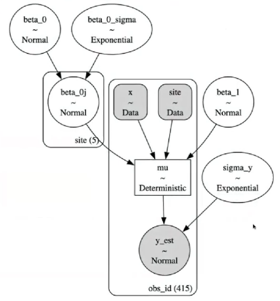
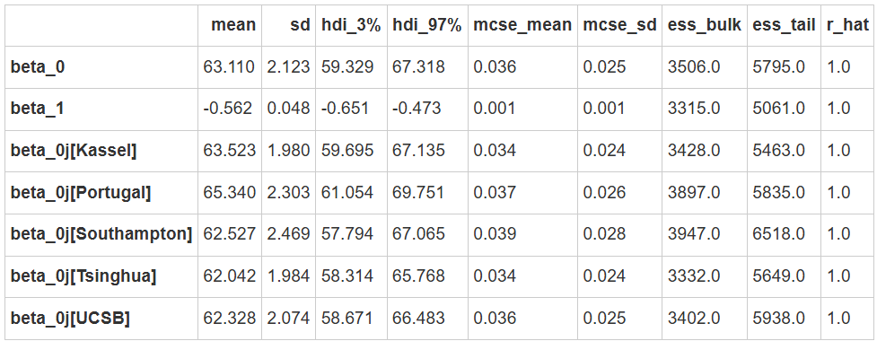
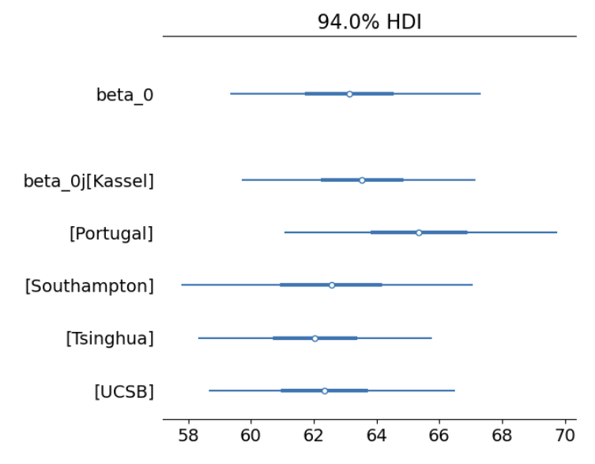

# Partial pooling & hierarchical model

***完全池化模型的局限：***

- 完全池化 (complete pooling) 模型假设所有站点下回归模型的截距($\beta_0$)和斜率($\beta_1$)都相同，没有考虑到不同站点下回归模型的截距($\beta_0$)和斜率($\beta_1$)都可能发生变化的情况。

而在上节课的学习中，我们知道部分池化 (partial pooling) 模型可以解决这一问题。

🤔 问题在于：如何将部分池化方法应用于回归模型？


- $j$来表示站点，$j \in \{ 1,2,...,5\}$

- $i$来表示站点内部的每一个数据，$i \in \{1,2,...,n_i\}$

- 每一个被试的数据可以表示为$Y_{ij}$，表示站点$j$内的第$i$个被试的自我控制分数观测值

$$
(Y_{11},Y_{21},...Y_{n_11}),....(Y_{15},Y_{25},...Y_{n_55})
$$

接下来将会介绍3种不同情况下的部分池化模型，以考虑回归模型的截距和斜率如何随着站点进行变化：

## Model1: Hierarchical model with varying intercepts（变化截距模型）

- 相较于没有自变量的分层模型，构建包含自变量的分层模型的关键在于区分 参数($\beta$) 和 分层(layer) 的关系。

**prior**

$$
\beta_0 \sim N(0,50^2)\\
\beta_1 \sim N(0,5^2)\\
\sigma_y \sim Exp(1)\\
\sigma_0 \sim Exp(1)
$$

**likelihood**

$$
\beta_{0j}|\beta_0,\sigma_0 \overset{ind}{\sim}N(\beta_0,\sigma_0^2)~~~~~~~~~~~~~~~~~~~~~~~~~~~~~~~~~~~~~~~~~~~~~~~~~~~Layer2:全局水平（表示截距在站点间的变化）
$$

$$
Y_{ij}|\beta_{0j},\beta_1,\sigma_y \sim N(\mu_{ij},\sigma_y^2)~with~~\mu_{ij}=\beta_{0j}+\beta_1X_{ij}~~~Layer1:被试水平（表示每个站点内的线性模型）
$$

***Layer 1: Variability within Site***

1.自我控制与压力之间的关系在被试内有什么不同

$$
Y_{ij}|\beta_{0j},\beta_1,\sigma_y \sim N(\mu_{ij},\sigma_y^2)~with~~\mu_{ij}=\beta_{0j}+\beta_1X_{ij}
$$

- 使用$i$表示每个站点内的第$i$个被试的自我控制分数观测值

- 对于每一个被试而言，其自我控制分数服从以$\mu_{ij}$为均值，$\sigma_y$为标准差的正态分布

- 而$\mu_{ij}$由参数$\beta_{0j},\beta_1$决定
  - 其中，$\beta_{0,j}$在组与组之间不同(group-specific)
  - $\beta_1和\sigma_y$则是相同的(global)

***Layer 2: Variability between Site***

2.自我控制与压力之间的线性关系在站点间有什么不同

- 自我控制与压力之间的线性关系由截距和斜率两方面构成

- Model1假设，在不同站点之间，截距是变化的

- 假设截距的基线为$\beta_0$，不同站点间的组间差异为$\sigma_0$，则每个站点的截距可以表示为：

$$
\beta_{0j}|\beta_0,\sigma_0 \overset{ind}{\sim}N(\beta_0,\sigma_0^2)
$$

***Global priors***

3.最后，全局参数也需要设置先验，包括$\beta_0,\beta_1,\sigma_0$

$$
\beta_0 \sim N(m_0,s_0^2)\\
\beta_1 \sim N(m_1,s_1^2)\\
\sigma_y \sim Exp(l_y)\\
\sigma_0 \sim Exp(l_0)
$$

**模型定义与采样**

- 这里将上述两种定义方式均转换为pymc代码，并比较两种定义方式下MCMC采样结果的差异

- 首先，设定总体的参数$\beta_0,\beta_1$
  - 由于$\beta_{0j}$在不同站点间不同，因此设定总体参数$\sigma_0$并假设每个站点$\beta_{0j}\sim N(\beta_0,\sigma_0)$
  - 在另一种定义方式下，将$\beta_{0j}$视为$\beta_0与b_{0j}$的组合
  - 之后，通过线性公式生成$\mu=\beta_{0j}+\beta_1*x$
  - 最后，个体层面的数据$y服从N(\mu,\sigma_y)$，其中$\sigma_y$为组内变异

```python
# 定义函数来构建和采样模型
def run_var_inter_model():

    #定义数据坐标，包括站点和观测索引
    coords = {"site": df_first5["Site"].unique(),
            "obs_id": df_first5.obs_id}

    with pm.Model(coords=coords) as var_inter_model:
        #定义全局参数
        beta_0 = pm.Normal("beta_0", mu=40, sigma=20)
        sigma_beta0 = pm.Exponential("sigma_beta0", 1)
        beta_1 = pm.Normal("beta_1", mu=0, sigma=5)
        sigma_y = pm.Exponential("sigma_y", 1) 

        #传入自变量、获得观测值对应的站点映射
        x = pm.MutableData("x", df_first5.stress, dims="obs_id")
        site = pm.MutableData("site", df_first5.site_idx, dims="obs_id") 
        
        #模型定义
        beta_0j = pm.Normal("beta_0j", mu=beta_0, sigma=sigma_beta0, dims="site")

        #线性关系
        mu = pm.Deterministic("mu", beta_0j[site]+beta_1*x, dims="obs_id")

        # 定义 likelihood
        likelihood = pm.Normal("y_est", mu=mu, sigma=sigma_y, observed=df_first5.scontrol, dims="obs_id")

        var_inter_trace = pm.sample(draws=5000,           # 使用mcmc方法进行采样，draws为采样次数
                            tune=1000,                    # tune为调整采样策略的次数，可以决定这些结果是否要被保留
                            chains=4,                     # 链数
                            discard_tuned_samples= True,  # tune的结果将在采样结束后被丢弃
                            random_seed=84735,
                            target_accept=0.99)
    
    return var_inter_model, var_inter_trace
```

```python
# 注意，以下代码可能运行5分钟左右

var_inter_model, var_inter_trace = run_var_inter_model()
```

```python
pm.model_to_graphviz(var_inter_model)
```



**先验预测检查**

```python
var_inter_prior = pm.sample_prior_predictive(samples=500,
                                            model=var_inter_model,
                                            random_seed=84735)
```

```python
# 定义绘制先验预测回归线的函数，其逻辑与绘制后验预测回归线相同
def plot_prior(prior,group_index):
    # 定义画布，根据站点数量定义画布的列数
    fig, ax = plt.subplots(1,len(df_first5["Site"].unique()), 
                        sharex=True,
                        sharey=True,
                        figsize=(20,5))
    # 根据站点数来分别绘图
    #需要的数据有原始数据中的自变量，每一个因变量的先验预测均值
    # 这些数据都储存在先验预测采样结果中，也就是这里所用的prior
    for i, group in enumerate(df_first5["Site"].unique()): 
        #绘制回归线
        ax[i].plot(prior.constant_data["x"].sel(obs_id = group_index[f"{group}"]),
                prior.prior["mu"].sel(obs_id = group_index[f"{group}"]).stack(sample=("chain","draw")),
                c='gray',
                alpha=0.5)
        ax[i].set_title(f"{group}")
    fig.text(0.5, 0, 'Stress', ha='center', va='center', fontsize=12)
    # 生成纵坐标名称
    fig.text(0.08, 0.5, 'Self control', ha='center', va='center', rotation='vertical', fontsize=12)
    # 生成标题
    plt.suptitle("Prior regression models", fontsize=15, y=1)
        
    sns.despine()
```

```python
plot_prior(prior=var_inter_prior,
           group_index=first5_index)
```


- 可以看出，先验预测范围是非常广的，能够覆盖所有可能性。当研究者缺乏明确的直觉或经验时，这种比较广的先验也是可用的。

**MCMC采样&后验参数估计**

```python
# ~ 和filter_vars="like" 表示在显示结果时去除掉包含这些字符的变量
var_inter_para = az.summary(var_inter_trace,
           var_names=["~mu","~_sigma","~_offset","~sigma_"],
           filter_vars="like")
var_inter_para
```



- 可以看到5条回归线的斜率都是一致的，$\beta_1=-0.56$

- 总体层面的截距$\beta_0=63.11$

- 但不同站点的截距$\beta_{0j}[...]$有所不同

```python
az.plot_forest(var_inter_trace,
           var_names=["~mu", "~sigma", "~offset", "~beta_1"],
           filter_vars="like",
           combined = True)
```



- 从图中可以看出，不同站点的截距不仅在均值上存在差异，变异性也有所不同。

**后验预测回归线**

```python
#定义函数，绘制不同站点下的后验预测回归线
def plot_partial_regression(data, trace, group_index):
    # 定义画布，根据站点数量定义画布的列数
    fig, ax = plt.subplots(1,len(data["Site"].unique()), 
                       sharex=True,
                       sharey=True,
                       figsize=(15,5))
    
    # 根据站点数来分别绘图
    # 需要的数据有原始数据，每一个因变量的后验预测均值
    # 这些数据都储存在后验参数采样结果中，也就是这里所用的trace
    for i, group in enumerate(data["Site"].unique()):
        #绘制真实数据的散点图
        x = trace.constant_data.x.sel(obs_id = group_index[f"{group}"])
        y = trace.observed_data.y_est.sel(obs_id = group_index[f"{group}"])
        mu = trace.posterior.mu.sel(obs_id = group_index[f"{group}"])
        ax[i].scatter(x, y,
                color=f"C{i}",
                alpha=0.5)
        #绘制回归线
        ax[i].plot(x, mu.stack(sample=("chain","draw")).mean(dim="sample"),
                color=f"C{i}",
                alpha=0.5)
        ax[i].set_title(f"Intercept: {var_inter_para.loc[f'beta_0j[{group}]']['mean']}", fontsize=12)
        #绘制预测值95%HDI
        az.plot_hdi(
            x, mu,
            hdi_prob=0.95,
            fill_kwargs={"alpha": 0.25, "linewidth": 0},
            color=f"C{i}",
            ax=ax[i])
        
    # 生成横坐标名称
    fig.text(0.5, 0, 'Stress', ha='center', va='center', fontsize=12)
    # 生成纵坐标名称
    fig.text(0.08, 0.5, 'Self control', ha='center', va='center', rotation='vertical', fontsize=12)
    # 生成标题
    plt.suptitle("Posterior regression models(varing intercept)", fontsize=15, y=1.05)
        
    sns.despine()
```

```python
plot_partial_regression(data=df_first5,
                trace=var_inter_trace,
                group_index=first5_index)
```


- 5条回归线的斜率基本相同，但将每条回归线延伸开来，与y轴相交的截距会有所不同。

**组间方差与组内方差**

- 在这个模型定义中，组间方差来自beta_0_offset，组内方差来自sigma_y

- 结果发现：组间变异 (0.028) 小于组内变异 (0.971)，表明组内相关性低。

```python
def calculate_var_odds(trace):
    # 提取组间和组内变异
    para_sum = az.summary(trace,
                        var_names=["mu","sigma_"],
                        filter_vars="like",
                        kind="stats"
                        )
    individual_par = para_sum.filter(like='mu', axis=0)["mean"]
    # 计算组间方差
    individual_par - individual_par.mean()
    normal_par = (individual_par - individual_par.mean()) / individual_par.std()
    tmp_df = df_first5.copy()
    tmp_df["mu"] = normal_par.values
    group_par = tmp_df.groupby("site_idx").mu.mean()
    between_sd = (group_par**2).sum()
    # 计算组内方差
    within_sd = para_sum.loc['sigma_y','mean']**2
    # 计算变异占比
    var = between_sd + within_sd
    print("被组间方差所解释的部分：", between_sd/var)
    print("被组内方差所解释的部分：", within_sd/var)
    print("组内相关：",between_sd/var)

calculate_var_odds(var_inter_trace)
```
被组间方差所解释的部分： 0.028661409760697212
被组内方差所解释的部分： 0.9713385902393027
组内相关： 0.028661409760697212