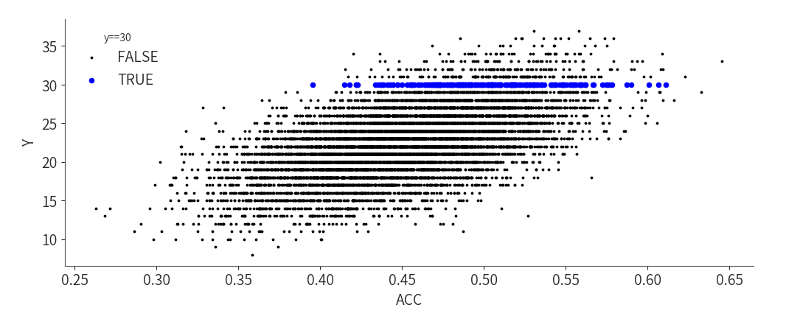
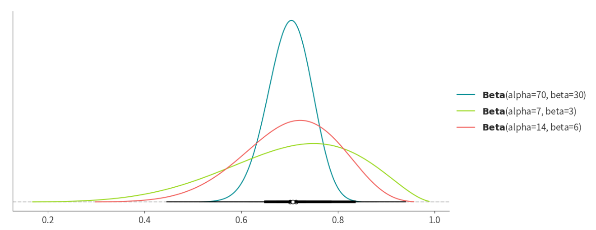

# Part 4: Beta-Binomial model and simulation

&emsp;&emsp;这个部分的主要目的就是通过代码的模拟帮助大家看到这个过程是如何发生的。大家可以逐渐通过了解代码的含义，然后尝试着将它运用到新的场景。并且，课程最后会有相应的小练习，大家可以通过完成小练习来学习如何在python里使用一些基本的数据操作和数据处理的小技巧。

## Beta-Binomial model的一般数学形式

在前一节中，我们对随机点运动任务的正确率ACC建立了基本、更加完整的Beta-Binomial模型。

- 我们现在假设了一个特定的Beta(45,55)先验分布和特定的正确判断次数（正确次数： Y = 30，总试次： n = 50）。
- 这只是Beta-Binomial模型的一个特例。 实际上 Beta 模型可以适用于任何参数范围在[0,1]的场景。
- 例如，硬币为正面的倾向，可重复研究的比率或是疫苗的有效率。

<center>

$ Y|ACC\sim Bin(n,ACC) $

$ ACC\sim Beta(α,β) $
</center>

无论是哪种情况，在观察到 n 次时间中有$ Y=y $次目标事件后，ACC的后验分布可以用Beta模型来描述，反映了先验（通过$ α和β $）和数据（通过$ y和n $）的影响：

<center>

$ ACC|(Y=y)\sim Beta(α+y,β+n-y) $
</center>

***需要注意的是：后验与先验是相同的概率模型，只是参数不同。***

- 在这个例子中，Beta($ α,β $)模型是对应数据模型的$ Bin(n,ACC) $的共轭先验(conjugate prior)。
- 如果$ f(ACC)是L(ACC|y) $的共轭先验，后验$ f(ACC|y)\propto f(ACC)L(ACC|y) $与先验来自相同的模型族。
- 我们将在第五次课详细介绍共轭先验的相关知识。

**代码实现**

让我们模拟正确率ACC的后验模型。

- 首先，我们从Beta(45,55)先验中模拟10,000个ACC值
- 然后, 使用从每个ACC值中模拟Bin(50,ACC)的潜在正确判断次数Y：
模拟结果：10,000对ACC和y值的模拟数据

```python
# 导入数据加载和处理包：pandas
import pandas as pd
# 导入数字和向量处理包：numpy
import numpy as np
# 导入基本绘图工具：matplotlib
import matplotlib.pyplot as plt

# 设置随机种子，以便后续可以重复结果
np.random.seed(84735)

# 模拟 10000 次数据
king_sim = pd.DataFrame({'ACC': np.random.beta(45, 55, size=10000)})  # 从Beta(45,55)先验中模拟10,000个ACC值
king_sim['y'] = np.random.binomial(n=50, p=king_sim['ACC'])       # 从每个ACC值中模拟Bin(50,ACC)的潜在正确判断次数Y

# 显示部分数据
king_sim.head()
```

通过散点图观察以上数据的关系:

- 黑色点表示正确次数Y≠30的部分。
- 蓝色点表示正确次数Y=30的部分。

```python
# 绘制散点图：正确次数 (Y!=30)部分，用黑色表示
plt.scatter(king_sim['ACC'][king_sim['y']!=30], 
            king_sim['y'][king_sim['y']!=30], 
            c='black', s = 3,
            label='FALSE')
# 绘制散点图：正确次数 (Y=30)部分，用蓝色表示
plt.scatter(king_sim['ACC'][king_sim['y']==30],
            king_sim['y'][king_sim['y']==30],
            c='b', s = 20, 
            label='TRUE')

# 显示图片
plt.legend(title = "y==30")
plt.xlabel('ACC')
plt.ylabel('Y')
plt.show()
```



当我们仅关注与我们的Y = 30正确次数匹配的对时，剩下的ACC值的很好地逼近了后验模型Beta(75,75)：

```python
# 导入绘图工具 seaborn 为 sns
import seaborn as sns

# 从模拟数据中筛选出 y 值为 30 的样本，生成对应的后验分布。
king_posterior = king_sim[king_sim['y'] == 30]

# 绘制分布图：概率密度+柱状图
sns.displot(king_posterior['ACC'], kde=True)
plt.xlabel('ACC')
plt.ylabel('Density')
plt.show()
```


同时绘制出先验、似然和后验:

```python
# 导入统计建模工具包 scipy.stats 为 st
import scipy.stats as st 

# 设置 x 轴范围 [0,1]
x = np.linspace(0,1,10000)
# 设置 Beta 分布参数
a,b = 45,55

# 形成先验分布 
prior = st.beta.pdf(x,a,b)/np.sum(st.beta.pdf(x,a,b))

# 形成似然
k = 30                  # k 代表正确率为1的次数
n = 50                  # n 代表总次数
likelihood = st.binom.pmf(k,n,x)

# 计算后验
unnorm_posterior = prior * likelihood                  # 计算分子
posterior = unnorm_posterior/np.sum(unnorm_posterior)  # 结合分母进行计算
likelihood = likelihood /np.sum(likelihood)            # 为了方便可视化，对似然进行类似后验的归一化操作 

# 绘图
plt.plot(x,posterior, color="#009e74", alpha=0.5, label="posterior")
plt.plot(x,likelihood, color="#0071b2", alpha=0.5, label="likelihood")
plt.plot(x,prior, color="#f0e442", alpha=0.5, label="prior")
plt.legend()
plt.xlabel("ACC")
plt.fill_between(x, prior, color="#f0e442", alpha=0.5)
plt.fill_between(x, likelihood, color="#0071b2", alpha=0.5)
plt.fill_between(x, posterior, color="#009e74", alpha=0.5)
plt.xlim([0,1])
plt.show()
```


--------------------

我们还可以使用模拟样本近似后验特征，例如随机点运动任务正确率的均值和标准差。

- 结果与上面计算的理论值非常相似，$ E(ACC|Y=30)=0.5024和SD(ACC|Y=30)=0.0394 $
- 在解释这些模拟结果时，“近似”是一个关键词。由于我们10,000次模拟中只有219次与观测到的Y = 30数据匹配，通过将原始模拟次数从10,000增加到50,000，可以改善这个近似值：

```python
print(
  "近似值：", 
  "均值，",
  king_posterior['ACC'].mean(), 
  "。标准差，",
  king_posterior['ACC'].std()
)
```
近似值： 均值， 0.5024772340319912 。标准差， 0.0394983348061003

```python
print(f"10,000次模拟中, {king_posterior.shape[0]}次与观测到的Y = 30数据匹配")

# 模拟新的数据
size = 50000 # 不同于之前的 10000
king_sim2 = pd.DataFrame({'ACC': np.random.beta(45, 55, size=size)})
king_sim2['y'] = np.random.binomial(n=50, p=king_sim2['ACC'])
king_posterior2 = king_sim2[king_sim2['y'] == 30]
print(f"50,000次模拟中, {king_posterior2.shape[0]}次与观测到的Y = 30数据匹配")
```
10,000次模拟中, 219次与观测到的Y = 30数据匹配
50,000次模拟中, 1045次与观测到的Y = 30数据匹配

## 总结

&emsp;&emsp;在第3章中，我们对一个真实的现象(随机点运动任务中特定条件下正确判断的能力)，构建了Beta-Binomial模型，并通过数据进行了一次信念更新：
<center>

$ Y|ACC\sim Bin(n,ACC) $
&emsp;&emsp;&emsp;&emsp;&emsp;&emsp;&emsp;&emsp;&emsp;&emsp;&emsp;&emsp;&emsp;&emsp;&emsp;&emsp;&emsp;&emsp;&emsp;&emsp;&emsp;&emsp; $ \Rightarrow ACC|(Y=y) $
$ ACC\sim Beta(α,β) $
&emsp;&emsp;&emsp;&emsp;&emsp;&emsp;&emsp;&emsp;&emsp;&emsp;$ \sim Beta(α+y,β+n-y) $

</center>

- 这个模型反映了贝叶斯分析的四个通用要素:

1、先验模型Beta先验模型可以通过调节参数来反映不同的ACC值在[0,1]范围内的相对先验可能性。
$ f(ACC)=\frac{Γ(α+β)}{Γ(α)Γ(β)}ACC^{α-1}(1-ACC)^{β-1} $

2、数据模型 为了学习ACC,我们收集数据$ Y $，即n次独立试验中成功的次数,其中每次试验正确的概率为ACC。$ Y $对ACC的依赖关系由二项分布$ Bin(n,ACC) $描述。

3、似然函数 在观测到数据$ Y=y $,其中$ y∈ 0,1,...,n$后,ACC的似然函数通过将y代入二项式概率质量函数而获得,它提供了一种机制来比较不同ACC与数据的兼容性:

$ L(ACC|y)=(^n_y)ACC^y(1-ACC)^{n-y}~for~ACC\in [0,1] $

4、后验模型 通过贝叶斯规则,共轭的Beta先验和二项式数据模型结合产生ACC的Beta后验模型。更新的Beta后验参数$ (α+y,β+n-y) $反映了先验的影响(通过α和β)和观测数据的影响(通过y和n)。

$ f(ACC|y)\propto f(ACC)L(ACC|y)\propto ACC^{(a+y)-1}(1-ACC^{(β+n-y)-1}) $

## 练习

- 假设心理学研究中的可重复研究出现的概率为 0.4（这里概率用π表示），请自行选择一个合适的 Beta 分布，模拟10000个$ π $值。
- 请根据$ π $模拟相应的数据$ Y $(可重复研究的数量)，假设总的可重复研究数量n=100。
- 绘制先验分布和后验分布的图像。

## Bonus 1：Beta(70,30)这个先验是怎么选取的?

在回答这个问题之前，我们先来了解一下**Beta分布的集中趋势量数**

需要注意的是，虽然我们可能比较熟悉计算正态分布的均值、众数和标准差；但 Beta 分布的相关统计量的计算有所不同：


> source:https://en.wikipedia.org/wiki/Probability_density_function

**1、平均数(mean)**

- ACC的平均取值

$ E(ACC)=\frac{α}{α+β} $

$ E(ACC)=\int ACC·f(ACC)dACC $

**2、众数(mode)**

- ACC最可能的取值。即，在ACC下，f(ACC)能取到的最大值

$ Mode(ACC)=\frac{α-1}{α+β-2}~~when~ α,β>1 $

$ Mode(ACC)=argmax_{ACC}f(ACC) $

**3、方差(variance)**
- ACC取值的变异性（variability）

$ Var(ACC)=E((ACC-E(ACC))^2)=\int (ACC-E(ACC))^2·f(ACC)dACC $

$ Var(ACC)=\frac{αβ}{(α+β)^2(α+β+1)} $

**4、标准差（standard deviation）**

$ SD(ACC)=\sqrt{Var(ACC)} $

**调整Beta先验**

我们已经知道，在先前的推测中，在 5% 一致性条件下，被试的平均正确率约为 70%。根据这一点，我们可以计算出Beta分布的$ α和β $参数。

$ E(ACC)=\frac{α}{α+β}=0.70 $

重新整理后：

$ α=0.7(α+β) $
$ α≈\frac{7}{3}β $

一个合适的分布中，$ α和β $需要满足的条件如上，我们可以选择 Beta(70,30), Beta(7,3), Beta(14,6)，我们可以通过以下代码来画出这些分布的形状：

```python
import numpy as np
from scipy.stats import beta
import matplotlib.pyplot as plt

fig, ax = plt.subplots(figsize=(13, 5))
pz.Beta(70, 30).plot_pdf(pointinterval=True,ax=ax)
pz.Beta(7, 3).plot_pdf(pointinterval=True,ax=ax)
pz.Beta(14, 6).plot_pdf(pointinterval=True,ax=ax)
plt.tight_layout()
plt.show()
```



如图所示，我们选择ACC∼Beta(70,30)作为先验模型

带入公式，可以计算出先验$ f(ACC) $的pdf、平均数、众数、方差和标准差：

- pdf:

$ f(ACC)=\frac{Γ(100)}{Γ(70)Γ(30)}ACC^{69}(1-ACC)^{29}~for~ACC\in [0,1] $

- 平均数

$ E(ACC)=\frac{70}{70+30}=0.70 $

- 众数

$ Mode(ACC)=\frac{70-1}{70+30-2}=0.6939 $

- 方差

$ Var(ACC)=\frac{70·30}{(70+30)^2(70+30+1)}=0.0021 $

- 标准差

$ SD(ACC)=\sqrt{0.0021}=0.0458 $

## Bonus 2: Beta-Binomial 模型生成的后验仍是Beta分布

**公式推导**

对于ACC的后验模型为Beta(α+y,β+n-y)的推导过程（其中，正确次数为y，总试次为n）

**1、首先写出先验的公式**

$ f(ACC)=\frac{Γ(α+β)}{Γ(α)Γ(β)}ACC^{α-1}(1-ACC)^{β-1} $

$ L(ACC|y)=(^n_y)ACC^y(1-ACC)^{n-y} $

**2、结合先验和似然函数 (暂时忽略分母)，后验概率密度函数可以由贝叶斯定理得到：**

$ f(ACC|y)\propto f(ACC)L(ACC|y)=\frac{Γ(α+β)}{Γ(α)Γ(β)}ACC^{α-1}(1-ACC)^{β-1}·(^n_y)ACC^y(1-ACC)^{n-y}\propto ACC^{(a+y)-1}(1-ACC)^{(β+n-y)-1} $

**3、最后，我们加上归一化因子（分母部分）**

$ f(ACC|y)=\frac{Γ(α+β+n)}{Γ(α+y)Γ(β+n-y)}ACC^{(α+y)-1}(1-ACC)^{(β+n-y)-1} $

我们知道Beta(α,β)的概率密度函数可以写成：

$ Beta(α,β)=\frac{Γ(α+β)}{Γ(α)Γ(β)}ACC^{α-1}(1-ACC)^{β-1}~for~ACC\in[0,1] $

因此，

$ f(ACC|y)=Beta(α+y,β+n-y) $