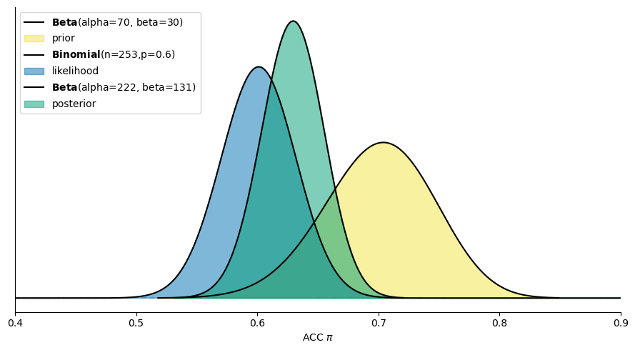

# Different data, different posteriors

在随机点运动任务中，被试正确探测出点的运动方向的取值范围在0-1之间。  

- 回顾上节课，根据(Shooshtari et al., 2019)的心理物理曲线，我们可以计算或预测当随机点的一致性为5%时，个体的正确率约为70%。
  
- 而根据(Evans et al., 2020)的实验结果，我们发现其中一个被试在随机点的一致性为5%时，个体的正确率约为60%。

> Shooshtari, S. V., Sadrabadi, J. E., Azizi, Z., & Ebrahimpour, R. (2019). Confidence representation of perceptual decision by EEG and eye data in a random dot motion task. Neuroscience, 406, 510–527. https://doi.org/10.1016/j.neuroscience.2019.03.031  
> Evans, N. J., Hawkins, G. E., & Brown, S. D. (2020). The role of passing time in decision-making. Journal of Experimental Psychology: Learning, Memory, and Cognition, 46(2), 316–326. https://doi.org/10.1037/xlm0000725 

&emsp;&emsp;在进行随机点运动任务时，我们发现不同的数据会导致不同的后验结果。在这个实验中，被试需要探测随机运动点的方向，其正确率的取值范围在0到1之间。例如，有的被试正确率可能是60%，有的可能是70%。我们假设一批被试的正确率都是60%。

&emsp;&emsp;我们使用的数据是，被试在5%一致性的条件下，其正确率大约是60%。我们的任务是根据这些数据来推断被试真实的正确率，即他们能够正确判断5%一致性的概率。

- 为了解决这个问题，我们需要建立一个清晰的推理框架，即一个完整的贝叶斯模型。首先，我们需要确定一个先验概率分布，这是在没有观察到被试数据之前，我们认为被试在各个正确率上的可能性分布。

```python
# 选取需要的列
data = data[["subject", "percentCoherence", "correct", "RT"]]

# 筛选符合条件的数据
data_subj1 = data.query('subject == 82111 & percentCoherence == 5')

# 打印前 10 条抽取的数据
print("被试 82111 在 5% 一致性正确率数据：", data_subj1.correct.mean())
data_subj1.head(5)
我们可以看到编号为“82111”的被试在253个试次中有152个试次判断为正确，5% 一致性的条件下的正确率约等于60%。
#统计 'binary' 列中各个值的出现次数
data_subj1['correct'].value_counts()
```

## 回顾： Beta(先验)-Binomial(似然) > Beta(后验) 推断

&emsp;&emsp;回顾上节课，我们的先验分布为Beta（70，30），那么编号为“82111”的被试在253个试次中，有152次判断为正确的可能性（这节课中我们假设正确率为 $\pi$ ），这个似然函数可以用**二项分布**来表示：  

$$
Y | \pi  \sim \text{Bin}(n, \pi)  
$$

似然函数为：  

$$
f(y|\pi) = P(Y=y | \pi) = \binom{253}{152} \pi^{152} (1-\pi)^{101}  
$$

这里，我们的正确率 $\pi$ 服从 **Beta** 分布，似然函数服从**二项分布**：  

$$
Y | \pi  \sim \text{Bin}(n, \pi)  
$$

$$
\pi  \sim \text{Beta}(\alpha, \beta)  
$$

从上一节课我们知道，在这种情况下，**后验分布**仍然是 Beta 分布，并且可以表示为：  

$$
\pi | (Y = y) \sim \text{Beta}(\alpha + y, \beta + n - y)  
$$

因此，编号为“82111”的被试在253个试次下，有152次判断为正确的情况时，后验分布可以写为：  

$$
\pi | (Y = 152) \sim \text{Beta}(\alpha + 152, \beta + 101)  
$$

&emsp;&emsp;为了用数学方法表示先验，我们首先定义数据为大写的$Y$。竖线表示条件，即在特定参数 $\pi$ 下，数据Y出现的可能性。我们假设服从二项分布，表示为 $Y∼Binomial(N,π)$ ，其中$N$是试验次数， $π$ 是每次试验成功的概率。

&emsp;&emsp;根据数据分布，我们可以计算似然函数，即在各种 $π$ 取值下，出现当前数据的可能性。我们用  $π$ 表示出现证据的可能性，然后将其带入公式中，得到一个总体的运算公式。根据  $π$ 的不同取值，我们可以得到不同的计算结果。

&emsp;&emsp;在上节课中，我们通过具体例子展示了如何将 $π$ 带入公式。这节课我们将不再重复这个过程。我们知道 $π$ 服从 $\beta$ 分布，似然函数服从二项分布。根据统计公式，我们可以计算后验分布。

&emsp;&emsp;后验分布仍然是一个 $\beta$ 分布，但其参数会有所变化。第一个参数 $\alpha$ 是先验贝塔分布的参数加上正确次数 $Y$ 。例如，如果100次试验中正确了50次，那么 $ Y = 50$ 。

&emsp;&emsp;第二个参数是先验贝塔分布的参数加上未正确次数 $N−Y$。

&emsp;&emsp;在我们讨论的示例中，我们有一个特定的情况，其中贝塔分布的参数是 $
α=70$ 和 $β=30$ 。被试在253次试验中正确判断了152次。因此，后验分布可以直接写成：

后验分布= $Beta(α+y,β+n−y)$

将实际数据代入公式，我们得到：

后验分布= $Beta(70+152,30+101)$

这简化为：

$后验分布=Beta(222,131)$

这里，$\alpha$ 和 $\beta$ 代表先验概率的参数，分别是70和30。通过将观察到的数据（正确次数 $Y=152$ 和总次数 $N=253$）代入，我们得到了更新后的后验分布。


```python
# 导入数字和向量处理包：numpy
import numpy as np
# 导入基本绘图工具：matplotlib
import matplotlib.pyplot as plt
# 导入高级绘图工具 seaborn 为 sns
import seaborn as sns
# 导入概率分布计算和可视化包：preliz
import preliz as pz

def bayesian_analysis_plot(
    alpha, beta, y, n, 
    ax=None, 
    plot_prior=True, 
    plot_likelihood=True, 
    plot_posterior=True, 
    xlabel=r"ACC $\pi$", 
    show_legend=True,
    legend_loc="upper left"):
    """
    该函数绘制先验分布、似然分布和后验分布的 PDF 图示在指定的子图上。
    
    参数:
    - alpha: Beta 分布的 alpha 参数（先验）
    - beta: Beta 分布的 beta 参数（先验）
    - y: 观测数据中的支持次数
    - n: 总样本数
    - ax: 子图对象，在指定子图上绘制图形
    """

    if ax is None:
        ax = plt.gca()

    if plot_prior:
        # 先验分布
        prior = pz.Beta(alpha, beta)
        prior.plot_pdf(color="black", ax=ax, legend="None")
        x_prior = np.linspace(prior.ppf(0.0001), prior.ppf(0.9999), 100)
        ax.fill_between(x_prior, prior.pdf(x_prior), color="#f0e442", alpha=0.5, label="prior")

    if plot_likelihood:
        # 似然分布 (两种写法等价)
        # likelihood = pz.Beta(y,n-y)
        # likelihood.plot_pdf(color="black", ax=ax, legend="None")
        x = np.linspace(0,1,1000)
        likelihood = pz.Binomial(n=n, p=y/n).pdf(x=x*n)
        likelihood = likelihood * n
        ax.plot(x, likelihood, color="black", label=r"$\mathbf{Binomial}$"+rf"(n={n},p={round(y/n,2)})")
        ax.fill_between(x, likelihood, color="#0071b2", alpha=0.5, label="likelihood")

    if plot_posterior:
        # 后验分布
        posterior = pz.Beta(alpha + y, beta + n - y)
        posterior.plot_pdf(color="black", ax=ax, legend="None")
        x_posterior = np.linspace(posterior.ppf(0.0001), posterior.ppf(0.9999), 100)
        ax.fill_between(x_posterior, posterior.pdf(x_posterior), color="#009e74", alpha=0.5, label="posterior")

    if show_legend:
        ax.legend(loc=legend_loc)
    else:
        ax.legend().set_visible(False)

    # 设置图形
    ax.set_xlabel(xlabel)
    sns.despine()
```

<div>

```python
# 创建一个单独的图和轴
fig, ax = plt.subplots(figsize=(9, 5))

# 先验参数 alpha=70, beta=30, 观测数据 y=152, n=253
bayesian_analysis_plot(alpha=70, beta=30, y=152, n=253, ax=ax) 
ax.set_xlim(0.4,0.9)

# 显示图像
plt.tight_layout()
plt.show()
```



上述代码和图片就是计算分布和呈现的结果。在这个图像中你可以找到：

1. **先验分布：** 图像中黄色面积，一个 $\beta$ 分布，其中 $\alpha$ =70 和 $\beta$ = 30

2. **似然：** 浅蓝色面积，一个二项分布，其中 $n=253$ ，$p=0.6$ 。这里的 $p$ 是频率，而不是概率

3. **后验分布：** 绿色面积，参数$\alpha$ 和 $\beta$ 已根据先验和似然算出

&emsp;&emsp;后验分布的参数是通过将观察到的数据（正确次数 $Y=152$ 和总次数 $
N = 253$）代入先验分布的参数计算得出的。具体来说，后验分布的参数为 $α+y$ 和 $β+n−y$ 。

&emsp;&emsp;在后续的课程中，我们会多次看到这个图形。重要的是要理解这些图形所代表的含义。例如，似然函数中的 $P=0.6$ ， 实际上是由观察到的数据计算得出的频率，即 $152/253$ 。

🤔***在看过单个被试的后验分布后，你或许会想，不同的被试的后验分布有何区别？***
<div>
通过贝叶斯公式我们知道，后验的分布主要取决于先验与似然，不同被试的数据将导致不同的似然。  

$$
f(\pi | y) = \frac{f(\pi)L(\pi|y)}{f(y)} \propto f(\pi)L(\pi|y)  
$$

接下来我们将看到，不同的似然对后验分布的影响。

**后验概率实际上是对先验概率和观测数据的一种平衡** 

&emsp;&emsp;我们之前提到，不同的数据会导致不同的后验概率。这里所说的“不同的数据”究竟指的是什么呢？为了更好地理解这一点，我们可以观察一个特殊的情况。探讨这种特殊情况是很有帮助的，因为如果数据差异非常大，人们自然会预期后验概率也会有所不同。

&emsp;&emsp;通过分析特殊情况，我们能够更清楚地看到数据是如何影响后验概率的。例如，如果观测到的数据与先验假设大相径庭，或者数据非常极端，那么后验概率的更新将会非常明显。这种情况下，后验概率会更多地反映新的数据，而不是原来的先验假设。

&emsp;&emsp;因此，当我们说不同的数据会导致不同的后验时，我们是指在极端或显著的数据变化下，后验概率会显著地偏离先验概率，更多地反映新数据的信息。这种更新是贝叶斯统计中的一个核心概念，它允许我们根据新的证据调整我们的信念。

## 不同数据条件下，似然对于后验的影响  

&emsp;&emsp;刚才的例子中我们仅选择了单个被试的数据，现在我们新增一位被试，编号为31727，并且此被试在三个不同的实验区块（block）中进行了实验。

- 为便于表示，在本例中我们将被试在3个block中的数据结果分别命名为a、b、c。

每次block的表现如下：  

- 1个 block（a）：进行了 128 次试次，其中有 77 次（60%）判断为正确。
  
- 2个 block（a+b）：进行了 254 次试次，其中有 152 次（60%）判断为正确。
  
- 3个 block（a+b+c）：进行了 385 次试次，其中有 231 次（60%）判断为正确。

&emsp;&emsp;在开始实验之前，我们对被试（31727）的表现持有一个共同的先验信念，即正确率遵循Beta(70, 30)的分布。  

&emsp;&emsp;尽管被试的正确率比例稳定在60%，但随着数据量的增加，我们预期后验概率会有所不同。如果我们使用相同的先验，并分别在每个block后进行贝叶斯更新，最终得到的后验概率是否会相同？

&emsp;&emsp;在传统的频率主义统计中，我们可能会认为这三个条件下对被试正确率的估计是一样的，都是60%。然而，在贝叶斯统计中，数据量的不同会影响后验概率。

&emsp;&emsp;在贝叶斯数据分析中，我们不仅考虑正确率的比例，还要考虑数据量。即使正确率的比例相同，数据量的增加会导致后验概率的更新，反映出对被试能力更精确的估计。

&emsp;&emsp;我们可以为这三种数据条件写出相应的似然函数。随着数据量的增加，似然函数会变化，反映出对被试正确率的不同信心水平。

&emsp;&emsp;我们将使用被试（31727）的观测数据，分析不同的似然函数，以及它们是如何影响每个block下后验分布的更新。

- **1个 block的情况**: 

在 a 的情况下（128次试次，77次判断为正确），似然函数为：

$$
f(y \mid \pi) = P(Y = 77 \mid \pi) = \binom{128}{77} \pi^{77} (1 - \pi)^{128 - 77}  
$$

即：  

$$
f(y \mid \pi) = \binom{128}{77} \pi^{77} (1 - \pi)^{51}  
$$

- **2个 block的情况**:  

在 a+b 的情况下（254次试次，152次判断为正确），似然函数为：

$$
f(y \mid \pi) = P(Y = 152 \mid \pi) = \binom{254}{152} \pi^{152} (1 - \pi)^{254 - 152}  
$$

即：  

$$
f(y \mid \pi) = \binom{254}{152} \pi^{152} (1 - \pi)^{102}  
$$

- **3个 block的情况**:  

在 a+b+c 下（385次试次，231次判断为正确），似然函数为：
  
$$
f(y \mid \pi) = P(Y = 231 \mid \pi) = \binom{385}{231} \pi^{231} (1 - \pi)^{385 - 231}  
$$

即：  

$$
f(y \mid \pi) = \binom{385}{231} \pi^{231} (1 - \pi)^{154}  
$$

&emsp;&emsp;由于每个block的数据量不同，即使正确率的比例相同，每个block的似然也会有所不同。这是因为二项分布的似然不仅取决于正确率的比例，还取决于试验的总次数。

&emsp;&emsp;如果先验概率相同，但似然不同，那么后验概率也会不同。后验概率是先验概率和似然的组合，因此数据量的变化会导致后验概率的变化。

&emsp;&emsp;我们可以将先验概率和似然函数的图形表示出来，以直观地展示它们如何组合成后验概率。这有助于理解数据量如何影响我们对被试正确率的信念更新：


```python
# 定义先验分布的 alpha 和 beta
alpha = 70
beta = 30

# 根据数据定义不同的二项分布数据 (y, n)
data_list = [(77, 128), (152, 254), (231, 385)]

# 创建一个包含三个子图的画布
fig, axes = plt.subplots(1, 3, figsize=(15, 5), sharex=True, sharey=True)

for i, ax in enumerate(axes):
    bayesian_analysis_plot(alpha=alpha, beta=beta, y=data_list[i][0], n=data_list[i][1], ax=ax, plot_posterior=False) 
    ax.set_xlim(0.4,0.9)

# 显示图形
plt.tight_layout()
plt.show()
```


- 我们可以从图形中观察到：在三种不同条件下，先验概率（用黄色表示）是完全相同的。这表明我们对被试能力的初始信念是一致的。

- 数据（用浅蓝色表示）带来的主要特点是，随着数据量的增加，即使正确率保持不变，数据分布会越来越窄，越来越集中。这说明随着更多的数据被收集，我们对被试能力的估计变得更加精确。

- 随着数据量的增加，后验分布（后验概率的图形表示）也变得越来越窄。这意味着我们对被试正确率的估计随着数据量的增加而变得更加集中和精确。
  

🤔思考时间：  
哪种数据条件下的后验分布受到的影响更大？
