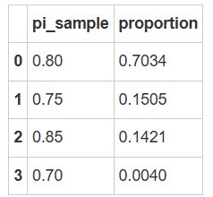
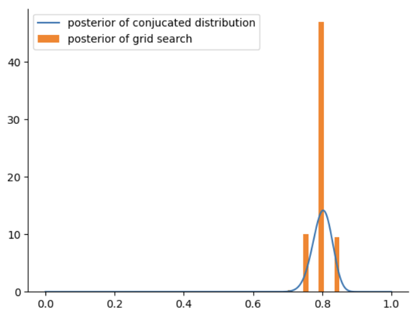
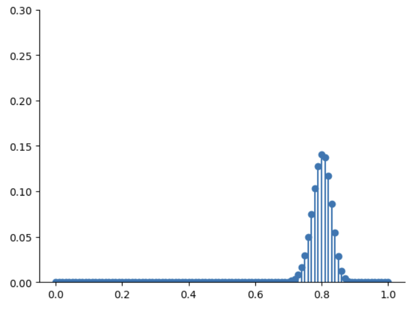
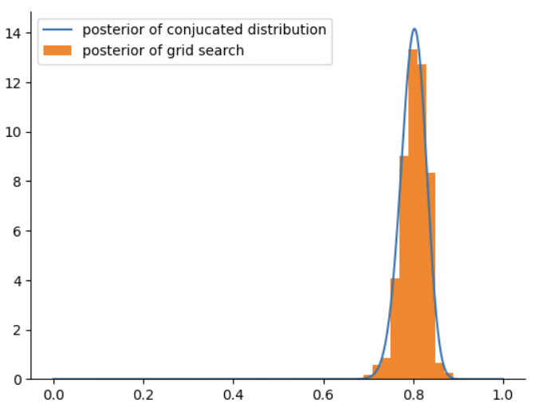
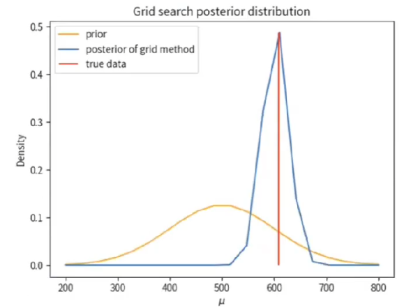
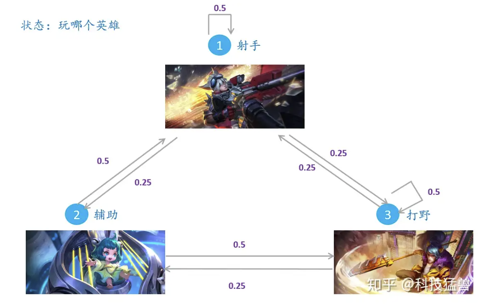
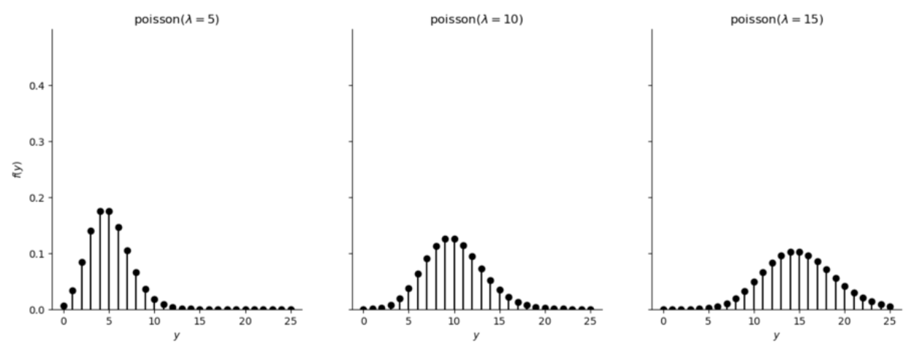

# Grid approximation 网格近似


> - 想象有一张图像(图三)，但你不能完整地看到它。不过你可以从左到右每次取一个这个图像中的一个小格来观察它。
> - 只要格子越细，最后组合在一起就会与完整的图片更近似

在网格近似中，后验分布$f(θ|y)$其实就是完整的图片。我们可以选择有限个$θ$，并观察对应的$f(θ|y)$，以此来近似完整的后验分布。


- 以一个参数为例，网络近似可以分为以下四个步骤：

1.选定一系列离散的$θ$值

2.计算每个$θ$值对应的先验分布$f(θ)$和似然函数$L(θ|y)$

3.对于所有的$θ$值，计算$f(θ)$和$L(θ|y)$二者的乘积并相加，再进行归一化

4.归一化后，根据$θ$值的后验概率分布，随机抽取N个$θ$值

## A Beta-Binomial example

假设先验$\pi$服从Beta分布：

$$
\pi \sim Beta(\alpha=70,\beta=30)
$$

似然函数：

$$
Y|\pi \sim Bin(n,\pi)
$$

- 假设$\pi$反映的是正确率，似然函数反映的则是在某个正确率下，总trial为100次时，正确次数的分布概率情况。

$$
\pi \sim \text{Beta}(70, 30)
$$

$$
Y|\pi \sim \text{Bin}(100, \pi)
$$

- 在观察到$n$次事件中有$Y=y$次目标事件后，$\pi$的后验分布可以用$Beta$模型来描述，反映了先验$（通过\alpha和\beta）$和数据$(通过y和n)$的影响：

$$
\pi | (Y = y) \sim \text{Beta}(\alpha + y, \beta + n - y)
$$

- 假设正确次数为90，我们通过共轭先验的公式，可以直接计算出$Beta$后验分布的两个参数：

$$
Y+\alpha=90+70, \beta+n-Y=30+100-90
$$

$$
\pi|(Y=90)\sim Beta(160,40)
$$

这个结果可以用来对我们使用网络近似的后验进行验证。

## 示例：网络近似估计后验分布

### Step1

首先，我们先在0.5到1这个区间内取一系列的值，总共取11个值，也就是每隔0.05取一个。

$$
\pi \in {0.5,0.55,0.6,0.65,0.7,0.75,0.8,0.85,0.9,0.95,1}
$$

导入需要的包：

```python
import numpy as np
import scipy.stats as st
import matplotlib.pyplot as plt
import seaborn as sns
import pandas as pd
```

从0.5到1之间取出11个值：

```python
pi_grid = np.linspace(0.5, 1, 11)
print("从0.5~1内的连续变量π中取出11个值:", pi_grid)
```

### Step2&3

在每一个$\pi$下，计算先验分布$Beta(70,30)$，与似然函数$Bin(100,\pi)(Y=90)$的乘积，计算总和并进行归一化：

```python
prior = st.beta.pdf(pi_grid, 70, 30)
likelihood = st.binom.pmf(90, 100, pi_grid)
posterior = prior * likelihood / np.sum(prior * likelihood)
```

我们将后验分布可视化出来：

```python
# 使用 plt.stem() 绘制垂直柱状图，表示在 pi_grid 上的 posterior 分布
plt.stem(
    pi_grid,
    posterior,  
    linefmt="black",
    bottom=-1,
)
# 设置 y 轴范围在 0 到 1 之间
plt.ylim(0, 1)  
plt.xlabel("pi_grid")  
plt.ylabel("Posterior")  
# 去除图形的上方和右侧的边框
sns.despine()
```

<center>
</center>

图中每个黑点就是$\pi$的取值，分别计算出后验概率，对他进行归一化，最后就得到了后验分布。但这个分别和我们真正的后验分布还差的很多，因此我们可以进一步进行可视化。

### Step4

- 得到后验结果$(π)$的分布后，从这个分布中抽样10000次，对后验进行可视化。

从上图可以看出，$\pi=0.8$的后验概率显著高于其他点，所以大多数样本会集中在$\pi=0.8$附近。

```python
np.random.seed(84735)

#  从 posterior 分布中抽取 10000 个样本
posterior_sample = np.random.choice(
    pi_grid, 
    size=10000,
    p=posterior,  
    replace=True,
)

# 将抽取的样本存储在 DataFrame 中，列名为 "pi_sample"
posterior_sample = pd.DataFrame(
    {"pi_sample": posterior_sample}
)  

# 对 posterior_sample 中的样本进行计数，并使用 normalize=True 将计数转换为相对频率
posterior_sample.value_counts(
    normalize=True
).reset_index()
```


**抽样结果图示**

抽样结果显示，$π$大多数集中在 0.80 附近，少部分在 0.75 和 0.85 附近。

- 接下来，我们可以将抽样得到的后验分布与理论上的$Beta$分布$Beta(160,40)$进行对比，以检验抽样的准确性。

```python
x_beta = np.linspace(0, 1, 10000)  # 生成10000 个点，范围在 [0, 1] 之间

y_beta = st.beta.pdf(x_beta, 160, 40)  # 生成 Beta(160,40)

# 绘制共轭方法计算得到的后验 beta(160,40)
plt.plot(x_beta, y_beta, label="posterior of conjucated distribution") 

# 绘制网格方法抽样后得到的结果
plt.hist(
    posterior_sample["pi_sample"],  
    density=True,
    label = "posterior of grid search"
)
plt.legend()

sns.despine()
```



这里可以看出，网络近似得到的后验分布与$Beta(160,40)$具有几分相似，但由于取值较少，形状上还差的较多，因此我们增大取值的个数。

**增加网格数**

- 这个结果当然过度简化了后验分布，还记得我们刚刚提到，只要取的网格越多，对后验的估计会更准确。

- 那么，现在$\pi$不取11个值，而是在0~1之间取101个值(每隔0.01取1个)

- 同样，我们执行上述4个步骤：

```python
# 生成一个 101 个点，范围在 [0, 1] 之间
pi_grid = np.linspace(0, 1, 101)  
# 生成 Beta(70,30)
prior = st.beta.pdf(pi_grid, 70, 30)  

# 生成二项分布, 参数为 n=100（总试验次数），k=90（正确次数），以及 pi_grid 中的每个概率值
likelihood = st.binom.pmf(
    90, 100, pi_grid
)  

# 计算后验概率，即先验概率和似然函数的乘积，然后除以归一化常数（分母和）
posterior = (
    prior * likelihood / np.sum(prior * likelihood)
)
```

```python
# 画图
plt.stem(pi_grid, posterior, bottom=-1)
plt.ylim(0, 0.3)
sns.despine()
```



其实我们要做的就是把likelihood的数量增加即可，甚至可以增加到1001个$\pi$值。可以看到，在这次的取样中，$\pi$的取值更加多样。

接下来，和上面的步骤一样，从后验中抽取10000个样本形成后验分布：

```python
np.random.seed(84735)

# 从 posterior 分布中抽取 10000 个样本
posterior_sample = np.random.choice(
    pi_grid,  
    size=10000,  
    p=posterior,  
    replace=True,
)  

# 将抽取的样本存储在 DataFrame 中，列名为 "pi_sample"
posterior_sample = pd.DataFrame(
    {"pi_sample": posterior_sample}
)  

# 对 posterior_sample 中的样本进行计数，并使用 normalize=True 将计数转换为相对频率
posterior_sample.value_counts(
    normalize=True
).reset_index()
```

**抽样结果图示**

对比一下抽样得到的后验分布图 和 实际的后验分布$Beta(110,30)$

相比于上一次，这一次的结果更加接近真实的后验分布

```python
# 生成一个 10000 个点，范围在 [0, 1] 之间
x_beta = np.linspace(0, 1, 10000)
# 生成Beta(160,40)  
y_beta = st.beta.pdf(x_beta, 160, 40)  

# 绘制共轭方法计算得到的后验 beta(160,40)
plt.plot(x_beta, y_beta, label="posterior of conjucated distribution")  

# 绘制网格方法抽样后得到的结果
plt.hist(
    posterior_sample["pi_sample"],  
    density=True,
    label = "posterior of grid search"
)
plt.legend()

sns.despine()
```



- 大家可以看到，网络近似获得的后验分布已经非常接近共轭分布。如果继续增大网格数，那么会越来越接近。

## 练习

> 📃以Normal-Normal模型为例来练习网格近似

在 Normal-Normal 模型 中，观测数据和参数之间的关系是通过正态分布来表示的。

### 模型设定

- 假设$\mu$是参与者在随机点运动任务中的平均反应时间（单位：ms）,$\sigma$是参与者在随机点运动任务中的标准差（单位：ms）。

- 先验分布设为正态分布，我们假设参与者的平均反应时间约为 500 ms，标准差为 100 ms。

> 对于$\mu$，其先验分布为$\mu \sim Normal(500,200)$
> 对于$\sigma$，其先验分布为$\sigma \sim Normal(100,50)$

- 观测数据$Y$表示参与者在实验中实际的反应时。假设我们收集了被试完成 10 次实验的反应时。

- 例如 [691., 582., 628., 729., 699., 472., 626., 538., 542., 583.] ms。

目标：通过网络近似法计算$\mu$的后验分布。

$$
Y_i|\mu \stackrel{ind}{\sim} Normal(\mu,\sigma^2)
$$

$$
\mu \sim Normal(\mu_0,\sigma^2_0)
$$

$$
\sigma \sim Normal(\mu_1,\sigma^2_1)
$$

首先，我们仅考虑只有一种参数的情况。 即假设我们已知$\sigma$为80，而$\mu$未知。

$\mu$的先验为正态分布，即$N(500,200)$

```python
import numpy as np
import scipy.stats as st
import matplotlib.pyplot as plt

# 生成模拟数据
np.random.seed(0)
data = np.random.normal(loc=550, scale=80, size=10)
```

> 代码解释：numpy一般用于数值计算或者矩阵相关的计算；st包主要用来做一些统计分析；plt则是用来绘图的包。
> np.random.seed(0)则是设置一个随机种子，确保后续根据这一seed进行复制。
> 接下来，生成了一个模拟数据data，loc=550代表均值为550，scale=80代表标准差为80，size=10代表生成一个包含10个元素的数组。

```python
# 展示数据
data.round(0)
```
输出：array([691., 582., 628., 729., 699., 472., 626., 538., 542., 583.])

> 这里的round()是指保留小数点的几位，（0）就是指整数

```python
##---------------------------------------------------------------------------
#                            设置网格范围和步长
#                            1. 假设被试反应的反应时范围为 200 到 800 ms
#                            2. 设定网格步长为10 (后续可以修改为20,50,100等)
# ---------------------------------------------------------------------------
# mu_grid = np.linspace(..., ..., 20)
```

> 这个mu_grid就是一个在下限200上限800的范围内包含了20个数的数组，是一个一维的数据。

```python
##---------------------------------------------------------------------------
#                            计算先验概率
#                            1. 设定先验概率服从正态分布
#                            2. 先验均值为500, 标准差为100
# ---------------------------------------------------------------------------
# prior_mean = ... 
# prior_std = ...
```

> 我们之前假设先验概率是服从正态分布的，因此这里的均值填500，标准差填100。接下来我们要计算先验分布的概率，应当为：prior_prob = st.norm.pdf(mu_grid, loc=prior_mean, scale=prior_std)

```python
##---------------------------------------------------------------------------
#                            计算似然函数
# ---------------------------------------------------------------------------
# likelihood = ...
```

> 首先，似然函数是对每一个观测数据的可能性，前面的网格个数不止一个值，它是很多个值一起的联合概率，因此这里的for循环相当于从mu_grid中抽出每一个$\mu$，我们的likelihood应当是：
> likelihood = np.array(
> [np.prod(st.norm.pdf(data, loc=mu, scale=80) for mu in mu_grid)]
> )

```python
##---------------------------------------------------------------------------
#                            计算后验
# ---------------------------------------------------------------------------
# posterior_prob = ...

# 归一化后验概率
```

> 后验应当是：posterior_prob = prior_prob * likelihood
> 归一化后验概率：posterior_prob /=np.sum(posterior_prob)

```python
##---------------------------------------------------------------------------
#                            计算找到后验概率的最大值对应的参数
# ---------------------------------------------------------------------------
# max_posterior = ...
print("最大后验概率对应的参数值：", theta_grid[max_posterior])
```

> 这里我们使用np.argmax()，它能够用于找到数组中最大值的一个索引位置。
> 因此，应当是：max_posterior = np.argmax(posterior_prob)

```python
# 绘制结果
#plt.plot(x,y)
plt.plot(mu_grid, prior_prob / prior_prob.sum(), color="orange", label="prior")
plt.plot(mu_grid, posterior_prob, label="posterior of grid method")
plt.vlines(data.mean(), 0, posterior_prob.max(), color="red", label="true data")
plt.legend()
plt.title("Grid search posterior distribution")
plt.xlabel("$\mu$")
plt.ylabel("Density")
plt.show()
```



> plt.vlines是绘制垂直线，x轴对应的是均值，最低点是y轴的0值，最高点是max。
> plt.legend是指集中显示图例，也就是左上角的小方块。

- 通过设置不同的网格数，大家可以观察一下后验分布的变化，例如将网格数增加到100，200等等。

```python
##---------------------------------------------------------------------------
#                            通过共轭方法计算后验概率 (具体算法见补充材料)
# ---------------------------------------------------------------------------
x = np.linspace(200,800,10000)
prior_mean = 500
prior_variance = 200**2
sigma2 = 80**2
n = len(data)  # 观测数据的数量
posterior_mean = (prior_mean / prior_variance + data.sum() / sigma2) / (1 / prior_variance + n / sigma2)
posterior_std = np.sqrt((1 / prior_variance + n / sigma2)**-1)
posterior_conjucate = st.norm.pdf(x, loc=posterior_mean, scale=posterior_std)

# 绘制结果
plt.plot(x, posterior_conjucate, label="posterior of conjucated method")
plt.vlines(data.mean(), 0, posterior_conjucate.max(), color="red", label="true data")
plt.legend()
plt.title("Conjucated posterior distribution")
plt.xlabel("$\mu$")
plt.ylabel("Density")
plt.show()
```

### 增加难度：估计$\mu$ 和 $\sigma$

上面只考虑了估计$\mu$参数，下面我们增加难度，增加考虑估计$\sigma$参数。

我们假设$\mu$和$\sigma$的先验服从正态分布，即：

- 对于$\mu$，其先验分布为$\mu \sim Normal(500,200)$

- 对于$\sigma$，其先验分布为$\sigma \sim Normal(100,50)$

```python
##---------------------------------------------------------------------------
#                            设置网格范围和步长
#                            1. 假设被试反应的反应时范围为 200 到 800 ms
#                            2. 假设被试反应时的方差范围为 20 到 200
# ---------------------------------------------------------------------------
n_step = 20
# mean_grid = ...  请补充...
# std_grid = ...   请补充...

mean_grid = np.linspace(200, 800, n_step)
std_grid = np.linspace(20, 200, n_step)
mean_mesh, std_mesh = np.meshgrid(mean_grid, std_grid)
```

> 由于我们现在要估计两个参数，因此需要利用np.meshgrid()生成一个二维坐标矩阵。

```python
##---------------------------------------------------------------------------
#                            计算先验概率
#                            1. 设定先验概率服从正态分布
#                            2. 先验均值为500，标准差为100
# ---------------------------------------------------------------------------

# prior_mean = ...        
# prior_std = ...         
prior_mean_mean = 500
prior_mean_std = 200
prior_std_mean = 100
prior_std_std = 50

prior_mean = st.norm.pdf(mean_mesh, loc=prior_mean_mean, scale=prior_mean_std)
prior_std = st.norm.pdf(std_mesh, loc=prior_std_mean, scale=prior_std_std)
prior_grid = prior_mean * prior_std
# 显示 prior_grid 的形状
prior_grid.shape
```

```python
##---------------------------------------------------------------------------
#                            计算似然函数
#                            1. 先计算一种参数条件下的似然值
#                            2. 通过for循环计算所有参数条件下的似然值，并储存在likelihood_grid中
# ---------------------------------------------------------------------------
# likelihood_single = ...
# likelihood_grid = np.zeros((n_step, n_step))

#定义一个全0矩阵
likelihood_grid = np.zeros((n_step, n_step))
for mean_index, mean in enumerate(mean_grid):
  for std_index, std in enumerate(std_gird):
    likelihood_i = st.norm.pdf(data, loc=mean, scale=std).prod()
    likelihood_grid[mean_index, std_index] = likelihood_i

likelihood_grid.shape
```

```python
##---------------------------------------------------------------------------
#                            计算grid的后验概率
# ---------------------------------------------------------------------------
# posterior_grid = ...

posterior_grid /= posterior_grid.sum()  # 归一化

# 显示 posterior_grid 的形状
posterior_grid.shape
```

```python
##---------------------------------------------------------------------------
#                            计算找到后验概率的最大值对应的参数
# ---------------------------------------------------------------------------
# max_idx = ...
# estimated_mean = ...
# estimated_std = ...

print(f"Estimated Mean: {estimated_mean}")
print(f"Estimated Standard Deviation: {estimated_std}")
```

```python
# 绘制后验概率分布图
plt.figure(figsize=(8, 6))

plt.scatter(prior_mean_mean, prior_std_mean, color="orange", label="prior")
plt.scatter(data.mean(), data.std(), color="black", label="data")
plt.scatter(estimated_mean, estimated_std, color="red", label="max_posterior")

plt.xlabel("Mean")
plt.ylabel("Standard Deviation")
plt.title("Posterior Distribution")

plt.xlim(400, 800)
plt.ylim(20, 200)
plt.legend()
plt.show()
```
## 网格近似的局限性

😎或许你也注意到了，上述模型还是只有一到俩个参数的情况

当模型的参数越来越多时，网格近似就会遇到“维数灾难问题”，例如当参数增加到3个、4个甚至更多。

在这里我们只需要简单理解为：**当模型参数越来越多时，网格近似需要的计算成本也越来越高。**

# Markov chain Monte Carlo(MCMC)

在计算具有多个参数的后验分布时，有一种有效的方法叫做马尔科夫链蒙特卡洛(MCMC)，可以用于模拟和近似后验概率分布。

***Markov chain***

- 前一个MC中的Markov 来源于一个俄国数学家的名字 Andrey Markov。

- 他研究并提出一种数学方法，被命名为马尔科夫链。用于描述状态空间中经过从一个状态到另一个状态的转换的随机过程。

- 该过程要求具备 **“无记忆性”**，即下一状态的概率分布只能由当前状态决定，在时间序列中它前面的事件均与之无关。

- 马尔可夫链在机器学习和深度学习中非常广泛，例如分层隐马尔可夫模型HMM (Hidden Markov Model)和卡尔曼滤波模型。

***Monte Carlo***

- 而后一个MC (Monte Carlo)则是一个赌场的名字。据说来自于 20 世纪 40 年代绝密核武器项目的，其中斯坦尼斯拉夫-乌拉姆、约翰-冯-诺伊曼和他们在洛斯阿拉莫斯国家实验室的合作者使用马尔可夫链来模拟和更好地理解中子旅行现象（Eckhardt，1987）。洛斯阿拉莫斯团队将他们的工作称为 "蒙特卡洛"，据说这一选择是受到法国里维埃拉富丽堂皇的蒙特卡洛赌场的启发。

## MCMC 的采样特点

1、和网格法类似，MCMC并不会从后验分布$f(\theta |y)$中直接采样

2、并且区分与网格法，MCMC的样本不是互相独立的——下一个样本值依赖于上一个样本值



> source: https://zhuanlan.zhihu.com/p/250146007

根据上面这个图例，MCMC主要讲的是如何从一个状态转移到下一个状态。虽然说起来很简单，但状态变多后，转换次数变多后，操作起来就会很复杂。

假设后验分布仍是关于$\theta$的分布，{$\theta^{(1)},\theta^{(2)},....\theta^{(N)}$}构成了一个长度为N的马尔科夫链

- 其中，$\theta^{(2)}$的结果依赖于$\theta^{(1)}$，$\theta^{(3)}$的结果又依赖于$\theta^{(2)}$....

- 总的来说，$\theta^{(i+1)}$的结果依赖于$\theta^{(i)}$和收集到的数据y

$$
f(\theta^{(i+1)}|\theta^{(1)},\theta^{(2)},...\theta^{(i)},y) = f(\theta^{(i+1)}|\theta^{(i)}, y)
$$

> $\theta^{(i+1)}$独立于$\theta^{(i-1)}$，这就是马尔科夫链的“无记忆性”特点

**好消息是：**

- 我们无需从零开始编写这些复杂的算法。目前已经有不少高效的工具，它们可以帮助我们轻松实现复杂的MCMC采样的问题，从而帮助我们实现复杂的贝叶斯模型。

**概率编程语言：**

- 这些工具被统称为概率编程语言（Probability Programming Languages），简称PPL。它们包括但不限于以下几种：

- [stan](https://mc-stan.org/)

- [PyMC](https://www.pymc.io/welcome.html)

- [JAGS](https://sourceforge.net/projects/mcmc-jags/)

- [BUGS (Bayesian Inference Using Gibbs Sampling)](http://www.bayesianscientific.org/resource/bugs-openbugs-winbugs/)

- [julia turing](https://turinglang.org/docs/tutorials/docs-00-getting-started/index.html)

**What is PyMC ?**


PyMC是一个在Python中基于 概率编程语音(probabilistic program language, PPL) 的工具，允许用户使用简单的Python API构建贝叶斯模型，并使用马尔可夫链蒙特卡洛（MCMC）方法进行拟合。

特点：

- PyMC致力于使贝叶斯建模尽可能简单，使用户能够专注于问题本身，而不是方法。

- 包括最先进的推断算法，包括MCMC（NUTS）和变分推断（ADVI）。

- 高效快速：使用PyTensor作为计算后端，通过C、Numba或JAX进行编译，可以将模型运行在GPU上，并受益于复杂的图优化。

- 提供后续的分析方法：包括概率分布、高斯过程、ABC、SMC等等。它与ArviZ集成得很好，用于可视化和诊断，以及与Bambi集成用于高级混合效应模型。

- 注重社区：在讨论区提问问题，参加MeetUp活动，关注他们的Twitter，并开始贡献。

***课程预告：***

在接下来的课程中，我们将深入探讨 马尔可夫链蒙特卡洛(MCMC) 方法的具体原理。MCMC是一种强大的统计模拟技术，用于估计贝叶斯模型中的参数。

我们将重点介绍如何使用 PyMC 这一概率编程语言来进行MCMC模拟的基本过程。通过PyMC，我们可以更加高效地进行贝叶斯统计分析，无需担心底层算法的实现细节。

**💐补充材料**

Normal-Normal conjugate family
除了 Beta-Binomial 外，最常见的共轭分布是：Normal-Normal。

- 以随机点运动任务（Random Dot Motion Task）为例

假设我们打算开始进行一项随机点运动任务实验，尚未开始招募被试。为了对被试在不同条件下的表现进行推断，我们参考了先前的文献Vafaei Shooshtari et al. (2019)，他们的研究表明，当随机点的一致性为5%时，个体的平均正确率约为 70%。

为了更新我们对被试在随机点一致性为5%时的平均正确率的信念，我们计划通过贝叶斯推断收集10000名被试的实验数据，并使用Normal-Normal 贝叶斯模型来估计更新后的正确率。

> Shooshtari, S. V., Sadrabadi, J. E., Azizi, Z., & Ebrahimpour, R. (2019). Confidence representation of perceptual decision by EEG and eye data in a random dot motion task. Neuroscience, 406, 510–527. https://doi.org/10.1016/j.neuroscience.2019.03.031

**正态模型的应用**

在这个实验中，我们假设被试的正确率服从正态分布，即：

$$
Y \sim N(\mu,\sigma^2)
$$

其中：

- $Y_i$是第i个被试在随机点一致性为5%时的正确率

- $\mu$是我们要估计的平均正确率

- $\sigma$是已知的正确率标准差

根据 Vafaei Shooshtari et al. (2019) 的研究结果，我们对$\mu$（平均正确率）的初始信念假设为正态分布，即先验分布为：

$$
\mu \sim N(\theta, \tau^2)
$$

注：

- $\theta=0.70$，表示我们根据文献得出的先验均值（70%）

- $\tau^2$是先验的方差，表示我们对这个均值的初始不确定性

**似然函数**

根据正态分布假设，样本数据的似然函数可以写为：

$$
L(\mu|\overrightarrow{y})\propto \mathop{\prod} \limits_{i=1}^n exp[-\frac{(y_i-\mu)^2}{2\sigma^2}]
$$

其中，$y_i$是每个被试的观测正确率，$\sigma^2$是已知的正确率方差

**正态-正态共轭关系**

由于我们选择了正态分布作为$μ$的先验，并且似然函数也是正态分布，因此，利用正态-正态共轭，后验分布仍然是正态分布。后验分布的形式为：

$$
\mu|\overrightarrow{y} \sim N(\frac{\theta \sigma^2+\overline{y}n\tau^2}{n\tau^2+\sigma^2},\frac{\tau^2\sigma^2}{n\tau^2+\sigma^2})
$$

其中：

- $\overline{y}$是样本的均值（观测到的平均正确率）

- $\sigma^2$是已知的正确率方差

- $\tau^2$是先验的方差

**后验分布分析**

- **后验均值**：后验均值是先验均值$\theta$和样本均值$\overline{y}$的加权平均：

$$
posterior mean = \theta \frac{\sigma^2}{n\tau^2+\sigma^2}+\overline{y}\frac{n\tau^2}{n\tau^2+\sigma^2}
$$

- **后验方差**：后验方差受先验的方差$r^2$和样本数据的方差$\sigma^2$的共同影响：

$$
posterior variance = \frac{\tau^2\sigma^2}{n\tau^2+\sigma^2}
$$

随着样本量$n$的增加，后验均值逐渐依赖于观测数据，而对先验的依赖减小。同时，后验方差随着样本量的增加而减小，意味着我们对$μ$的估计将变得更加精确。

```python
import numpy as np
import scipy.stats as st
import matplotlib.pyplot as plt
import seaborn as sns

# 定义正确率范围
x = np.linspace(0, 1, 10000)  # 正确率在0到1之间

# 定义先验分布 (基于文献，正确率均值为70%)
prior_mean = 0.70
prior_std = 0.05
prior_y = st.norm.pdf(x, loc=prior_mean, scale=prior_std) / np.sum(
    st.norm.pdf(x, prior_mean, prior_std)
)

# 生成似然分布 (基于新实验数据，正确率均值为75%)
likelihood_mean = 0.75
likelihood_std = 0.05
likelihood_values = st.norm.pdf(x, loc=likelihood_mean, scale=likelihood_std) / np.sum(
    st.norm.pdf(x, likelihood_mean, likelihood_std)
)

# 计算后验分布
posterior_mean = (prior_mean * likelihood_std**2 + likelihood_mean * prior_std**2) / (
    prior_std**2 + likelihood_std**2
)
posterior_std = np.sqrt(
    (prior_std**2 * likelihood_std**2) / (prior_std**2 + likelihood_std**2)
)
posterior = st.norm.pdf(x, loc=posterior_mean, scale=posterior_std) / np.sum(
    st.norm.pdf(x, posterior_mean, posterior_std)
)

# 绘制先验、似然和后验分布
plt.plot(x, prior_y, color="#f0e442", label="prior")
plt.fill_between(x, prior_y, color="#f0e442", alpha=0.5)
plt.plot(x, likelihood_values, color="#0071b2", label="likelihood")
plt.fill_between(x, likelihood_values, color="#0071b2", alpha=0.5)
plt.plot(x, posterior, color="#009e74", label="posterior")
plt.fill_between(x, posterior, color="#009e74", alpha=0.5)

# 设置 x 和 y 轴标签
plt.xlabel("$\mu$ for accuracy (correct response rate)")
plt.ylabel("density")
plt.legend()

# 移除图的上、右边框线
sns.despine()

# 展示图像
plt.show()
```

**补充：Gamma-Poisson conjugate family**

Gamma-Poisson共轭家族是一组统计模型，其中Poisson分布用于描述计数数据，而Gamma分布作为其参数的先验分布。

- Poisson分布是一种离散概率分布，用于描述在固定时间间隔或空间区域内发生某一事件的次数。

- Gamma分布是一种连续概率分布，用于描述等待时间直到第k个事件发生的时间长度，或者作为正态分布方差的共轭先验。

**例子：随机点运动任务中的被试招募：**

假设一位心理学研究者每天都需要每天招募新的被试参与随机点运动任务实验。

他认为平均下来，每天可以招募到 12 个被试，这个数字大约在 5 到 20 之间浮动。

我们假设研究者平均每天招募到的被试数量为$\lambda$

🤔我们该使用哪种分布来描述下面这个例子？

需要注意的是，通常我们会：

- 为$\lambda$选择一个合适的先验

- 接着收集数据，并且选择一个合适的数据模型

- 结合先验与数据，更新我们对$\lambda$的信念

**Poisson分布**

泊松分布(Poisson distribution) 适用于描述在一定时间间隔内事件发生的次数。

Poisson分布的概率质量函数(pmf)可以表示为：

$$
f(y)=\frac{\lambda^ye^{-\lambda}}{y^!}
$$

- Poisson分布只有一个参数$\lambda$，表示事情发生平均发生率(event rate)或事件发生的期望次数。

- $y$是数据，指在一定时间间隔中事件发生的次数。

- $f(y)$表示在某单位时间内，某事件$y$发生的平均次数的概率。

例如，假设研究者平均每天可以招募 12 个被试（$\lambda$=12），那么在一天内招募到 5 个被试的概率$f(5)$招募到 10 名被试的概率$f(10)$，或招募到 15 名被试的概率$f(15)$都可以通过Poisson分布进行计算。

**Poisson分布图示**

下图展示了不同$\lambda$下，事件发生y次的可能性分布



**Potential priors**

🤔思考：

我们有如下形式的Poisson 似然函数：

$$
L(\lambda|\overrightarrow{y})=\frac{\lambda^{\sum y_i}e^{-n\lambda}}{\prod^n_{i=1}y_i!}\propto \lambda^ke^{-\tau\lambda}
$$

从公式中可以看到，似然函数具有类似于$\lambda^ke^{-\tau\lambda}$的结构

那么，哪种先验分布与这种似然函数相匹配，从而作为 Poisson 分布的共轭先验？

1.Gamma模型：$f(\lambda) \propto \lambda^{s-1}e^{-\tau\lambda}$

2.Weibull模型：$f(\lambda) \propto \lambda^{s-1}e^{(-\tau\lambda)^s}$

3."F"模型：$f(\lambda) \propto \lambda^{\frac{s}{2}-1}(1+\lambda)^{-s}$

从形式上看，Gamma 分布与 Poisson 似然函数最匹配，
在 Poisson 分布中，Gamma 分布是$\lambda$的共轭先验，计算后会得到简便的后验分布。

**共轭性**

Gamma分布是一种连续概率分布，用于描述等待时间直到第k个事件发生的时间长度，或者作为正态分布方差的共轭先验。其概率密度函数（PDF）由以下公式给出：

$$
f(\lambda|\alpha,\beta) = \frac{\beta^\alpha \lambda^{\alpha-1}e^{-\beta\lambda}}{\Gamma(\alpha)}
$$

其中，$\lambda$是分布的随机变量，$\alpha和\beta$是Gamma分布的形状参数和速率（或尺度）参数，$\Gamma(\alpha)$是Gamma函数。

当使用Gamma分布作为Poisson分布参数$\lambda$的先验分布时，得到的后验分布也属于Gamma分布。这种关系称为共轭性。具体来说，如果先验分布是Gamma分布，即：

$$
\lambda \sim Gamma(\alpha,\beta)
$$

并且我们观测到Poisson数据$Y=y$，那么后验分布也是Gamma分布，其参数更新为：

$$
\lambda|Y=y\sim Gamma(\alpha+y,\beta+1)
$$

这种共轭关系使得Gamma分布成为Poisson分布参数的自然选择，因为它保持了数学上的简洁性，使得后验分布的推导和分析变得容易。

**Critiques of conjugate family models**

共轭族的优势在于方便理解和计算，这种便利性也带来了缺点：

1.共轭先验模型可能并不能适应你的先验信念。

- 例如，正态模型总是围绕均值$\mu$对称。因此，如果你的先验认识不是对称的，那么正态先验模型可能就不适合作为先验

2.共轭族模型并不允许有一个完全平坦的先验(uniform prior)。

- 虽然我们可以通过设置$\alpha=\beta=1$来使得 Beta 先验变得更加平坦，但无论是 Normal 还是 Gamma 先验（或任何具有无限支持的适当模型）都无法调整为完全平坦。

- 我们能做的最好的办法就是调整先验，使其具有非常高的方差，这样它们就几乎是平的了。