# MCMC诊断

在上一课中，我们已经介绍了PyMC的基本用法。

- 其实，PyMC 就是一种 概率编程语言（PPL）框架，它帮助我们在 Python 中进行贝叶斯模型的构建和后验推断。

- 通过 PyMC，我们可以定义先验分布、设置似然函数、运行采样算法，并在采样后对模型结果进行可视化和诊断。

- PyMC 支持多种采样方法，如 MCMC（马尔可夫链蒙特卡洛），这使得 PyMC 在保持高效性的同时，能够处理更复杂的模型，满足多种统计建模需求。

- PyMC 只是 PPL 框架的一个代表，不同的 PPL 框架（如 Stan）在设计和功能上各有特色。

## 什么是概率编程语言（PPL，probabilistic programming language）

概率编程语言的关键在于**自动进行概率分布（尤其是贝叶斯后验分布）**的推理过程。

- 传统贝叶斯后验分布的推理过程中，我们需要定义先验，确定似然函数，然后使用 MCMC 等方法来计算后验分布：

```python
N = 10; Y = 9    
x = np.linspace(0, 1, 10000)    
pi = st.beta.pdf(x, alpha=2, beta=2)    
likelihood = st.binom.pmf(Y, N, x)    

posterior_unstandardized = likelihood * pi    
# then we need MCMC to get the posterior distribution    
# each iteration we will calculate posterior_unstandardized = likelihood * pi    
mh_simulation = mh_tour(N=5000)
```

- 对于概率编程语言，我们只需要定义先验和数据模型，然后就可以自动推断出后验分布:

```python
N = 10; Y = 9    
with pm.Model() as bb_model:    
    pi = pm.Beta('pi', alpha=2, beta=2)    
    likelihood = pm.Binomial('likelihood', n=N, p=pi, observed=Y)    
    trace = pm.sample(draws=5000)
```

PPL的优势在于：我们只需要定义先验和似然，在无需考虑如何使用MCMC等方法的前提下自动计算后验分布

PPL 框架还提供了其他更多的功能和特点，我们将在之后的课程中慢慢接触到：

<style>
.center 
{
  width: auto;
  display: table;
  margin-left: auto;
  margin-right: auto;
}
</style>
<div class="center">

|功能|描述|主要用途|
| :-----------: | :-----------: |:-----------: |
|**模型定义**|用简洁语法定义先验分布和似然函数，支持分层模型|简化模型构建流程，灵活定义复杂结构|
|**自动采样**|提供 MCMC (HMC、NUTS)、变分推断等多种近似算法|高效获取后验样本，适应高维复杂模型|
|**自动微分**|自动计算梯度，支持高维复杂模型|加速模型优化，适应复杂计算需求|
|**诊断与调试**|提供 Trace Plot、R-hat 等诊断工具，检测采样质量与收敛性	|确保采样结果可靠，识别采样问题|
|**后验分析和可视化**|提供后验分布图、密度图、置信区间等可视化工具	|直观理解参数分布和不确定性，辅助决策|
|**后验预测**|从后验分布生成新观测数据，用于模型验证|检查模型合理性，评估预测效果|
|**灵活建模扩展性**|支持模块化建模、集成外部工具，构建自定义模型|适应不同应用场景，增强模型的扩展性|
</div>

**贝叶斯概率编程中的核心术语**

这些术语在贝叶斯统计和概率编程中具有重要应用。除了已经讲过的部分概念外，本节课将涉及一些新概念：

<style>
.center 
{
  width: auto;
  display: table;
  margin-left: auto;
  margin-right: auto;
}
</style>
<div class="center">

|术语（中英文全称）|定义|
| :-----------: | :-----------: |
|**先验分布（Prior Distribution）**|先验分布是指在观察数据之前，研究人员对模型中未知参数的初始信念。这种信念可以基于现有研究或试点数据形成。|
|**似然函数（Likelihood Function）**|似然函数是指特定参数下观测数据的概率，它是统计模型中选择参数的概率函数。例如，伯努利函数是描述硬币投掷统计的似然函数。|
|**后验分布（Posterior Distribution）**|后验分布是指在观察到数据后，根据贝叶斯规则平衡先验知识与观测数据，对参数的更新信念。|
|**马尔可夫链蒙特卡洛方法（Markov Chain Monte Carlo, MCMC）**|MCMC是一种通过模拟来推断后验分布的采样方法。通过算法构建多个马尔可夫链，使得它们的平稳分布与感兴趣的后验分布相匹配，这个过程称为MCMC收敛。|
|**有效样本大小（Effective Sample Size, ESS）**|	有效样本大小是指与N个自相关样本具有相同估计力的独立样本数量。ESS常用于判断MCMC链中的抽样数量是否足以保证可靠的估计不确定性。	|
|**Gelman-Rubin统计量（Gelman-Rubin Statistics, R̂）**|Gelman-Rubin统计量是链内变异性与链间变异性的比率。所有参数和感兴趣量接近1.0的值表明马尔可夫链蒙特卡洛算法已足够收敛到平稳分布。|
|**最高密度区间（Highest Density Interval, HDI）**|最高密度区间是贝叶斯统计中参数可信范围的估计。它包括后验分布中的一个区间，该区间内的每个点的密度都高于区间外的点。|
|**实践等效区间（Region of Practical Equivalence, ROPE）**|实践等效区间是预先定义的参数值范围，这些值被认为在实践上等同于零。用于判断参数估计是否显著不同于零。|
|**贝叶斯因子（Bayes Factor, BF）**|贝叶斯因子量化了一个统计模型相对于另一个模型的证据强度。大于1的值表明相对于原始模型，替代模型得到了更多的支持。|
|**采样样本（Samples/Draws）**|采样样本值是指从后验分布中抽取的参数值，用作后验分布的近似，并通过蒙特卡洛积分获得后验分布的经验估计和感兴趣的汇总统计量。其采样结果在计算机术语中也称为 trace。|
|**调试样本（Tune）**|调试样本是指在MCMC抽样过程中用于达到平稳分布的初始阶段，此阶段的样本通常被丢弃，不在最终分析中使用。也叫做 Warmup 或 burn-in，燃烧样本。|
|**链（Chains）**|链是指来自单个MCMC链的一系列样本（或抽样值）。链用于诊断收敛性以及程序在特定应用中的其他潜在问题。|
</div>

**使用后验分布进行统计推断**

下面是我们使用PyMC等概率编程语言来实现模型推断的大致步骤：

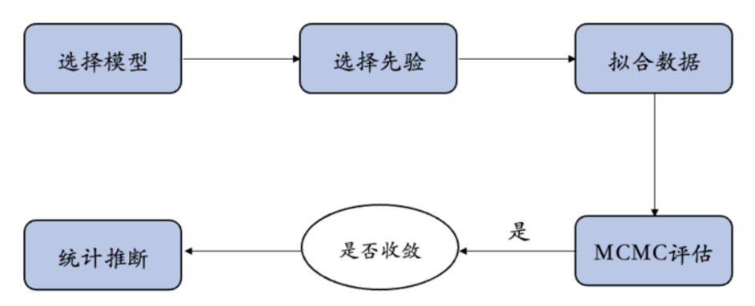

🤔思考：

如何判断我们得到的mcmc结果是可靠的？通过mcmc得到的后验能告诉我们什么？

## 对马尔科夫链的诊断 (Markov chain diagnostics)

🤔在使用我们的采样结果前需要思考一个问题，这些采样结果是否可信呢？

- 由于这些采样来自于 MCMC 算法，即马尔科夫链蒙特卡洛算法，而模拟采样方法的关键是 "近似 "和 "收敛" 。也就是说，最终是否达到一个稳定的状态，表现为高概率的地方有更多的样本，低概率的地方对应更少的样本，并且是一种稳定的收敛的状态。

我们需要考虑下面3个问题：

- 好的马尔可夫链是什么样的？

- 如何判断马尔可夫链样本是否产生了合理的后验近似值？

- 马尔可夫链样本量应该多大？

**诊断的意义**：确定好的trace的标准，为我们不知道真实的后验时作为标准进行推断。

在本节中，我们将重点介绍几种诊断方法（这些诊断方法需要综合考虑！）：

- 可视化诊断：轨迹图 (trace plot)和平行链 (parallel chains)。

- 量化诊断指标：有效样本大小 ESS(effective sample size)、自相关性 (autocorrelation)和$\widehat{R}$(R-hat)。

### 轨迹图（trace plots）

轨迹图 (trace plot) 是一种可视化方法，用于显示马尔可夫链的轨迹，即马尔可夫链在参数空间中的位置。

- 图中的横坐标是时间步长（即每一次的采样），纵坐标是参数的值，Chain就是不同的链（绝大部分的PPL里默认的都是4条链）。

- 轨迹图往往结合参数的后验分布一起展示，以便于观察采样样本对于参数分布的代表性。

我们先来看一下正常的轨迹图（之前 Beta-Binomial model 的示例）是什么样的：

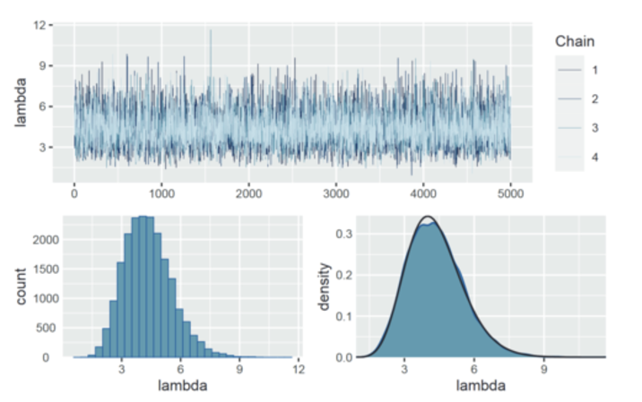

- 上图：轨迹图看起来像一堆白噪声，没有明显的趋势或现象（例如出现明显的跳跃或者隔断），这意味着**链是稳定的**。

- 下右：展示了正常的参数后验分布的情况。

相比之下，我们再来看一个糟糕的轨迹图：

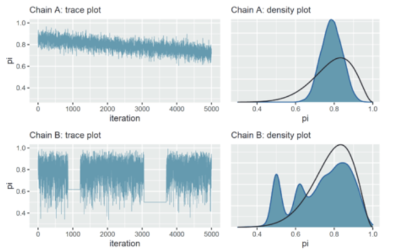

***图中上部分链 A：***

- 链 A 中的轨迹图显示，它在 5000 次迭代后还没有稳定下来，并且它只探索了 0.6 到 0.9 之间的参数值。

- 下降趋势也暗示着链值之间存在着很强的相关性--它们看起来并不像独立的噪音。

- 虽然马尔可夫链本身具有依赖性，但它们越像噪声(独立样本的表现)，得出的后验近似值误差就越小（粗略地说）。

- 结合后验分布图：**它的后验近似值高估了真实分布中央部分，而完全低估了这个范围之外值的可信度。**

***图中下部分链 B：***

- 链 B 表现出不同的问题，迹线图中的部分区域存在**两条完全平直的线**所显示的那样，

- 这意味着，当它采样到较小的参数值时，往往会**陷入这个值的附近**， 这也表明了一种局部的高相关性。

- 链条 B 在陷入困境时，会对后验参数左侧尾部的值进行**过度采样**。

- 结合密度图：
虽然链 B 后验分布和真实分布的重合性更好，但它存在多峰分布，原因在于过度采样。

📍如果我们得到一个糟糕的轨迹图，如何进行补救：

- 检查模型。确定假定的先验模型和数据模型是否合适。

- 对数据链进行更多迭代。一些不理想的短期连锁趋势可能会在长期内得到改善。

### 有效样本大小 ESS(effective sample size)和自相关性 (autocorrelation)

🤔在进行mcmc采样过程中，我们希望样本之间呈现什么样的特点？

- 最理想的状态是每次采样都是相互独立的，这样的样本实际上能够更好地代表总体。例如，我们想要了解中国人的某个特点，如果我们全部从南师大进行抽样，可能样本之间在某些维度上存在高度相关，最后也就很难代表总体的特征。

MCMC 链的样本存在相关性，如本身的特性一样，后一个参数的采样过程与前一个参数有关，这导致间隔一个位置的参数样本间的相关性很高。

然而，MCMC 链又要求“无记忆性”，即样本之间最好是独立的。

🤔那么如何理解 MCMC链中独立与相关的矛盾？

- 需要清楚的是，相关性仅限于间隔一个位置的参数样本。

- 而独立性的要求是针对于参数样本间大于一个间隔的情况的。

**自相关就可以很好的描述样本之间的相关性；而有效样本量针对于描述样本的独立性。**

**自相关性 (autocorrelation)**

- 可用于评估马尔科夫链的样本之间的相关性。

- 强烈的自相关性或依赖性是一件坏事--**它与较小的有效样本比相伴而生**，说明我们得出的后验近似值可能不可靠。

根据马尔可夫链的简单构造，链值之间必然存在一些自相关性：一个链值取决于前一个链值，而前一个链值又取决于更前一个链值...，以此类推。这种依赖性意味着，每个链值都在一定程度上依赖于之前的所有链值。

- 然而，这种依赖性或自相关性会逐渐消失，这种相关会随着步长逐渐降低。

> 这就像托布勒的地理学第一定律：万事万物都与其他事物相关，**但近处的事物比远处的事物更相关。**

一个自相关良好的例子：


- 图左是之前提到的轨迹图(trace plot)。

- 右图是自相关图，x轴是样本之间的间隔距离，y 轴为自相关性。

- 例如 0 代表所有参数采样和自己的相关性 (这显然为1)，1代表所有参数和间隔一个距离参数的样本的相关性，该相关性依然很高，大约为 0.5，表明相差仅 1 步的链值之间存在中等程度的相关性。随后自相关性迅速下降，**到间隔 5 个样本时相关性下降为 0**。

- 也就是说，相差间隔越大，马尔科夫链值之间的相关性越小，这是一个好消息，**表明马尔科夫链正在快速混合**，即在后验可信$π$值范围内快速移动，从而至少模拟了一个独立样本。

- 对于间隔解释的例子：如果有100个参数形成的样本，编号为 1-100。 那么间隔10，就代表，10-100组成的样本。为了让 10-100 和原始的样本长度相同，我们可以使用 1-90和 10-100 的样本进行相关分析。需要注意的是，存在更好的数学方法可以避免间隔越大，样本量越小的问题。扩展阅读: https://zhuanlan.zhihu.com/p/77072803

一个自相关比较糟糕的例子：


- 自相关曲线的缓慢下降表明，链值之间的依赖关系不会很快消失。

- 相差整整 20 步的马尔可夫链值之间存在大约 0.9 的相关性！

- 由于其链值与前值的联系非常紧密，因此该链的混合速度很慢，需要很长时间才能充分探索后验的全部范围。

- 因此，我们应该谨慎使用该链来近似后验。

### 重要概念：Fast vs slow mixing Markov chains

- 快速混合：指链表现出与独立样本的行为，即混合链值之间的自相关性迅速下降，有效样本大小比相当大。

- 慢速混合：指链不具有独立样本的特征，即混合链值之间的自相关性下降非常缓慢，有效样本大小比很小。换句话说，链在后验可信值范围内 "缓慢 "移动。

📍**如果我们的链混合速度太慢该怎么办呢？一些推荐的策略**：

第一， "运行更长的链"。如果迭代次数足够多，即使是缓慢的混合链最终也能产生良好的后验近似值。

第二，使得马尔科夫链更薄。

- 例如，在包含 5000 个样本的链中，我们每间隔一个参数来保留样本，并丢弃其余的样本，例如$\pi_2,\pi_4,...\pi_{5000}$

- 我们还可以每间隔10个样本来保留：$\pi_{10},\pi_{20},...\pi_{5000}$

- 通过舍弃中间的抽样，我们可以消除低间隔带来的强相关性。（$\pi_{20}$与稀疏链中的前一个值$\pi_{10}$的相关性小于与原始链中的前1个值$\pi_{19}的相关性$）

**一个使 MCMC 链变得更薄(thin)来减少自相关的示例：**

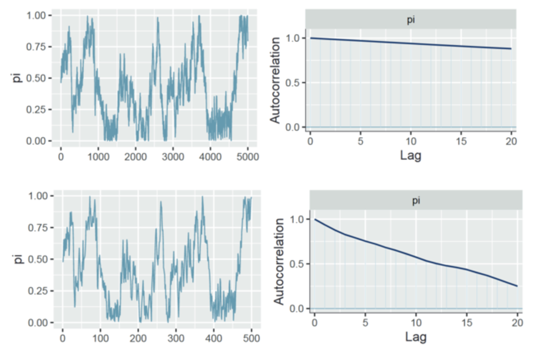

- 可以观察到，我们使用thin=10来将链变薄10倍，也就是从5000个样本中，每间隔10个样本保留1个，总共保留500个样本。

- 虽然自相关性快速下降，但这可能仍然无法完全消除自相关性。

🤔需要思考一个问题：

- 使用thin=10的时候，我们通过损失90%的原始样本值来降低自相关性，这样做是否值得？是不是一旦自相关性过高，我们就采用这种粗暴的方法来降低它？

实际上，我们可以通过增加步长或迭代的次数来尝试解决这一问题，而不是一味地将链变薄。

### 有效样本量比率 Effective sample size ratio

为了避免链中相关性的影响，有效样本量(effective sample size)被提出，以用于描述链中独立样本的数量。因为根据 MCMC 的特性，我们需要链存在**无记忆性**，也就是大于两个间隔的参数样本间不存在或者存在很小的相关性。

- 有效样本量计算了这些不存在或者存在很小的相关性样本的数量。

$$
\frac{N_{eff}}{N}
$$

- N 表示依赖马尔可夫链的实际样本量或长度。

- $N_{eff}$为马尔可夫链的有效样本大小，量化了产生等效精确后验近似所需的独立样本数量。

- $N_{eff}$越大越好，但马尔可夫链近似的准确性通常只能达到较小独立样本的准确性。也就是说，通常情况下，$N_{eff}<N$,因此有效样本大小比＜1。我们通常会对有效样本量比＜0.1的马尔可夫链产生怀疑，即$N_{eff}/N<0.1$

假设马尔科夫链的长度为 20,000，并且包括 6800 个独立样本，即有效样本量 ESS = 6800。

- 因此，有效样本量比率 EFF=34%，代表相当于我们只使用了 34% 的独立样本。

- 由于这个比例高于 0.1，这是是可以接受的。并且 ESS > 400(ESS>400是近些年研究者推荐的一个大致标准)。

> 更详细的定义请参见 Vehtari 等人（2021）。如需了解有效样本量, R-hat等指标的的联系，请参阅 Vats 和 Knudson (2018)。

### R-hat and comparing parallel chains

自相关和有效样本量仅针对于描述一条MCMC链的有效性。假如我们获得了四条并行的马尔可夫链。我们不仅希望看到每条链的稳定性，还希望看到**四条链的一致性**。

可以想象，如果四条链的结果并不一致，那么推断结果的可靠性就很难保证。

同样，我们首先展示一个良好的并行链的结果：


- 四条链产生的后验近似值几乎没有差别，这证明我们的模拟是稳定的。（也就是说，这4条链虽然起点不一样，但是最后的形状几乎混合在一起，说明mcmc的指标比较良好）

为了便于比较和展示一个糟糕的并行链的结果，我们用更短的马尔可夫链模拟来演示：


- 运行四条并行链仅进行 100 次迭代，其中 50 次为warmup (burn-in)

- 虽然这些链的轨迹图表现出相似的随机行为，但它们对应的密度图却不尽相同，因此产生的后验近似值也不尽相同。

这表明，如果我们只进行了 100 次迭代就停止模拟，那结果是不稳的。


**不同链样本之间的变异性的一致性也很重要：**


- 中图显示，4条链的可变性几乎是相同的。右图中，所有链的变异与综合为单个链的变异性相似。

我们再来看一个糟糕的例子：


- 观察轨迹图（左图）可以发现，4条链的范围均不一致，并且涉及的变异性也存在较明显的差异。

- 四条平行链产生了相互冲突的后验近似值（中图）

- 当我们将这些链组合在一起时，后验近似值不稳定且较差（右图）

- 因此，所有链中参数值的范围和变异性远大于任何单个链中参数值的范围和变异性

我们可以直观地看出，所有链条上的数值变化与单个并行链条内部的数值变化之间的关系非常重要。具体来说

- 在 **"好的 "马尔可夫链模拟**中，所有**并行链的变异性总和**将与任何**单个链内的变异性**大致相当；

- 在 **"坏的 "马尔可夫链模拟**中，所有并行链的变异性总和可能**超过每个链内的典型变异性**

我们可以使用$R̂$量化**综合链变异性和链内变异性**之间的关系。

$R̂$指标（R-hat）为并行链的可视化比较提供了具体的数学指标：

$$
R̂ = \frac{V_{combined}}{V_{within}}
$$

- $R̂$通过比较**所有链**上采样值的变异性和每个**单独链**上的变异性来解决一致性问题。

- combined代表所有链的样本值的总变异，within代表每个链内部样本值的变异。

理想情况下，$R̂$≈1，反映了平行链的稳定性。一般来说，我们认为越接近1越好

- $R̂>1$表示链之间的变异不稳定，即组合链内的变异性大于单个链内的变异性。

- 虽然不存在黄金法则，但大于1.05会给模拟的稳定性带来危险信号，此时需要谨慎考虑。如果更大，例如大于1.1或1.2，需要重新进行考虑，此时审稿人也可能会表示质疑。

对于示例1：


- $R̂=1$，这反映了4个并行链之间和链内部的变异性存在很好的一致性。

对于示例2：


- $R̂=5.35$，这表明所有链值的方差总和是每个链内方差的5倍多。这远远超过了1.05的标准，充分证明平行链并未产生一致的后验近似值。

因此，我们可以得出，mcmc的模拟近似是不稳定的，其后验分布的结果不可用于后续推断。

## 代码演示--MCMC诊断

使用 PyMC 建模的模型默认使用 MCMC 方法进行参数估计。

并且我们可以很方便的使用 arviz 对MCMC进行可视化和基于数学化标准的诊断

首先，我们建立一个简单的 beta 模型，并对该模型使用MCMC采样方法 (以下术语可见课件上分术语表)


```python
import pymc as pm
import arviz as az
import matplotlib.pyplot as plt

# 设置数据
N = 10; Y = 9
# 创建PyMC模型
bb_model = pm.Model()

with bb_model:
    pi = pm.Beta('pi', alpha=2, beta=2)
    likelihood = pm.Binomial('likelihood', n=N, p=pi, observed=Y)

#采样过程仍在该容器中进行
with bb_model:
    trace = pm.sample(draws=5000,                   # 设置MCMC采样样本的数量
                      tune=0,                       # 设置调试样本的数量
                      chains=4,                     # 设置4条MCMC链
                      random_seed=84735)
```

- 设置采样样本数 (draws) 为 5000

- 设置 MCMC 链 (chains) 的数量为 4，和上面的示例一样。

- 设置 MCMC 调试样本的数量 (tune) 为0，而默认 tune 为 1000。

- 这里暂时理解 tune 为提前进行 MCMC 采样 1000次，然后丢弃掉这些采样。

- 根据 MCMC 的性质，**链中越早的采样越不稳定**。因此，丢掉这些采样可以保证后续的采样更加稳定。
后续课程会详细介绍该参数的意义。

**绘制 trace 图**

```python
ax = az.plot_trace(trace, legend = True)
```


- 可以看到，每条链的后验分布都重合在一起。

- MCMC链的行为表现得类似噪音一样，这是一个好的表现。

**绘制自相关图**

```python
ax = az.plot_autocorr(trace, max_lag=20, combined=True)
```
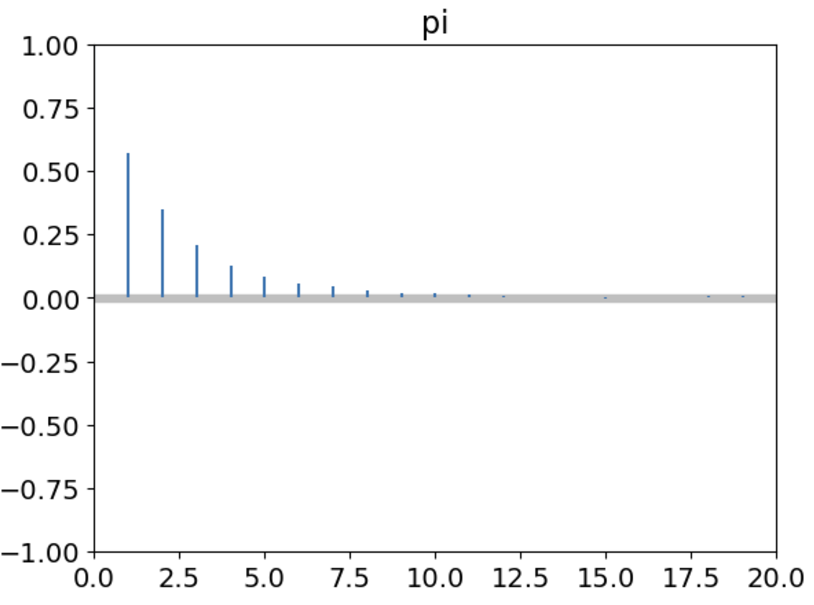

- 可以看到，随着间隔的下降，自相关也快速下降

**我们使用 arviz 的 summary来获得对于 MCMC 链的 R-hat和 有效样本量 ESS 指标**

- 可以看到 r-hat 接近1，表明链间和各链内的变异的一致性。

- 有效样本量 ESS (ess_bulk) 为 4744，有效样本量比率 4744/5000 = 0.95，远大于 0.1。

```python
az.summary(trace, kind = "diagnostics")
```


- 根据前面的内容，我们通过mcmc找到了后验，首先需要诊断这个后验是否靠谱，接下来则是用这个后验分布帮助我们解决实际感兴趣的问题，也就是需要进行一些统计推断。

## Posterior estimation

当我们确定 MCMC 采样的结果的可信后，我们就可以将其当作后验分布进行统计推断。

在此之前，我们需要回顾后验分布的含义和意义。

- 在贝叶斯的框架下，我们可以把后验分布看作是对成功次数$\pi$的一种估计，即当前数据更可能在哪一种$\pi$下出现。

🤔当你看到下面这个后验分布时，你觉得它描述了关于$\pi$怎样的一种信息呢？

a. 参与者正确判断的概率大概在80%

b. 参与者正确判断的概率比例最有可能是80%，但这个比例也可能是60%到99%中的某一个。

```python
# 导入数字和向量处理包：numpy
import numpy as np
# 导入基本绘图工具：matplotlib
import matplotlib.pyplot as plt
# 导入高级绘图工具 seaborn 为 sns
import seaborn as sns
# 导入概率分布计算和可视化包：preliz
import preliz as pz

def bayesian_analysis_plot(
    alpha, beta, y, n, 
    ax=None, 
    plot_prior=True, 
    plot_likelihood=True, 
    plot_posterior=True, 
    xlabel=r"$\pi$", 
    show_legend=True,
    legend_loc="upper left"):
    """
    该函数绘制先验分布、似然分布和后验分布的 PDF 图示在指定的子图上。
    
    参数:
    - alpha: Beta 分布的 alpha 参数（先验）
    - beta: Beta 分布的 beta 参数（先验）
    - y: 观测数据中的支持次数
    - n: 总样本数
    - ax: 子图对象，在指定子图上绘制图形
    """

    if ax is None:
        ax = plt.gca()

    if plot_prior:
        # 先验分布
        prior = pz.Beta(alpha, beta)
        prior.plot_pdf(color="black", ax=ax, legend="None")
        x_prior = np.linspace(prior.ppf(0.0001), prior.ppf(0.9999), 100)
        ax.fill_between(x_prior, prior.pdf(x_prior), color="#f0e442", alpha=0.5, label="prior")

    if plot_likelihood:
        # 似然分布 (两种写法等价)
        # likelihood = pz.Beta(y,n-y)
        # likelihood.plot_pdf(color="black", ax=ax, legend="None")
        x = np.linspace(0,1,1000)
        likelihood = pz.Binomial(n=n, p=y/n).pdf(x=x*n)
        likelihood = likelihood * n
        ax.plot(x, likelihood, color="black", label=r"$\mathbf{Binomial}$"+rf"(n={n},p={round(y/n,2)})")
        ax.fill_between(x, likelihood, color="#0071b2", alpha=0.5, label="likelihood")

    if plot_posterior:
        # 后验分布
        posterior = pz.Beta(alpha + y, beta + n - y)
        posterior.plot_pdf(color="black", ax=ax, legend="None")
        x_posterior = np.linspace(posterior.ppf(0.0001), posterior.ppf(0.9999), 100)
        ax.fill_between(x_posterior, posterior.pdf(x_posterior), color="#009e74", alpha=0.5, label="posterior")

    if show_legend:
        ax.legend(loc=legend_loc)
    else:
        ax.legend().set_visible(False)

    # 设置图形
    ax.set_xlabel(xlabel)
    sns.despine()
```

```python
# 创建一个单独的图和轴
fig, ax = plt.subplots(figsize=(7, 5))

# 先验参数 alpha=2, beta=2, 观测数据 y=9, n=10
bayesian_analysis_plot(alpha=2, beta=2, y=9, n=10, ax=ax) 

# 显示图像
plt.tight_layout()
plt.show()
```

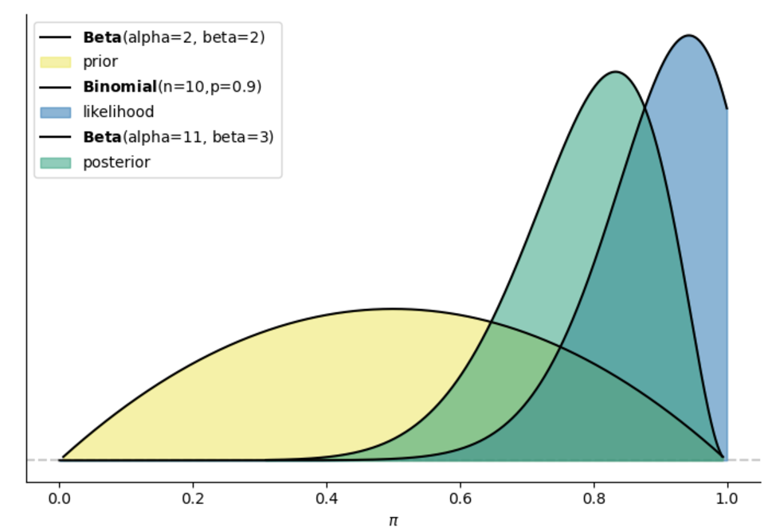

选项b是更符合贝叶斯取向的回答。 为什么？ ➡

- 我们来考虑另一种调查情况下得出的后验分布：

- 我们对$\pi$的先验仍然为$\pi \sim Beta(2,2)$，但现在我们的试验总次数为118次，成功次数为99次。

$$
\pi \sim Beta(2,2)
$$

$$
Y|\pi \sim Bin(118,\pi)
$$

$$
\pi|(y=99) \sim Beta(\alpha+y,\beta +n-y)
$$

这种情况下，$\pi$的后验分布满足$\pi|(Y=99) \sim Beta(101,21)$

下图展示了这两种情况下的后验分布

> 黑线表示众数，即在后验分布中最可能出现的值

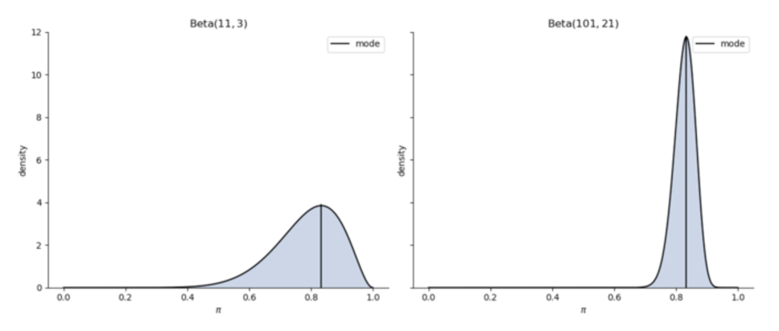

根据上面两种分布，$\pi$最可能的取值都在83%-84%左右

- 如果只关注众数，两种截然不同的情况却会导致相似的结论。但很明显，我们可以看到两个图中$\pi$的分布范围是不同的。

- 但是，随着样本量的增加，后验分布会越来越窄，也会朝着这个集中量数越来越集中，这**意味着你的不确定性在慢慢被消除**。

因此，在贝叶斯统计中，**汇报不确定性**是一个非常重要的工作。不确定性反映了你的数据量到底有多大，你的信心到底有多大。

**为了同时了解$\pi$的集中趋势和离散趋势，我们可以使用95%的可信区间(credible intervals)来描述$\pi$**

### 可信区间(credible intervals)

- 后验分布的2.5%百分位数和97.5%百分位数包含的区域共同组成了95%的后验可信区间，可信区间表示了参数出现在这个区域的概率。

- 比如，Beta(101, 21) 95%的可信区间为(0.756, 0.889)。这意味着我们可以说，在随机点运动任务中参与者成功的真实概率出现在(0.756, 0.889)的可能性是95%。

一种理解是，有95%的人在随机点运动任务中参与者成功概率很高，大概为 0.756 到 0.889。

下面是可视化的例子：

```Python
import numpy as np
import matplotlib.pyplot as plt
from scipy.stats import beta

# 定义 Beta 分布的参数 Beta(101, 21)
params = [(11, 3), (101, 21)]
titles = [r"Beta(11, 3)", r"Beta(101, 21)"]
ci_level = 0.95

# 创建图形和子图
fig, axes = plt.subplots(1, 2, figsize=(8, 3), sharey=True)

# 绘制 Beta 分布的 PDF 和 95% CI 区间
for i, (a, b) in enumerate(params):
    x = np.linspace(0, 1, 1000)
    y = beta.pdf(x, a, b)
    ci_lower, ci_upper = beta.ppf([(1 - ci_level) / 2, (1 + ci_level) / 2], a, b)
    x2 = np.linspace(ci_lower, ci_upper, 1000)
    y2 = beta.pdf(x2, a, b)

    # 绘图
    axes[i].plot(x, y, color='black', label=f'{int(ci_level*100)}% CI')
    axes[i].fill_between(x2, y2, color='#a6bddb', alpha=0.6)
    axes[i].set_title(titles[i])
    axes[i].set_xlabel(r"$\pi$")
    axes[i].set_ylabel("density")
    axes[i].set_ylim(0, 12)  
    
    # 隐藏上部和右部的边框
    axes[i].spines['top'].set_visible(False)
    axes[i].spines['right'].set_visible(False)
    
    # 添加图例
    axes[i].legend()

# 调整子图布局
plt.tight_layout()
plt.show()
```
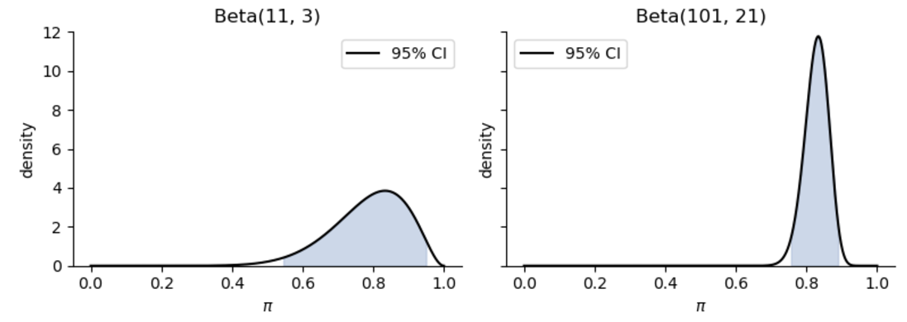

注意：贝叶斯的可信区间和频率主义的置信区间解读不同，不要混淆这两个概念。

**在报告可信区间时，95%是最常见的选项，但并不是唯一的选项。**

我们也可以创建其他可信区间，比如Beta(101, 21)的分布之下：

- 50% 可信区间：由25%百分位数和75%百分位数包含的区域

- 99%可信区间：由0.5%百分位数和99.5%百分位数包含的区域

> 在95%CI的图中，由于后验分布是一个偏态分布，可以看到相较于前半部分，后半部分包含的值对应的概率更低。
> 当后验分布是偏态分布时，有时我们不以中位数为中心构建95%的可信区间，而是基于**最高后验概率密度(众数)**。

```python
import numpy as np
import matplotlib.pyplot as plt
from scipy.stats import beta

# 定义 Beta 分布的参数 Beta(101, 21)
a, b = 101, 21
x = np.linspace(0, 1, 1000)
y = beta.pdf(x, a, b)

# 设置三个不同的可信区间
ci_levels = {
    "50% CI": (0.25, 0.75),
    "95% CI": (0.025, 0.975),
    "99% CI": (0.005, 0.995)
}
ci_colors = ['#bdd7e7', '#6baed6', '#3182bd']  # Colors for 50%, 95%, and 99% CI

# 为每个可信区间创建子图
fig, axes = plt.subplots(1, 3, figsize=(12, 3), sharey=True)

# 绘制每个可信区间
for i, (ci_name, (lower_percentile, upper_percentile)) in enumerate(ci_levels.items()):
    # 计算可信区间的上下界
    ci_lower, ci_upper = beta.ppf([lower_percentile, upper_percentile], a, b)

    # 绘制分布曲线并填充可信区间
    axes[i].plot(x, y, color='black')
    axes[i].fill_between(x, y, where=(x >= ci_lower) & (x <= ci_upper), color=ci_colors[i], alpha=0.6)
    axes[i].set_title(f"{ci_name} for Beta(101, 21)")
    axes[i].set_xlabel(r"$\pi$")
    axes[i].set_ylim(0, 12)
    
    # 绘制可信区间的垂直线
    y_ci_lower = beta.pdf(ci_lower, a, b)
    y_ci_upper = beta.pdf(ci_upper, a, b)
    axes[i].axvline(ci_lower, color='black', linestyle='-', ymax=y_ci_lower / max(y))
    axes[i].axvline(ci_upper, color='black', linestyle='-', ymax=y_ci_upper / max(y))
    
    # 移除顶部和右侧的边框
    axes[i].spines['top'].set_visible(False)
    axes[i].spines['right'].set_visible(False)

    axes[i].set_xlim(0.5, 1)

# 设置 y 轴标签
axes[0].set_ylabel("density")

# 调整布局
plt.tight_layout()
plt.show()
```


### 最大后验概率密度区间(the highest density interval, HDI)

最大概率密度区间HDI与中心区间是非常接近的。但是**当后验分布为非正态分布时，两者存在区别**，比如：

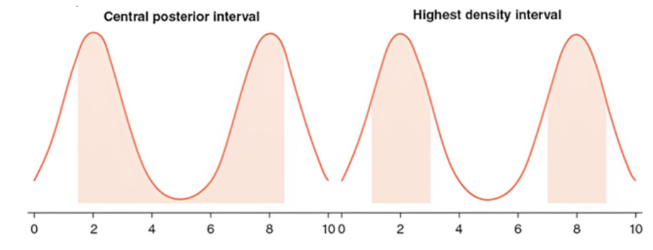

- 左图是中央后验区间，从中位数的两侧开始展开

- 右图是HDI，从y轴最高的两处（众数）开始展开

这个HDI是现在大家常见的并且比较推荐的一种报告方法。

***直觉理解：想象有一根水平的线从后验概率密度最高点往下滑，如果是95%HDI，则意味着黄色部分的面积占曲线下面积的95%***

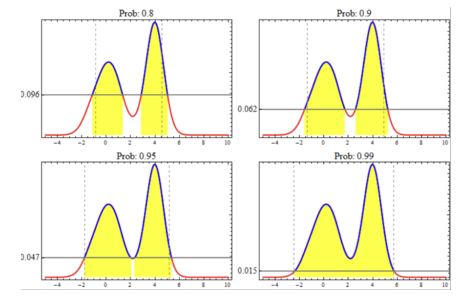

> source: https://mathematica.stackexchange.com/questions/173282/computing-credible-region-highest-posterior-density-from-empirical-distributio


🤔思考：为什么要使用HDI，而不是中央后验区间呢？

大家可以看到，如果我们要寻找一个范围，这个范围最能够代表参数取值的话，那么应该从密度高的地方开始取值，也就是可能性最大的地方开始取值。当后验分布是非正态时，中位数并不是密度最高的地方，因此我们选择HDI进行取值，这更符合我们想要的一个结果。

- 从下面的两幅图可以看出，95% CI 和 95%HDI实际上存在一些细微的差别。

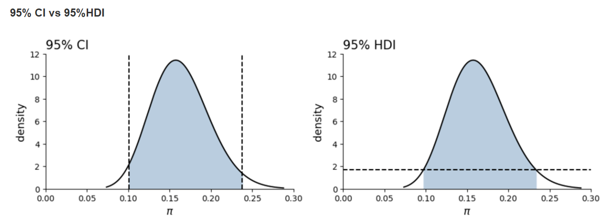

此外，非正态分布后验的平均值，中位数和众数并不相等。

- 其中众数为分布最高点对应的参数值

- 中位数左右两侧分布的面积各占50%

- 平均值的位置接近中位数，并且它容易分布形态的影响

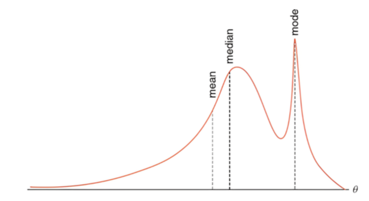
