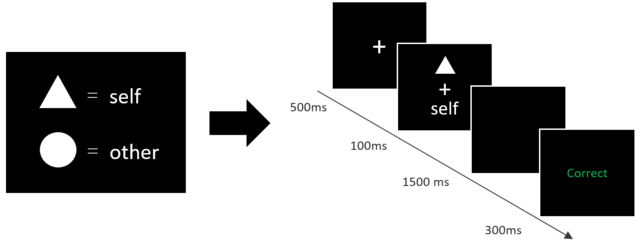
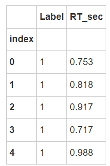
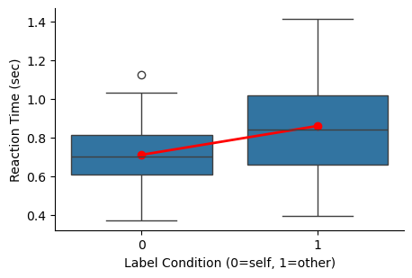
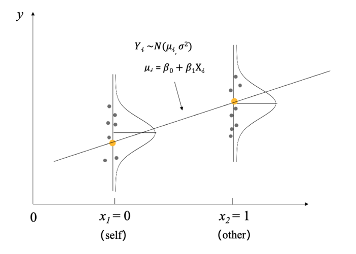

# <center> Lecture8 : A Simple Linear Regression Model with PyMC </center>  

## 序言  

> ⭐ 在之前的课程中，我们学习了贝叶斯统计方法和使用代码实现统计模型。  
> 
> 然而，我们并没有使用贝叶斯模型深入到真正的心理学研究当中。  
> 
> 从本节课开始，我们将通过一个个真实的案例，带领大家进入心理学贝叶斯统计分析的世界。
>
本节课我们将使用一个**简单的线性回归模型**，通过PyMC来建立这个模型，并走完贝叶斯分析的大部分流程。后续，我们将把这个贝叶斯模型的分解式和框架应用到**更复杂的线性模型**上，直至**层级模型**。

💡希望大家开始投入更多时间进行**练习**，尽量搞懂课堂相关的练习部分。大作业也可以开始提前准备。因为这节课并没有涉及太多新的统计知识，包括模型，我默认大家已经有一定的了解。我们主要是在贝叶斯框架下，换一个视角来做这些熟悉的统计方法。今天，我们就从一个非常简单的线性回归模型开始。

## 研究示例： 自我加工优势 (Self-prioritization Effect, SPE)  

🤔在本节课，我们关注的研究问题是 “自我作为人类独特的心理概念，是否在也会促进认知加工的表现？”。  

特别地，我们关注的是自我在**知觉匹配任务**中的作用，**探究自我和他人条件下，人们的认知加工差异，尤其是在反应时间上的表现。**  

- 2012年，Jie Sui开发了一个新的范式，即在实验室中让被试将原本中性的刺激与自我或他人关联，然后进行认知任务。例如，我们让被试学习三角形代表他自己，圆形代表另一个人，然后进行匹配任务。任务是判断呈现的图形和标签是否匹配，即是否符合他们刚刚学到的关系。当然，这个关系在被试之间是平衡的。

- 通过这个实验，我们可以在一定程度上**消除自我熟悉性**的影响。因为在日常生活中，我们对自己相关信息肯定更加熟悉。所以当我们在实验室中及时习得这种自我相关性时，相对来说是更好的数据控制。

- 通过这个实验，我们基本上能够发现，当一个原本中性的刺激与自我关联后，被试在进行匹配任务时会有更快更准的反应。

> 探究自我加工的优势通畅使用匹配范式任务中“自我（self）”和“他人（other）”的认知匹配之间的关系 (Sui et al., 2012)。  
>
> * 在自我匹配任务中，被试首先学习几何图形和身份标签的关系。例如，三角形代表自我；圆形代表他人。在随后的知觉匹配判断任务中，需要判断所呈现的几何图形和文字标签是否与之前学习的关系相匹配。
>   
> * 想象一下你在完成自我匹配任务时，面对不同的刺激：有时你可能会觉得某个“自我”相关的图像比“他人”相关的更具吸引力，或许这反映了你对自己本身具有更多的关注。  



> Sui, J., He, X., & Humphreys, G. W. (2012). Perceptual effects of social salience: Evidence from self-prioritization effects on perceptual matching. Journal of Experimental Psychology: Human Perception and Performance, 38(5), 1105–1117. <https://doi.org/10.1037/a0029792>  

根据Sui等（2012）的文章，我们假设，**在“自我”条件下，个体的反应时间会快于在“他人”条件下的反应时间。** 那么在贝叶斯的框架下，我们应该如何解决我们的研究问题以及验证我们的研究假设是否正确呢？  

 

在本节课中，我们将学习如何使用大家所熟悉的简单线性模型 (linear regression model) 来检验心理学效应。  

包括以下内容：  

1. **简单线性模型**

2. **先验预测检验**

3. 模型拟合和诊断

4. 后验推理

5. **模型检验 (后验预测检验)**

在**传统统计学**中，研究问题通常转化为**假设检验**问题。配对样本t检验是解决此类问题的一个常用方法，但它实际上是回归分析的一个特例。本节内容将阐述**从研究问题的明确到数据收集后，如何选择合适的统计模型，以及如何构建似然函数**。在**贝叶斯分析**中，除了似然函数，还需考虑先验分布。

**实验预测检验**是实验设计后验证模型适宜性的关键步骤。

- 若模型适宜，将采用MCMC方法进行推断，以获得后验分布。随后，评估MCMC结果的合理性，并进一步评估模型的预测效果，以确保模型的可用性。本节将通过一个简单的线性回归模型，演示**从模型构建到基于后验分布的统计推断的完整流程**，并展示代码实现方法。这包括线性模型的构建、先验预测检验、模型拟合与诊断、后验检验等步骤，旨在确保推断的严谨性。
<div style="padding-bottom: 20px;"></div>

我们使用的数据来自于Kolvoort等人（2020），该数据集包含了多个被试在自我匹配范式下的行为数据。数据集涉及了不同年龄、性别、文化背景的健康成年被试。  

数据可在和鲸平台及Gitee平台上获取。在Python环境中，利用pandas库读取数据。本研究关注的自变量是标签（label），用以区分实验条件是自我相关还是他人相关。因变量为反应时间（RT），单位为秒。每条数据记录代表一个试验（trial）。在认知实验中，每位受试者在每个条件下需完成多次试验，可能是50次、60次甚至超过100次。每行数据代表单个试验中的一个观测值。

- 我们使用 `pandas` 的 `read_csv` 方法来读取数据 `Kolvoort_2020_HBM_Exp1_Clean.csv` (数据已经预先存放在和鲸平台中)。  

- 数据包含多个变量，选择我们需要的`Label` 表示标签（self / other），`RT_sec` 表示被试的反应时间。  

- 每一行(index)表示一个trial数。  

> - 数据来源: Kolvoort, I. R., Wainio‐Theberge, S., Wolff, A., & Northoff, G. (2020). Temporal integration as “common currency” of brain and self‐scale‐free activity in resting‐state EEG correlates with temporal delay effects on self‐relatedness. Human brain mapping, 41(15), 4355-4374.  

```python
# 导入 pymc 模型包，和 arviz 等分析工具 
import pymc as pm
import arviz as az
import seaborn as sns
import scipy.stats as st
import numpy as np
import matplotlib.pyplot as plt
import xarray as xr
import pandas as pd

# 忽略不必要的警告
import warnings
warnings.filterwarnings("ignore")
# 通过 pd.read_csv 加载数据 Kolvoort_2020_HBM_Exp1_Clean.csv
try:
  df_raw = pd.read_csv('/home/mw/input/bayes3797/Kolvoort_2020_HBM_Exp1_Clean.csv')
except:
  df_raw = pd.read_csv('2024/data/Kolvoort_2020_HBM_Exp1_Clean.csv')

df_raw.head()
```

<div>
<style scoped>
    .dataframe tbody tr th:only-of-type {
        vertical-align: middle;
    }

    .dataframe tbody tr th {
        vertical-align: top;
    }

    .dataframe thead th {
        text-align: right;
    }
</style>
<table border="1" class="dataframe">
  <thead>
    <tr style="text-align: right;">
      <th></th>
      <th>Unnamed: 0</th>
      <th>Subject</th>
      <th>Age</th>
      <th>Handedness</th>
      <th>First_Language</th>
      <th>Education</th>
      <th>Countryself</th>
      <th>Countryparents</th>
      <th>Shape</th>
      <th>Label</th>
      <th>Matching</th>
      <th>Response</th>
      <th>RT_ms</th>
      <th>RT_sec</th>
      <th>ACC</th>
    </tr>
  </thead>
  <tbody>
    <tr>
      <th>0</th>
      <td>1</td>
      <td>201</td>
      <td>18</td>
      <td>r</td>
      <td>English/Farsi</td>
      <td>High School</td>
      <td>Iran/Canada</td>
      <td>Iran</td>
      <td>3</td>
      <td>2</td>
      <td>Matching</td>
      <td>1</td>
      <td>753</td>
      <td>0.753</td>
      <td>1</td>
    </tr>
    <tr>
      <th>1</th>
      <td>2</td>
      <td>201</td>
      <td>18</td>
      <td>r</td>
      <td>English/Farsi</td>
      <td>High School</td>
      <td>Iran/Canada</td>
      <td>Iran</td>
      <td>3</td>
      <td>2</td>
      <td>Matching</td>
      <td>1</td>
      <td>818</td>
      <td>0.818</td>
      <td>1</td>
    </tr>
    <tr>
      <th>2</th>
      <td>3</td>
      <td>201</td>
      <td>18</td>
      <td>r</td>
      <td>English/Farsi</td>
      <td>High School</td>
      <td>Iran/Canada</td>
      <td>Iran</td>
      <td>1</td>
      <td>3</td>
      <td>Matching</td>
      <td>1</td>
      <td>917</td>
      <td>0.917</td>
      <td>1</td>
    </tr>
    <tr>
      <th>3</th>
      <td>4</td>
      <td>201</td>
      <td>18</td>
      <td>r</td>
      <td>English/Farsi</td>
      <td>High School</td>
      <td>Iran/Canada</td>
      <td>Iran</td>
      <td>3</td>
      <td>2</td>
      <td>Matching</td>
      <td>1</td>
      <td>717</td>
      <td>0.717</td>
      <td>1</td>
    </tr>
    <tr>
      <th>4</th>
      <td>5</td>
      <td>201</td>
      <td>18</td>
      <td>r</td>
      <td>English/Farsi</td>
      <td>High School</td>
      <td>Iran/Canada</td>
      <td>Iran</td>
      <td>3</td>
      <td>2</td>
      <td>Matching</td>
      <td>1</td>
      <td>988</td>
      <td>0.988</td>
      <td>1</td>
    </tr>
  </tbody>
</table>
</div>

- 在Jupyter Notebook中进行数据分析的初步步骤包括挂载所需数据并读取。通过查看数据的前五行，我们可以初步了解数据结构，包括被试的标签和年龄等信息，尽管这些信息在当前分析中并非关注重点。我们的核心关注点是反应时间（RT）及其毫秒值，以及准确率，尽管现阶段我们主要关注RT和与之相关的标签（label）。

- 为了简化演示过程，我们将选取单个被试在特定条件下（例如匹配条件）的数据。这样做的目的是为了使模型尽可能简化，便于理解和演示。接下来，我们将对label的含义进行详细说明，并展示如何从简化的数据集中提取和分析关键信息：

```python
# 筛选出被试"201"，匹配类型为"Matching"的数据
df_raw["Subject"] = df_raw["Subject"].astype(str)
df = df_raw[(df_raw["Subject"] == "201") & (df_raw["Matching"] == "Matching")]

# 选择需要的两列
df = df[["Label", "RT_sec"]]

# 重新编码标签（Label）
df["Label"] = df["Label"].map({1: 0, 2: 1, 3: 1})

# #设置索引
df["index"] = range(len(df))
df = df.set_index("index")

# 显示部分数据
df.head()
```



- 在最终的模型构建中，我们将关注两个核心变量：**标签（label）**和**反应时间（second）**，即以秒为单位的RT。基于这两个变量，我们将建立一个简洁的回归模型。

- 在正式进行模型构建之前，我们建议先进行**数据的可视化**———这有助于直观理解数据分布和潜在的模式，为后续的模型分析提供直观的依据。

进一步可视化数据情况：  

* 我们使用 `seaborn` 的 `boxplot` 方法来进行可视化。  
* 其中横轴为Label `x="Label"`，纵轴为反应时间 `y="RT_sec"`。  
  
```python
import seaborn as sns
import matplotlib.pyplot as plt

# 计算每个Label条件下的均值
mean_values = df.groupby('Label')['RT_sec'].mean()

# 使用 seaborn 绘制箱线图，展示 Matching 条件下反应时间的分布情况
plt.figure(figsize=(5, 3.2))
sns.boxplot(x="Label", y="RT_sec", data=df)

plt.plot(mean_values.index, mean_values.values, marker='o', color='r', linestyle='-', linewidth=2)

# 移除上面和右边的边框
sns.despine()

# 添加标签
plt.xlabel("Label Condition (0=self, 1=other)")
plt.ylabel("Reaction Time (sec)")
plt.show()

```



>💡**强烈推荐大家进行数据可视化：**
>
> - **可视化允许我们直接观察原始数据，而不是立即进行统计分析**。直接跳过数据探索阶段而进入分析是不恰当的，因为即使统计结果相似，数据的实际模式也可能截然不同。例如，即使相关系数保持不变，数据的图形表示可能会有显著差异，这强调了可视化的重要性，以确保所选统计模型的合理性。
> 
> - **对于特定的数据集，可视化揭示了常见的反应时间特征**。在实验室条件下，被试的反应时间通常在一秒以内，大约在0.6到0.7秒之间，并且存在超过一秒的分布。此外，数据还显示出自我优势效应的趋势，即在自我条件下的反应时间相对较短。这种可视化使我们能够识别数据中潜在的趋势。
> 然而，仅仅识别趋势是不够的。当我们绘制所有单个试验的数据时，会发现数据之间存在重叠，这使得我们无法立即确定一个条件是否总是优于另一个条件。**这种数据重叠强调了进行严格统计检验的必要性**，以确定不同条件之间是否存在显著差异。统计检验在这里至关重要，因为它帮助我们超越直观观察，量化参数之间的差异，从而做出更准确的推断。
>
> - 在数据分析的过程中，我们经常会遇到一个误区，即认为只有通过统计分析才能做出推断。然而，实际情况并非总是如此。在某些情况下，纯描述性的数据已经足够明显，以至于我们可以直接从中得出结论，无需进行复杂的统计分析。**当数据差异显著到肉眼即可辨识时，统计分析可能变得多余**。
> 
> - 统计分析的真正价值在于，当我们的直观观察无法达成共识，或者需要更深入地了解数据背后的参数差异时，它提供了一种量化的方法。在这种情况下，统计分析成为揭示数据背后差异的重要工具。此外，**统计结果的应用通常有两个目的：支持理论发展或辅助决策制定。**
> 
> - 在实际应用场景中，例如心理健康领域，有时简单的观察就足以判断干预措施的效果，无需进行AB test或统计分析。当决策目标明确，且数据变化明显时，原始数据本身就可能提供足够的信息，使得统计判断变得不必要。
> 
> 💡因此，这里有两个重要的注意事项需要强调：
>
> * 在进行数据分析之前，一定要看**原始数据**。不应盲目地应用标准流程，而忽视了对数据本身的理解，这种做法是机械且缺乏洞察力的。
> * 认识到统计分析**并非在所有情况下都是必需的**。在许多情况下，我们可以直接从数据中推断出结论，而无需依赖统计方法。

## 简单线性回归：使用线性模型表示两种条件下反应的差异  

### 频率学派视角下的回归模型  

让我们先回顾在传统频率学派的视角下，回归模型的建立和检验一般基于参数估计和假设检验：  

1. **构建模型**：我们可以使用一个简单线性回归模型，其中反应时间（RT_sec）作为因变量，自变量为二分离散变量（Label）。我们可以将 `self` 编码为 0，`other` 编码为 1，这样模型将估计出“自我”条件相较于“他人”条件在反应时间上的效应。  

模型形式为：  

$$  
   RT_{sec} = \beta_0 + \beta_1 \cdot Label + \epsilon  
$$  

其中，$\beta_0$ 表示“self”条件下的平均反应时间，$\beta_1$ 表示other条件下相较于self条件的反应时间差异。  

2. **假设检验**：在该模型中，$\beta_1$ 的显著性可以用 t 检验来判断。如果 $\beta_1$ 显著不为 0（例如 $p < 0.05$），则说明自我条件下的反应时间显著不同于他人条件，即存在自我加工的优势。  

3. **模型解释**：若 $\beta_1$ 为负值，则表明自我条件的反应时间较短，暗示自我加工速度较快。

### 贝叶斯视角下的回归模型  

在贝叶斯视角下，回归模型的建立和检验不同于传统的假设检验，而是通过对参数的后验分布进行推断：  

1. **构建贝叶斯模型**：贝叶斯模型和频率学派的回归模型形式相同，但其参数估计基于贝叶斯推断。我们会为 $\beta_0$ 和 $\beta_1$ 指定先验分布（例如，正态分布），并结合观测数据计算其后验分布：  

$$  
RT_{sec} \sim \mathcal{N}(\beta_0 + \beta_1 \cdot Label, \sigma^2)  
$$  

1. **计算后验分布**：使用贝叶斯推断方法（如 MCMC 采样）得到 $\beta_1$ 的后验分布。  

2. **显著性检验**：通过后验分布检验 $\beta_1$ 是否显著，例如计算 $\beta_1 > 0$ 或 $\beta_1 < 0$ 的概率，或计算最高密度区间（HDI）。如果 95% HDI 不包含 0，可以认为自我条件和他人条件在反应时间上的差异是显著的。  

3. **模型解释**：在贝叶斯框架下，我们不仅可以观察参数的点估计（如 $\beta_1$ 的均值），还可以通过后验分布和 HDI 提供更加直观的置信水平解释。

***频率主义和贝叶斯主义中回归模型的差异***

- 在前面，我们讨论了频率主义（经典统计）视角下的回归模型。在贝叶斯回归中，基本思路一致，但表达形式有所不同。在频率主义框架下，模型包含一个误差项，用于解释数据的变异性。

- 回归模型的核心任务是对数据的均值进行预测。当$X$取某一具体值时，我们假定目标变量$Y$来源于某个正态分布。该分布的均值由线性模型确定，即通过自变量的线性组合计算得到；而贝叶斯框架仅是换一种方式描述相同的问题。需要注意的是，传统线性回归假设残差（误差项）服从正态分布，这是理论成立的重要前提条件。这一假设确保通过线性组合预测的均值具有合理性。


**⭐贝叶斯回归模型的可视化表达**  

- <span style = "color: orange;">预测值</span> $\mu_i$(即直线上橙色的点)可以写为：$\mu_i = \beta_0 + \beta_1 X_i(1)$  

- 从图上可以看到<span style = "color: orange;">预测值</span>和<span style = "color: gray;">实际值</span> (即灰色的散点)之间存在出入，实际值会在预测值附近波动  

- 那么实际值可以看作服从以$\mu_i$为均值，标准差为$\sigma$的正态分布，即：$Y_i \sim N(\mu_i, \sigma ^ 2)$  



*(改编自：https://saylordotorg.github.io/text_introductory-statistics/s14-03-modelling-linear-relationships.html)*  

<br>

对于$X_0$和$X_1$，我们预测的是什么？实际上是预测在某个特定条件下$Y$的均值。当$X=1$时，我们预测的是$Y$的均值。以这个均值为中心，数据呈正态分布，并在均值上下波动。

在这种情况下，我们可以预测不同条件下的均值。例如，假设有两个条件$i=1$和$i=2$，分别对应两个均值$μ_1$和$μ_2$。每个均值都对应一个正态分布，数据围绕其均值波动。

**回到[贝叶斯视角下的回归模型](#贝叶斯视角下的回归模型)，我们实际上是将传统建模方式应用到贝叶斯框架中，构建一个简单的回归模型，即基于正态分布的回归模型**。这被称为简单回归模型，因为它仅涉及一个正态分布，用以描述因变量的分布特性。

在贝叶斯框架下构建回归模型的流程如下：
> 1.根据数据特点（包括因变量和自变量），结合经验判断，选择适合的模型。
> 2.对模型参数设置先验分布和似然函数。
> 3.利用概率编程语言计算后验分布。


通过后验分布，我们可以进行统计推断。虽然贝叶斯方法中没有传统的“显著性检验”，但我们可以使用**后验分布的最高密度区间（HDI）和区域等同于零（ROPE）来推断参数是否显著**：
>- 如果后验分布与 ROPE 完全不重叠，则可认为参数显著（不等于 0）。
>- 类似于传统统计中对显著性的解释。

此外，还可以根据后验分布计算效应量，或利用贝叶斯因子进行统计推断。关于贝叶斯因子的计算，我们将在下一节详细讲解，补充 HDI 之外的推断方法。

<div style="padding-bottom: 20px;"></div>

**贝叶斯回归模型的数学表达式**  

$$  
\begin{align*}  
\beta_0   &\sim N\left(m_0, s_0^2 \right)  \\  
\beta_1   &\sim N\left(m_1, s_1^2 \right)  \\  
\sigma    &\sim \text{Exp}(\lambda)        \\  
&\Downarrow \\  
\mu_i &= \beta_0 + \beta_1 X_i      \\  
&\Downarrow \\  
Y_i | \beta_0, \beta_1, \sigma &\stackrel{ind}{\sim} N\left(\mu_i, \sigma^2\right). \\  
\end{align*}  
$$  

* 回归模型需满足如下假设：  

    1. **独立观测假设**:每个观测值$Y_i$是相互独立的，即一个被试的反应时间不受其他被试的影响。  

    2. **线性关系假设**: 预测值$\mu_i$和自变量$X_i$之间可以用线性关系来描述，即：$\mu_i = \beta_0 + \beta_1 X_i$  

    3. **方差同质性假设**： 在任意自变量的取值下，观测值$Y_i$都会以$\mu_i$为中心，同样的标准差$\sigma$呈正态分布变化（$\sigma$ is consistent）  

**表达式讲解：**
在这个回归模型中，正态分布有三个参数：$β_0$、$β_1$和$σ$。每一个观测值$Y_i$都是从其对应的正态分布中采样而来，这里的$i$对应不同的$X$取值。在我们的模型中，只有两个条件$X_0$和$X_1$，每个条件对应一个正态分布。由于有三个参数，因此在进行贝叶斯分析时，需要为这些参数指定先验分布。一旦确定了先验分布和似然函数（模型的定义），我们就可以进行后续的贝叶斯推断。

回归模型的假设与传统模型类似。首先，假设观测值$Y_i$是独立的，即每个观测值都不受其他观测值的影响。其次，模型假定误差项服从正态分布，并且遵循方差同质性假设，即所有条件下的$σ$相同（没有下角标标记）。

然而，贝叶斯模型的**灵活性**使得我们可以进一步扩展这个假设。例如，我们可以为每个条件的方差$σ$添加下角标，以允许其在不同条件下变化。这种灵活性正是贝叶斯模型的一个显著特点，允许我们在建模过程中根据数据的特点进行更为精细的调整。

