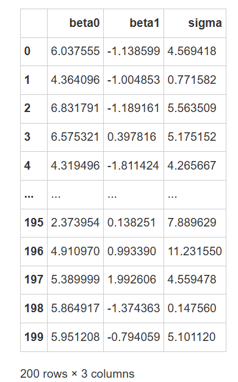
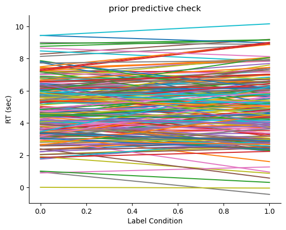

# 定义先验  

在贝叶斯的分析框架中，我们需要为模型中的每个参数设置先验分布。  

而根据之前的模型公式(数据模型)可发现，我们的$Y$为被试反应时间(RT_sec)，$X$为标签（Label），并且存在三个未知的参数$\beta_0，\beta_1，\sigma$ 。  

因此，我们需要对每个未知的参数定义先验分布。  

$$  
\beta_0    \sim N\left(m_0, s_0^2 \right)  \\  
\beta_1   \sim N\left(m_1, s_1^2 \right) \\  
\sigma \sim \text{Exp}(\lambda)  
$$  

接下来，我们逐步完成模型的各个部分。

- 首先，我们要为每个参数指定先验分布。因变量是反应时，自变量仅包含两个条件$X_0$和$X_1$，因此我们可以从一个基本的模型形式开始。例如，我们可以假定$β_0$和$β_1$都服从正态分布，这是一个合理的假设，可以作为模型的起点。在这个假设下，$β_0$和$β_1$各自有均值和标准差，表示它们的分布特性。

- 对于方差$σ$，由于方差不可能为负值，因此我们需要确保先验分布的选择使得$σ$始终为正值。在实践中，方差的先验分布可以有多种选择，具体取决于建模者的偏好和经验。常见的选择之一是使用**指数分布**，因为它能确保值为正。此外，也可以选择**半正态分布（half Normal）**，即正态分布的正半部分，这也是一种可行的选择。其他的分布类型，只要满足方差为正的条件，也都可以使用。虽然不同领域和研究者的选择可能有所不同，**但在心理学研究中，指数分布（Exponential Distribution）通常被认为是一个较为理想的选择**。尽管如此，选择哪种分布以及如何确定其参数仍需根据实际数据和研究背景来进一步调整。

> * 参数的前提假设(assumptions):  
>   * $\beta_0，\beta_1，\sigma$ 之间相互独立  
> * 此外，规定 $\sigma$ 服从指数分布，以限定其值恒为正数  
> * 其中，$m_0，s_0，m_1，s_1$为超参数  
>   * 我们需要根据我们对$\beta_0$和$\beta_1$的先验理解来选择超参数的范围  
>   * 比如，$\beta_1$反映了标签从 self 切换到 other 时，反应时间的平均变化值；$\beta_0$反映了在 other 条件下的基础反应时间  

**在贝叶斯建模中，确定先验分布常常是最具挑战性的部分**。我们已经有了模型和数据，但要进行贝叶斯分析，必须首先确定先验分布的具体形式和取值，才能执行后续的MCMC（马尔可夫链蒙特卡洛）计算。因此，首要任务是能够让模型成功运行。

为确定先验分布，我们可以根据数据的特征和每个参数的实际意义来大致推测其取值。比如，$\beta_0$代表自变量$X=0$时某一条件下的反应时间（RT）。我们可以将其看作反映人类在实验中的反应时间范围。如果以秒为单位，显然反应时间不可能是千秒、万秒或十万秒这样的量级。基于此，我们可以推测出$\beta_0$的一个合理范围。

类似地，$\beta_1$反映的是两种条件下反应时间的差异。通常来说，$\beta_1$的量级应该比$\beta_0$小，因为它表示的是两条件间的差异。若差异过大，则可能说明实验设计或数据本身存在问题。因此，根据这些基本原则，我们可以确定一个大致的先验范围，从而为后续的贝叶斯分析提供合理的起点。

**指定超参数**  

$$  
\begin{equation}  
\begin{array}{lcrl}  
\text{data:} & \hspace{.05in} &   Y_i | \beta_0, \beta_1, \sigma & \stackrel{ind}{\sim} N\left(\mu_i, \sigma^2\right) \;\; \text{ with } \;\; \mu_i = \beta_0 + \beta_1X_i \\  
\text{priors:} & & \beta_{0}  & \sim N\left(5, 2^2 \right)  \\  
                    & & \beta_1  & \sim N\left(0, 1^2 \right) \\  
                    & & \sigma   & \sim \text{Exp}(0.3)  \\  
\end{array}  
\end{equation}  
$$  

这里，我们根据生活经验或直觉对超参数进行了定义：  

* 其次，我们假设 $\beta_0$ 服从均值为 5，标准差为 2 的正态分布,代表：  
  * 当实验条件为 self（编码为 0）时，反应时间的平均值大约为 5 秒。  
  * 截距值可能在 3 ± 7 秒 的范围内波动，反映了在 self 条件下的反应时间预估  
  
* 我们假设 $\beta_1$ 服从均值为 0，标准差为 1 的正态分布，代表：  

  * (斜率)将其均值指定为 1，表示我们预期在 self 和 other 条件下的反应时间差异较小。  

    * 这个影响的量是变化的，范围大概在 -1  ± 1。  

* 最后，我们假设 $\sigma$ 服从指数分布，其参数为0.3。  

  * 参数0.3 意味着标准差通常集中在较小的正数范围内，使反应时间在预测值$\mu_i$附近波动。  
  * 这一设置允许较小到中等的波动，但大部分数据应集中在 0 到 10 秒的合理反应时间范围内。  

<div style="padding-bottom: 20px;"></div>

我们在确定贝叶斯回归模型中的先验分布时，首先依据对人类反应时间的基本认识。**具体来说，$\beta_0$代表某一条件下的基础反应时间**，可以理解为所有人在认知实验中的反应时间范围。因此，我们可以将其先验分布设置为一个正态分布，例如均值为5秒，标准差为2秒。

**对于$\beta_1$，它表示两个条件之间的反应时间差异**。基于常识，我们可以将其先验分布设置为均值为0，标准差为1的正态分布，假设差异值可能是正的或负的，通常不会超过一秒。

**对于方差$σ$，我们假定其反映了反应时间的离散程度**。通常情况下，人的反应时间标准差较小，因此可以选择一个集中于较小值的先验分布，例如指数分布，允许方差在一定范围内波动，但仍保持合理性。

在本节课练习和实际应用中，大家可以根据自己的需求调整贝叶斯模型中的先验分布。先验的设置通常基于对数据的直觉和常识，但如何判断先验是否合理呢？关键是要确保它不违背常识。例如，我们可以通过数据的范围来构建先验，确保先验与数据一致。然而，一般来说，不推荐设定一个过于严格或狭窄的先验范围。

当先验过于强时，意味着它与数据不符，这时需要大量的数据才能更新先验至后验。相反，如果先验适度且较为宽松（weakly informed prior），即使数据量不大，也能有效更新至后验，这样可以避免先验对推断过程的过度影响。

- 举个例子，假设我们预期反应时间大约在1至2秒之间，设定先验为均值1秒，标准差2秒。这虽然可以，但标准差为2意味着反应时间可能会出现负值，这是不合常理的。因此，**我们需要根据常识来调整先验的范围**，避免不合理的结果。

此外，在某些情况下，我们也可以考虑不使用正态分布，而是根据数据的实际形态选择合适的分布类型。这些方法会在后续的课程中进一步讲解，尤其是当我们需要使用广义线性模型时。

可视化指定超参下的先验：  
```python
# 导入库

import pandas as pd
import numpy as np
import matplotlib.pyplot as plt
import scipy.stats as stats
import seaborn as sns

# 定义新的先验分布的参数

mu_beta0 = 5
sigma_beta0 = 2
mu_beta1 = 0
sigma_beta1 = 1
lambda_sigma = 0.3

# 生成 beta_0 的先验分布值

x_beta0 = np.linspace(-5, 15, 1000)  
y_beta0 = stats.norm.pdf(x_beta0, mu_beta0, sigma_beta0)

# 生成 beta_1 的先验分布值

x_beta1 = np.linspace(-5, 5, 1000)
y_beta1 = stats.norm.pdf(x_beta1, mu_beta1, sigma_beta1)

# 生成 sigma 的先验分布值

x_sigma = np.linspace(0, 10, 1000)  
y_sigma = stats.expon.pdf(x_sigma, scale=1/lambda_sigma)

# 绘制先验分布图

fig, axes = plt.subplots(1, 3, figsize=(15, 5))

# 绘制 beta_0 的先验分布

axes[0].plot(x_beta0, y_beta0, 'k-')
axes[0].set_title(r"$N(5, 2^2)$")
axes[0].set_xlabel(r"$\beta_0$")
axes[0].set_ylabel("pdf")

# 绘制 beta_1 的先验分布

axes[1].plot(x_beta1, y_beta1, 'k-')
axes[1].set_title(r"$N(0, 1^2)$")
axes[1].set_xlabel(r"$\beta_1$")
axes[1].set_ylabel("pdf")

# 绘制 sigma 的先验分布

axes[2].plot(x_sigma, y_sigma, 'k-')
axes[2].set_title(r"Exp(0.3)")
axes[2].set_xlabel(r"$\sigma$")
axes[2].set_ylabel("pdf")

# 调整布局并显示图表

sns.despine()
plt.tight_layout()
plt.show()
```


我们从先验的可视化开始，帮助大家更直观地理解各个参数的分布。我们当前的模型包括三个参数：$\beta_0$、$\beta_1$和 $\sigma$。通过可视化这些参数的分布，我们可以更好地建立直觉理解，尤其对于统计学背景的人来说，这种直观的感受非常重要。通过可视化，我们能够直观地看到这些参数的可能取值范围，从而增强我们对先验分布的认识。

例如，当我们使用$\beta_0= 5$ 和$\beta_1= 2$ 这两个参数时，虽然理论上β1的值可以是正负的，但可视化显示在正态分布下，我们可能会看到少量负值。这是因为$\beta_1$代表的是条件间的差异，因此其正负取值是合理的。至于$\sigma$，它是标准差，理论上应为正值，而通过可视化，我们可以发现其大部分取值集中在较小的范围内，如8或10以内，这是一个合理且可接受的范围。


## 先验预测检验(prior predictive check)  

🤔有些同学可能认为这个先验的定义过于随意，甚至有些不靠谱。 那我们是否可以检验先验的合理性，以及适当的调整这个先验呐？  

**我们通过代码来说明，如何进行先验预测检验**  

首先根据公式，先验模型为：  

$$  
\begin{align*}  
\text{priors:} & & \beta_{0}  & \sim N\left(5, 2^2 \right)  \\  
                    & & \beta_1  & \sim N\left(0, 1^2 \right) \\  
                    & & \sigma   & \sim \text{Exp}(0.3)  \\  
\end{align*}  
$$

为了检验先验分布的合理性，我们可以使用一种方法叫做**先验预测检验**。这一方法的核心思想是，从先验分布中随机抽取一组参数，并将这些参数带入我们的数据模型中，生成预测值。通过这种方式，我们能够判断这些预测值是否符合我们基于经验的常识。

具体来说，先验分布本质上是从一个概率分布中抽取的，因此我们可以在这个分布下随机抽取多个样本。每个样本代表了我们在没有看到数据之前对模型的信念。然后，使用这些抽取的样本参数，我们将其带入模型，生成一组预测数据，进而检查这些预测值是否符合实际的常识性预期。这个过程实际上是一种蒙特卡洛采样方法，通过随机抽取大量的样本来估算数据的分布，帮助我们验证先验设定的合理性。

**先验预测检验的大致思路**  

1. 在先验中随机抽取200组$\beta_0, \beta_1$值  
2. 生成假数据自变量X  
3. 生成200条 $\beta_0 + \beta_1 X$ 生成预测的反应时间数据  
4. 观察生成的反应时间数据是否在合理范围内，评估先验假设的合适性  

1. 在先验中随机抽取200组$\beta_0, \beta_1$值  

```python
# 设置随机种子确保结果可以重复

np.random.seed(84735)

# 根据设定的先验分布，在其中各抽取200个beta_0,200个beta_1, 200个sigma

beta0_200 = np.random.normal(loc = 5, scale = 2, size = 200)
beta1_200 = np.random.normal(loc = 0, scale = 1 , size = 200)
sigma_200 = np.random.exponential(scale=1/0.3, size=200)

# 将结果存在一个数据框内
prior_pred_sample = pd.DataFrame({"beta0":beta0_200,
                                  "beta1":beta1_200,
                                  "sigma":sigma_200})
# 查看抽样结果
prior_pred_sample
```


在实际操作中，整个取样过程主要依赖于Python中的库和函数。首先，通过`numpy`库中的函数，我们从特定的分布中进行随机抽样。例如，使用`numpy.random.normal`从正态分布中获取样本。然后，抽取到的参数（如$\beta_0$、$\beta_1$）与自变量数据（如$X$）组合成一个数据框（DataFrame）


1. 生成假数据自变量$X$  

* 这里我们根据现实情况来定义X的取值范围  
* 我们使用 `np.arange`设置自变量 Label 的可能取值  
```python
# 通过np.arange设置Label，0 代表 Self， 1 代表other

x_sim = np.array([0, 1])

# 查看自变量值

x_sim
```

得到数据后，我们可以通过线性组合的方式计算出$μ和σ$，从而得到正态分布的两个参数。利用这两个参数，我们就能够从正态分布中进行随机取样，生成符合模型假设的预测数据。在此过程中，我们还可以先观察生成的回归线，检查$μ$的取值范围，确保生成的数据合理并符合我们的预期。


1. 根据公式 $\mu = \beta_0 + \beta_1 X$ 生成200条回归线, 观察其中的$\mu$是否处在合理的范围内  

* 我们有200次采样，每次采样都有三个参数 beta_0, beta_1, sigma。  

* 结合每次采样的结果，和自变量X，我们可以生成一条直线  

* 重复这个过程200次，我们就能生成200条直线  


在一次随机采样的过程中，我们从β0和β1的分布中随机取值，并生成200次预测数据。通过将每次的β0和β1带入模型，我们可以得到相应的回归线。左图展示了200次采样的结果，显示出预测值在一定范围内变化，并符合我们对β0和β1的设定。右图则展示了特定参数组合下生成的回归线。

> **我们通过一次采样来理解这个过程**  


* **左侧图表**显示了 200 组随机抽取的参数  beta_0, beta_1, sigma 的值。  
  * 这帮助我们直观地看到参数在各自先验分布下的取值范围。  
* **右侧图表**展示了基于抽取的一个特定参数组合绘制的回归线 $Y = \beta_0 + \beta_1 X$  
  * 红色的点表示预测的反应时间在两个条件下的值，蓝色线是连接这两个预测值的回归线。

### 🎯练习1：先验预测  

根据获取的第一条MCMC链的第一组采样参数，结合自变量X的范围，预测 $\mu$ 的值。  

1. 根据回归公式 $\mu = \beta_0 + \beta_1 X$ 预测$\mu$ 的值。  
2. 绘制回归线条。
```python
# 设置随机种子确保结果可以重复

np.random.seed(84735)

# 根据设定的先验分布，在其中各抽取200个beta_0,200个beta_1, 200个sigma

beta0_200 = np.random.normal(loc = 5, scale = 2, size = 200)
beta1_200 = np.random.normal(loc = 0, scale = 1 , size = 200)
sigma_200 = np.random.exponential(scale=1/0.3, size=200)
# 将结果存在一个数据框内
prior_pred_sample = pd.DataFrame({"beta0":beta0_200,
                                  "beta1":beta1_200,
                                  "sigma":sigma_200})
# 查看抽样结果
prior_pred_sample

# 保存为数据框

prior_pred_sample = pd.DataFrame({"beta0": beta0_200, "beta1": beta1_200, "sigma": sigma_200})

# 获取第一组采样参数

beta_0 = prior_pred_sample["beta0"][0]
beta_1 = prior_pred_sample["beta1"][0]

print(f"获取的第一组采样参数值，beta_0:{beta_0:.2f}, beta_1:{beta_1:.2f}")
# ===========================
```
获取的第一组采样参数值，beta_0:6.04, beta_1:-1.14
```python
# 根据回归公式 $\mu = \beta_0 + \beta_1 X$ 预测$\mu$ 的值

# 已知：自变量（标签），self = 1, other = 2

# ===========================
x_sim = np.array([1, 2])
mu = beta_0 + beta_1 * x_sim
print("预测值 μ:", mu)
```
预测值 μ: [4.89895573 3.76035694]
```python
# ===========================

# 绘制回归线，请设置x轴和y轴的变量

# ===========================
x_axis = ...
y_axis = ...

plt.plot(x_axis,y_axis)
plt.xlabel("Label Condition")
plt.ylabel("RT (sec)")  
sns.despine()
```

> 重复上述结果200遍，我们就能得到200次先验预测回归线了  

**可视化先验预测结果**  

* 每一条线代表一次抽样生成的预测，因此我们绘制了200条线。  

* 我们可以观察到 self 和 other 条件下的反应时间如何随着自变量（标签Label）变化。  

* 如果先验设置不合理（如过于宽泛的分布），可能导致预测结果在合理范围之外。  
  * 例如，如果我们将 beta_1 设得过大，可能导致预测的 other 条件下的反应时间显著增加或减少，不符合实验数据的预期。  
  * 因此，通过合理的先验设定，我们可以得到更加符合实验背景的预测结果，这有助于模型对真实数据的拟合。

```python
# 通过 np.array 设置实验条件的取值范围，self=0，other=1

x_sim = np.array([0, 1])

# 设置一个空列表，用来储存每一个的预测结果

mu_outcome = []

# 循环生成 200 次先验预测回归线

for i in range(len(prior_pred_sample)):
    # 根据回归公式计算预测值
    mu = prior_pred_sample["beta0"][i] + prior_pred_sample["beta1"][i] * x_sim
    mu_outcome.append(mu)
```
```python
# 画出每一次的先验预测结果

for i in range(len(mu_outcome)):
    plt.plot(x_sim, mu_outcome[i])

plt.title("prior predictive check")
plt.xlabel("Label Condition")
plt.ylabel("RT (sec)")
sns.despine()
```


- 课上针对练习的讲解：

绘制200条回归线，我们可以观察到反应时间的预测值分布大致呈现一定的范围。我们特别关注自变量X的取值0和1，因其是我们模型的主要输入。通过汇总这200次预测结果，我们发现反应时间的均值在一个合理范围内，这符合我们的常识判断。首先，反应时间的值始终为正，符合实验条件下的预期；其次，反应时间大致落在0到10之间，未出现不合理的大幅波动，尽管实际实验可能表明反应时间更集中在0到2秒之间，但整体预测结果仍在可以接受的范围内。这样的验证显示，模型的先验分布符合基本常识，不存在明显的偏差。`


### 我们的先验设置的合理吗？  

让我们重新聚焦于我们的研究问题：**在知觉匹配任务中，自我相关信息是否会促进认知加工？** 具体而言，我们探讨自我和他人条件下的认知加工差异，尤其是在反应时间上的表现。  

变量定义：  

* 𝑋：标签（Label）  

  * 在自我匹配范式任务中，标签分为 self 和 other 两种，分别编码为 0 和 1。这些条件用于观察在自我相关和非自我相关条件下的反应时间差异。  

* 𝑌：反应时间（RT）  
  
  * 表示在 self 或 other 条件下参与者的平均反应时间，通常以秒为单位。我们的目标是通过模型预测 self 和 other 条件下反应时间的差异，并观察其随实验条件的变化。  


在进行先验分布的选择时，虽然每个人的接受度和精细化的需求可能不同，但一般来说，只要先验分布是合理的，并且数据量足够大，贝叶斯更新机制会使得先验逐步接近共同的后验分布。因此，即使每个人选择的先验略有差异，随着数据的积累，这些差异的影响会被逐渐消除，最终后验分布会收敛到一个固定的范围。因此，尽管先验可能不完全一致，但在足够多的数据支持下，不同的先验选择不会对结果产生显著影响。

- 正如刚才所提到的，通过观察我们得到的结果，可以认为这是合理的：反应时间的变化既有正向也有负向，且反应时间的整体范围符合预期。


```python
import numpy as np
import pandas as pd
import matplotlib.pyplot as plt
import seaborn as sns

def prior_predictive_plot(beta0_mean=0.5, beta0_sd=0.3, beta1_mean=-0.1, beta1_sd=0.04, sigma_rate=0.2, samples=200, seed=84735):
    """
    生成先验预测图。

    参数：
    - beta0_mean: float，beta0的均值
    - beta0_sd: float，beta0的标准差
    - beta1_mean: float，beta1的均值
    - beta1_sd: float，beta1的标准差
    - sigma_rate: float，控制sigma的指数分布率参数（lambda = 1/scale）
    - samples: int，生成的样本数量
    - seed: int，随机种子，默认为84735，确保结果可重复
    
    输出：
    - 一个先验预测图
    """
    
    # 设置随机种子
    if seed is not None:
        np.random.seed(seed)
    
    # 根据设定的先验分布抽样
    beta0_samples = np.random.normal(loc=beta0_mean, scale=beta0_sd, size=samples)
    beta1_samples = np.random.normal(loc=beta1_mean, scale=beta1_sd, size=samples)
    sigma_samples = np.random.exponential(scale=1/sigma_rate, size=samples)
    
    # 创建数据框存储样本
    prior_pred_sample = pd.DataFrame({
        "beta0": beta0_samples,
        "beta1": beta1_samples,
        "sigma": sigma_samples
    })

    # 定义实验条件（self=0，other=1）
    x_sim = np.array([0, 1])
    
    # 创建一个空列表存储每次模拟的结果
    mu_outcome = []
    
    # 生成先验预测回归线
    for i in range(samples):
        mu = prior_pred_sample["beta0"][i] + prior_pred_sample["beta1"][i] * x_sim
        mu_outcome.append(mu)
    
    # 绘图
    plt.figure(figsize=(10, 6))
    for i in range(len(mu_outcome)):
        plt.plot(x_sim, mu_outcome[i])
    
    plt.title("Prior Predictive Check")
    plt.xlabel("Label Condition")
    plt.ylabel("RT (sec)")
    sns.despine()
    plt.show()

# 使用示例

prior_predictive_plot()
```

### 🎯练习2：先验预测  

🤔请大家判断，下图的先验预测合理吗？  


在实际实验中，我们知道被试的反应时间（RT）不会小于0秒。然而，**当前模型的先验预测图中可能会包含一些小于0的反应时间，这显然不符合逻辑**。  

通过以下练习,你可以尝试对三个参数的先验分布进行设置，观察它们对反应时间预测的影响。
```python
import numpy as np
import pandas as pd
import matplotlib.pyplot as plt
import seaborn as sns

# =====================================================

# 请完善代码中...的部分，设置3个参数的值，使先验分布更符合实际情况

# =====================================================

prior_predictive_plot(beta0_mean=...,  # beta 0 的均值
                      beta0_sd=...,    # beta 0 的标准差
                      beta1_mean=...,  # beta 1 的标准差
                      beta1_sd=...,    # beta 1 的标准差
                      sigma_rate=...,  # 控制sigma的指数分布率参数（lambda = 1/scale）
                      samples=200,
                      seed=84735)

```

- 课上针对练习的讲解：

如果我们遇到另一组数据，是否合理呢？从我的角度来看，这个先验依然是可以接受的。虽然它的分布在0以下出现了一些反应时间值，但这并不意味着先验必须完全符合所有理论预期。实际上，有时只要先验大致合理并且与理论相符，就已经足够。在使用先验预测图时，我们可以直观地看到某些不合理的预测值，意识到它们的存在，并且知道大多数情况下数据是符合预期的。只要有了这种认知，即使存在一些不合理的部分，继续运行模型也是可以接受的。