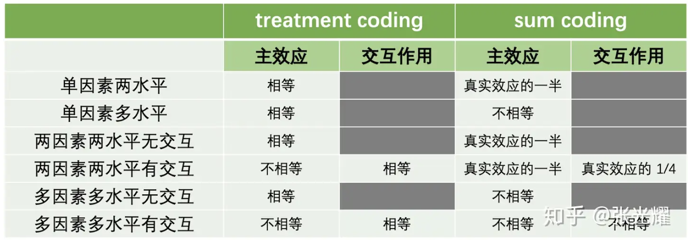
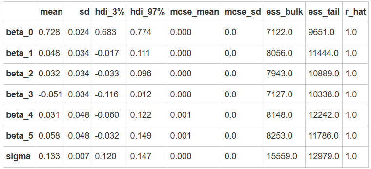
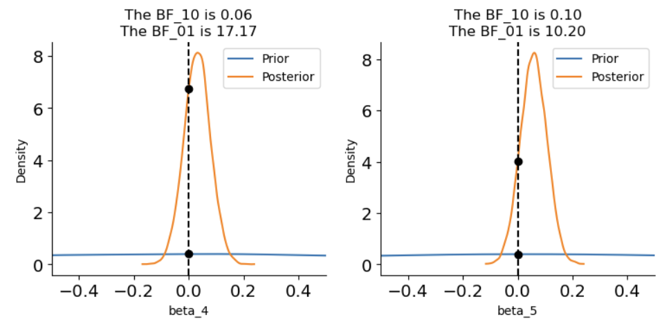
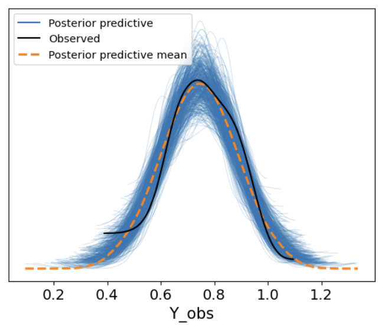
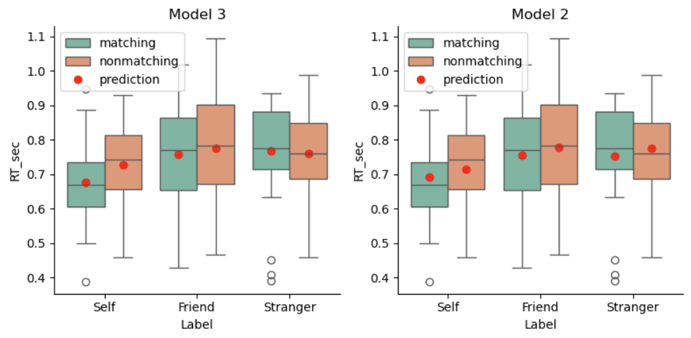

# 模型三：带交互项的2 X 3 的多元线性回归

**交互作用**： 当模型存在两个或两个以上的自变量时，交互作用是指一个自变量$X_1$对因变量$Y$的影响会随着自变量$X_2$不同水平的变化而有所差异。

当我们考虑交互效应时，模型不仅包含 “Label” 和 “Matching” 的独立主效应，还需要加入它们之间的交互作用。

- 加入交互项可以观察 “Label” 和 “Matching” 是否存在相互依赖的影响，即 “Matching” 对 “Self、Friend 和 Stranger” 条件的影响是否不同。通过引入交互项，我们能够捕捉变量之间的相互关系。

🤔**需要注意：一旦我们涉及交互作用，需要谨慎地考虑编码方式的选取以及参数的解读，此时不同编码可能会影响最后的结果推断。**

## 多个理解变量下，不同编码和研究效应的关系

如图所示，表中列出了 Treatment Coding 和 Sum Coding 两种常用的因子变量编码方式，并展示了它们在研究主效应和交互效应时的特点：



> 参考资料：
[线性（混合）模型中如何对因子变量事先生成虚拟变量 - 知乎](https://zhuanlan.zhihu.com/p/103547646)

- 这里需要注意：如果想要线性回归的分析结果与方差分析保持一致，编码的方式以及方差的选取等等都很重要，需要严格考虑。

**哑变量编码规则**

增加了交互作用后的线性模型的编码规则应该是：

1、主效应的编码规则：

- Label（3 levels）

(1)($X_{L1}=1$)表示“friend”条件；($X_{L1}=0$)表示其他条件

(2)($X_{L2}=1$)表示“stranger”条件；($X_{L2}=0$)表示其他条件

(3)“self”条件为基线水平，不需要单独编码（隐含在（$X_{L1}=0，X_{L2}=0$）当中）

- Matching（2 levels）

(1)($X_{M1}$=1)表示“nonmatching”条件

(2)($X_{M1}$=0)表示“matching”条件（基线水平）

2、交互项的编码规则：

- 交互项($X_{L1}·X_{M1}$):

(1)当($X_{L1}=1$)且($X_{M1}=1$)时，交互项($X_{L1}·X_{M1}=1$)

(2)否则，($X_{L1}·X_{M1}=0$)

- 交互项($X_{L2}·X_{M1}$):

(1)当($X_{L2}=1$)且($X_{M1}=1$)时，交互项($X_{L2}·X_{M1}=1$)

(2)否则，($X_{L2}·X_{M1}=0$)

## Treatment编码矩阵(有交互项)

<style>
.center 
{
  width: auto;
  display: table;
  margin-left: auto;
  margin-right: auto;
}
</style>
<div class="center">

|Label|Matching|截距（baseline）|$X_{L1}$|$X_{L2}$|$X_{M1}$|$X_{L1}·X_{M1}$|$X_{L2}·X_{M1}$|
| :-----------: | :-----------: | :-----------: | :-----------: | :-----------: | :-----------: |:-----------: | :-----------: |
|self|matching|1|0|0|0|0|0|
|self|nonmatching|1|0|0|1|0|0|
|friend|matching|1|1|0|0|0|0|
|friend|nonmatching|1|1|0|1|1|0|
|stranger|matching|1|0|1|0|0|0|
|stranger|non-matching|1|0|1|1|0|1|
</div>

通过表格中各行编码参数之间的相减可以得出对应的效应，例如：

- self条件的nonmatching水平与matching水平之差：$X_{M1}$

- friend条件的nonmatching水平与matching水平之差：$X_{M1}+X_{L1}·X_{M1}$

- friend条件的（nonmatching与matching之差） 与 （self条件的nonmatching与matching之差） 之间的差异：$X_{L1}·X_{M1}$

**模型设定**

在了解哑变量之后，我们就可以开始进行模型拟合和推断了。

有交互项的 2 X 3 的线性回归模型表达为：

$$
Y=\beta_0+\beta_1·X_{L1}+\beta_2·X_{L2}+\beta_3·X_{M1}+\beta_4·(X_{L1}·X_{M1})+\beta_5·(X_{L2}·X_{M1})+\epsilon_i
$$

**模型先验设置**

在先前设定的先验基础上，加入对$\beta_4和\beta_5$先验分布的设置：

$$
\beta_4 \sim N(0,1^2),\beta_5 \sim N(0,1^2)
$$

**模型拟合和推断**

```python
# 转换分类变量为哑变量
X1 = (df['Label'] == 'Friend').astype(int)
X2 = (df['Label'] == 'Stranger').astype(int)

# Matching 条件的哑变量
Matching = (df['Matching'] == 'matching').astype(int)  

# Friend 和 Matching 的交互
Interaction_1 = X1 * Matching  
# Stranger 和 Matching 的交互
Interaction_2 = X2 * Matching
```

```python
import pymc as pm

with pm.Model() as model3:
    # 定义先验分布
    beta_0 = pm.Normal('beta_0', mu=5, sigma=2)  
    beta_1 = pm.Normal('beta_1', mu=0, sigma=1) 
    beta_2 = pm.Normal('beta_2', mu=0, sigma=1)  
    beta_3 = pm.Normal('beta_3', mu=0, sigma=1)  
    beta_4 = pm.Normal('beta_4', mu=0, sigma=1) 
    beta_5 = pm.Normal('beta_5', mu=0, sigma=1)  
    sigma = pm.Exponential('sigma', lam=0.3)  
    
    # 线性模型
    mu = (beta_0 + beta_1 * X1 + beta_2 * X2 + beta_3 * Matching +
          beta_4 * Interaction_1 + beta_5 * Interaction_2)
    
    # 观测数据的似然函数
    likelihood = pm.Normal('Y_obs', mu=mu, sigma=sigma, observed=df['RT_sec'])
```

**进行后验采样**

```python
with model3:
    model3_trace = pm.sample(draws=5000,                   # 使用mcmc方法进行采样，draws为采样次数
                             tune=1000,                    # tune为调整采样策略的次数，可以决定这些结果是否要被保留
                             chains=4,                     # 链数
                             discard_tuned_samples=True,  # tune的结果将在采样结束后被丢弃
                             random_seed=84735)           # 后验采样
```

**MCMC诊断和后验推断**

```python
az.summary(model3_trace)
```



使用 ROPE+HDI 对参数进行检验:

```python
# 定义 ROPE 区间，根据研究的需要指定实际等效范围
rope_interval = [-0.05, 0.05]

# 绘制后验分布，显示 HDI 和 ROPE
az.plot_posterior(
    model3_trace,
    var_names=["beta_4", "beta_5"],
    hdi_prob=0.95,
    rope=rope_interval,
    figsize=(12, 3),
    textsize=12
)

plt.show()
```


- 可以看出，$\beta_4和\beta_5$的HDI与ROPE区间重叠非常大，表明没有交互作用。

使用贝叶斯因子进行差异检验：

```python
# 进行贝叶斯因子计算，需要采样先验分布
with model3:
    model3_trace.extend(pm.sample_prior_predictive(5000, random_seed=84735) )

fig, axes = plt.subplots(1,2, figsize=(9, 3.5))

# 绘制贝叶斯因子图
# beta4
ax = axes[0]
az.plot_bf(model3_trace, var_name="beta_4", ref_val=0, ax=ax)
ax.set_xlim(-0.5, 0.5) 
# beta5
ax = axes[1]
az.plot_bf(model3_trace, var_name="beta_5", ref_val=0, ax=ax)
ax.set_xlim(-0.5, 0.5) 

# 去除上框线和右框线
sns.despine()
plt.show()
```



- $\beta_4和\beta_5的BF_{01}$在10~20之间，即有较强的证据支持不存在交互作用。

**后验预测**

```python
with model3:
    model3_ppc = pm.sample_posterior_predictive(model3_trace, random_seed=84735)
```

```python
az.plot_ppc(model3_ppc, num_pp_samples = 500)
```



```python
import xarray as xr

# 导入真实的自变量
X1 = xr.DataArray((df['Label'] == 'Friend').astype(int))
X2 = xr.DataArray((df['Label'] == 'Stranger').astype(int))
Matching = xr.DataArray((df['Matching'] == 'matching').astype(int))
Interaction_1 = X1 * Matching
Interaction_2 = X2 * Matching

model3_trace.posterior["y_model"] = model3_trace.posterior["beta_0"] + \
    (model3_trace.posterior["beta_1"] * X1) + \
    (model3_trace.posterior["beta_2"] * X2) + \
    (model3_trace.posterior["beta_3"] * Matching) + \
    (model3_trace.posterior["beta_4"] * Interaction_1) + \
    (model3_trace.posterior["beta_5"] * Interaction_2)

df["model3_prediction"] = model3_trace.posterior.y_model.mean(dim=["chain","draw"]).values
```

```python
df['Label'] = df['Label'].astype(str)
```

```python
fig, axes = plt.subplots(1, 2, figsize=(8, 4))

# 绘制model3预测结果
plot_prediction(df, "model3_prediction", ax=axes[0])
axes[0].set_title("Model 3")

# 绘制model2预测结果
plot_prediction(df, "model2_prediction", ax=axes[1])
axes[1].set_title("Model 2")

# 显示图像
sns.despine()
plt.tight_layout()
plt.show()
```



- 我们可以观察到Model3的红点（预测值）相比于Model2更加拟合数据的集中趋势，表明将交互作用纳入考虑的Model3相比于没有考虑交互的Model2有了一个显著的提升。

**模型解读与结论**

通过贝叶斯回归模型的后验分布，我们可以推断以下几个方面：

- 反应时间与标签的关系：根据$\beta_2和\beta_3$的估计值，我们可以判断不同标签条件下反应时间的差异（自我对比其他标签）。

- 匹配条件的影响：通过$\beta_1$，我们可以判断是否匹配条件会显著影响反应时间。

- 交互效应：通过$\beta_4和\beta_5$的估计，我们可以了解匹配条件与标签之间的交互作用是否显著，尤其是在自我与他人标签的反应时间是否有显著差异。

🤔思考题：贝叶斯线性回归模型与传统线性回归模型得到的结论是否一致？

***注意：***

- 与传统假设检验不同，在贝叶斯建模的过程中我们需要根据具体的问题情境详细考虑每一个步骤。例如，我们该如何设置ROPE？在许多知觉实验研究中，可能相差几毫秒就会出现显著差异，那么正负50ms的ROPE在这种实验情境下可能就显得不是那么合理。此外，还需要考虑先验设置的是否合理等等问题。

